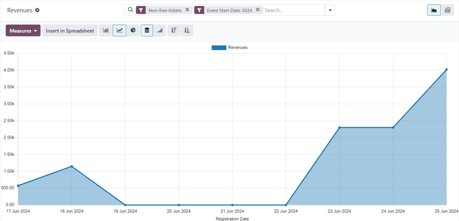
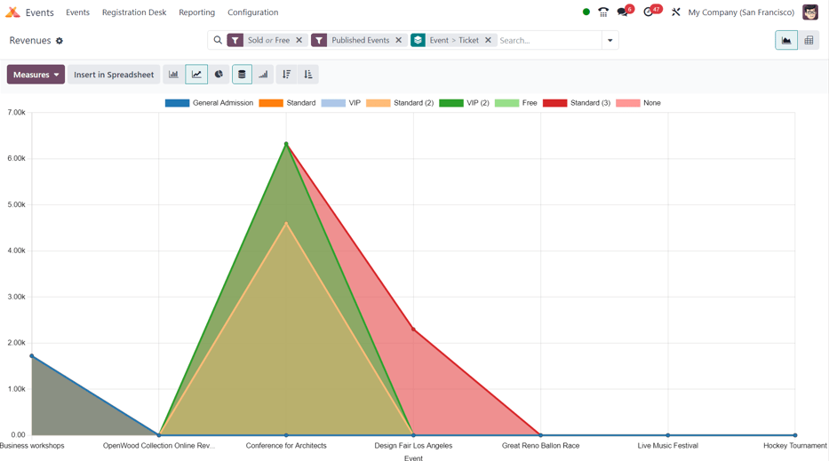
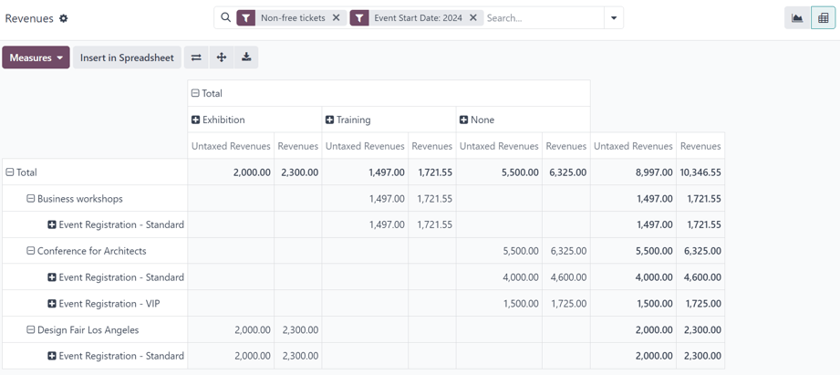

===============
Revenues report
===============

The Odoo **Events** application creates custom reports, based on event-related data and analytics.
These reports can either be focused on *Attendees* or *Revenues*.

The following documentation focuses on the reporting options related to event *Revenues*.

Revenues reporting page
=======================

To access the *Attendees* reporting page, navigate to :menuselection:`Events app --> Reporting -->
Revenues`.

By default, the :guilabel:`Revenues` reporting page appears as a graph (a :icon:`fa-line-chart`
:guilabel:`(Line Chart)` with :icon:`fa-database` :guilabel:`(Stacked)` data). The default filters,
:guilabel:`Non-free tickets` and :guilabel:`Event Start Date: (current year)`, are present in the
search bar.

.. tip::
   To learn more about the various graph views (and graph view options), refer to the :ref:`Graph
   views <reporting/using-graph>` documentation.

The :guilabel:`Revenues` reporting page can also be viewed as a :ref:`pivot table
<reporting/views/pivot>`, by clicking the :icon:`oi-view-pivot` :guilabel:`(Pivot)` icon in the
upper-right corner.

Measures
--------

Choosing specific :ref:`Measures <reporting/choosing-measures>` is a quick way to customize
reporting pages.

Regardless of the chosen view, the measures on the :guilabel:`Revenues` reporting page are as
follows: :guilabel:`Revenues`, :guilabel:`Untaxed Revenues`, and :guilabel:`Count`.

.. note::
   In the default graph view of the :guilabel:`Revenues` reporting page, only the
   :guilabel:`Revenues` option is set in the :guilabel:`Measures` drop-down menu.

   In graph view, only one of the :guilabel:`Measures` can be selected at a time.

   When the pivot option is selected, all :guilabel:`Measures` options are selected, by default.

- :guilabel:`Revenues`: shows the revenues generated from events.
- :guilabel:`Untaxed Revenues`: shows the untaxed revenues generated from events.
- :guilabel:`Count`: shows the total amount of registrants who attended events.

Filters and grouping options
----------------------------

To reveal a drop-down menu of filter and grouping options to create custom reports, click the
:icon:`fa-caret-down` :guilabel:`(down arrow)` to the right of the search bar.

Doing so opens a drop-down mega menu of options organized into columns: :ref:`Filters
<search/preconfigured-filters>`, :ref:`Group By <search/group>`, and :ref:`Favorites
<search/favorites>`.

.. note::
   If a time-related option has been selected from the :guilabel:`Filters` column (e.g. the default
   :guilabel:`Event Start Date: (year)` filter), a :guilabel:`Comparison` column appears, with
   comparison options for the corresponding time-related filter option selected.

   Only **one** selection can be made from the :guilabel:`Comparison` column at a time.

.. seealso::
   :doc:`../../essentials/search`

Filter options
~~~~~~~~~~~~~~

In the :guilabel:`Filters` column of the drop-down mega menu, there are various event-related
options that can be utilized to create custom reports, based on a number of specific criteria.

Multiple options in the :guilabel:`Filters` column can be selected at once.

The :guilabel:`Filters` column has the following options:

- :guilabel:`Non-free tickets`: event tickets/registrations that were **not** free.
- :guilabel:`Free`: event tickets/registrations that *were* free.
- :guilabel:`Pending payment`: event tickets/registrations that were purchased, but still have
  payment pending.
- :guilabel:`Sold`: event tickets/registrations that have been successfully sold (and paid for).
- :guilabel:`Registration Date`: Click the :icon:`fa-caret-down` :guilabel:`(down arrow)` icon to
  reveal a list of month, quarter, and year options. Select any number of these options to view a
  specific periods of time and see how many registrations happened during that time.
- :guilabel:`Upcoming/Running`: include revenue-related information for events that are either
  currently running or are going to happen in the future.
- :guilabel:`Past Events`: include revenue-related information for events that have already taken
  place.
- :guilabel:`Event Start Date`: Click the :icon:`fa-caret-down` :guilabel:`(down arrow)` icon to
  reveal a list of month, quarter, and year options. Select any number of these options to designate
  event start dates to use as filters for revenue-related event data.
- :guilabel:`Event End Date`: Click the :icon:`fa-caret-down` :guilabel:`(down arrow)` icon to
  reveal a list of month, quarter, and year options. Select any number of these options to designate
  event end dates to use as filters for revenue-related event data.
- :guilabel:`Published Events`: Select this option to show revenue-related data for published
  events.
- :guilabel:`Add Custom Filter`: Create a custom filter to analyze event-related revenue data. To
  learn more, refer to the documentation on :ref:`custom filters <search/custom-filters>`.

Group By options
~~~~~~~~~~~~~~~~

In the :guilabel:`Group By` column of the drop-down mega menu, there are various event-related
options to create custom groupings of data.

Multiple :guilabel:`Group By` options can be selected at once.

The :guilabel:`Group By` column has the following options:

- :guilabel:`Event Type`: Group data based on the type of event.
- :guilabel:`Event`: Organize data into individual groups, separated by events.
- :guilabel:`Product`: Group data based on the event registration product.
- :guilabel:`Ticket`: Group data based on the type of event ticket purchased by attendees.
- :guilabel:`Registration Status`: Group data based on the status of registrations.
- :guilabel:`Sale Order Status`: Group data based on the status of event-related sales orders.
- :guilabel:`Customer`: Group data based on customer records.
- :guilabel:`Add Custom Group`: Click the :icon:`fa-caret-down` :guilabel:`(down arrow)` icon to
  reveal a drop-down of grouping options. To select one, click on the desired option, and Odoo adds
  it to the :guilabel:`Group By` column. Multiple selections can be made.

Sample report: event ticket analysis (graph)
============================================

The following is an example of how various filters and grouping options can create a useful analytic
graph report related to event revenues. In this case, the configurations present data about sold or
free tickets to published events, with the metrics separated by ticket type and event.

To create such a report, navigate to :menuselection:`Events app --> Reporting --> Revenues`. Stay in
the default graph view, but remove the default filters from the search bar.

Then, click the :icon:`fa-caret-down` :guilabel:`(down arrow)` to the right of the search bar, to
reveal the drop-down mega menu of filter and grouping options.

From here, select :guilabel:`Free` and :guilabel:`Sold` from the :guilabel:`Filters` column.

Then, since it is desired to **only** view data related to already published events, select the
:guilabel:`Published Events` option in the :guilabel:`Filters` column, as well.

Next, in the :guilabel:`Group By` column, select the :guilabel:`Event` and :guilabel:`Ticket`
options, **in that sequential order**. Doing so first groups the data by event, *then* by ticket
type, which provides a more useful array of data to analyze.

.. important::
   The order in which the options are selected in the :guilabel:`Group By` column directly affects
   how the data is presented on the report.

From there, additional configurations can be added for more detailed data, if desired.

If no additional filters or groupings are added, Odoo presents a graphical representation of data
related to all *free* or *sold* tickets for *published events*, grouped by *event*, and organized by
*ticket* type.

Sample report: event type analysis (pivot table)
================================================

The following is an example of how various filters and grouping options can create a useful analytic
pivot table report related to event revenues. In this case, the configurations present data about
how much revenue different event types have generated, in order to gauge which events are the most
profitable.

First, navigate to :menuselection:`Events app --> Reporting --> Revenues`, and switch to the pivot
table view, by clicking the :icon:`oi-view-pivot` :guilabel:`(Pivot)` icon in the upper-right
corner.

Keep the default filters (:guilabel:`Non-free tickets` and :guilabel:`Event Start Date: (year)`) in
the search bar.

Next, open the :guilabel:`Measures` drop-down menu, and deselect the option for :guilabel:`Count`,
because this report is only going to focus on revenues.

Then, click :icon:`fa-plus-square` :guilabel:`Total` above the column titles, and select
:guilabel:`Event Type` from the resulting drop-down menu.

With these configurations in place, all the revenues generated from the events (and their
corresponding registrations) are displayed, organized by the event type (presented as expandable
columns).
