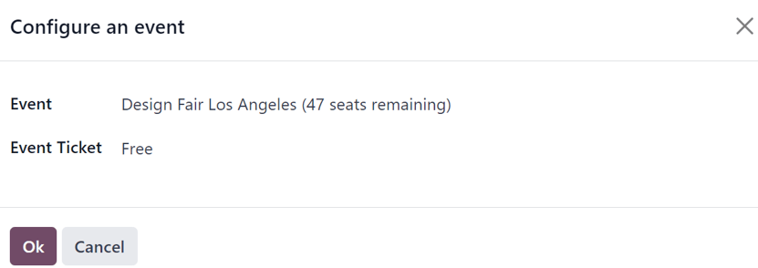
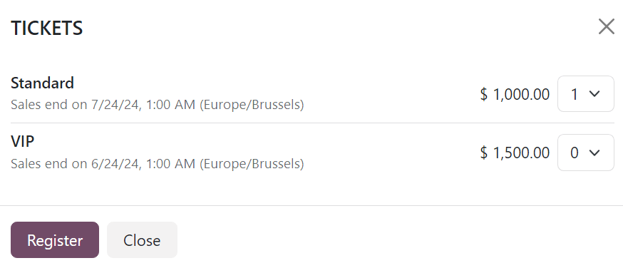
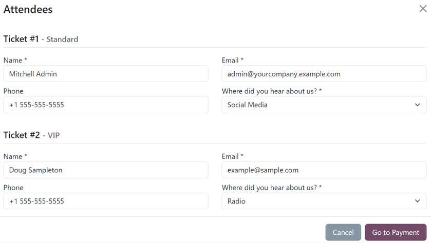

==================
Sell event tickets
==================

Odoo *Events* provides users with the ability to create custom event tickets (and ticket tiers),
with various price points.

It *also* allows them to sell event tickets in two different ways: via standard sales orders, and
online through an integrated website.

Odoo also simplifies the ticket-purchasing process by providing plenty of payment method options.

.. tip::
   To learn more about how to create custom tickets (and ticket tiers) for events, check out the
   :doc:`create_events` documentation.

Configuration
=============

In order to sell event tickets in Odoo, some settings must first be enabled.

First, navigate to :menuselection:`Events app --> Configuration --> Settings`. In the
:guilabel:`Registration` section, there are two different settings: :guilabel:`Tickets` and
:guilabel:`Online Ticketing`.

The :guilabel:`Tickets` setting allows users to sell event tickets with standard sales orders.

The :guilabel:`Online Ticketing` setting allows users to sell event tickets online through their
integrated Odoo website.

To activate a setting, tick the checkbox beside the desired feature's label, and click
:guilabel:`Save` to finish enabling it.

.. note::
   If these options are *not* enabled, a default :guilabel:`Register` button becomes available for
   visitors to interact with and procure free registrations to the event.

.. image:: sell_tickets/events-settings-tickets.png
   :align: center
   :alt: View of the settings page for Odoo Events.

With those settings enabled, Odoo automatically creates a new *Product Type* called, *Event Ticket*,
which is accessible on every product form. Odoo also creates three event registration products (with
the *Product Type* set to *Event Ticket*) that can be used or modified for event tickets.

.. important::
   When creating a new event registration product, the *Product Type* **must** be set to *Event
   Ticket* on the product form, in order for it to be selected in the *Product* column under the
   *Tickets* tab on an event form.

   .. image:: sell_tickets/events-tickets-registration-product.png
      :align: center
      :alt: View of an event form highlighting the column product under the tickets tab in Odoo.

.. note::
   Any event with paid tickets sold, features a :icon:`fa-dollar` :guilabel:`Sales` smart button at
   the top of the event form, where the respective sales orders attributed to those ticket sales
   become available.

   .. image:: sell_tickets/events-sales-smartbutton.png
      :align: center
      :alt: View of an event's form and the sales smart button in Odoo Events.

   Clicking the :icon:`fa-dollar` :guilabel:`Sales` smart button reveals a separate page, showcasing
   all the sales orders (standard and/or online) related to tickets that have been sold for that
   specific event.

Sell event tickets with the Sales app
=====================================

To sell event tickets with sales orders, start by navigating to the :menuselection:`Sales` app.
Then, click :guilabel:`New` to open a new quotation form.

After filling out the top portion of the form with the appropriate customer information, click
:guilabel:`Add a product` in the :guilabel:`Order Lines` tab. Then, in the :guilabel:`Product`
column, select (or create) an event registration product configured with its :guilabel:`Product
Type` set to :guilabel:`Event Ticket` on its product form.

Once an event registration product is selected, a :guilabel:`Configure an event` pop-up window
appears.

From the :guilabel:`Configure an event` pop-up window, select to which event this ticket purchase is
related to in the :guilabel:`Event` field drop-down menu. Then, in the :guilabel:`Event Ticket`
drop-down menu, select which ticket tier the customer wishes to purchase, if there are multiple
tiers configured for that event.

When all the desired configurations are complete, click :guilabel:`Ok`. Doing so returns the user to
the sales order, with the event registration ticket product now present in the :guilabel:`Order
Lines` tab. The user can proceed to confirm and close the sale, per the usual process.

.. tip::
   To re-open the *Configure an event* pop-up window, hover over the event registration product name
   in the :guilabel:`Order Lines` tab, and click on the :icon:`fa-pencil` :guilabel:`(pencil)` icon.

Sell event tickets through the Website app
==========================================

When a visitor arrives on the register page of the event website, they can click the
:guilabel:`Register` button to purchase a ticket to the event.

.. note::
   If the visitor is *not* already on the register page of the event website, clicking
   :guilabel:`Register` on the event website's submenu redirects them to the proper
   register page. From there, they can click the :guilabel:`Register` button to begin the ticket
   purchasing process.

If different ticket tiers are configured for the event, the visitor is presented with a
:guilabel:`Tickets` pop-up window.

From here, visitors select which ticket tier they would like to purchase, along with a quantity,
using the numerical drop-down menu available to the right of their desired ticket. Once the desired
selections have been entered, the visitor then clicks the :guilabel:`Register` button.

Then, an :guilabel:`Attendees` pop-up window appears, containing all the questions that have been
configured in the *Questions* tab of the event form for this particular event.

If multiple tickets are being purchased at once, there are numbered sections for each individual
ticket registrant, each containing the same questions. However, if any question has been configured
with the *Ask once per order* setting, that question is only asked once -- and **not** for every
attendee making the reservation in the order.

With all necessary information entered, the visitor can then click the :guilabel:`Go to Payment`
button. Doing so first takes the visitor to a :guilabel:`Billing` confirmation page, followed by a
:guilabel:`Payment` confirmation page, where they can utilize any configured payment method set up
in the database to complete the order.

Then, once the purchase is complete on the front-end of the website, the subsequent sales order is
instantly accessible in the back-end of the database.

.. seealso::
   :doc:`create_events`
