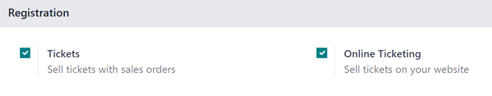
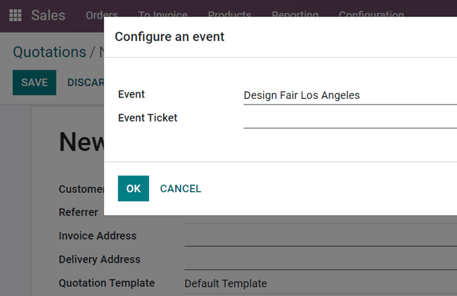
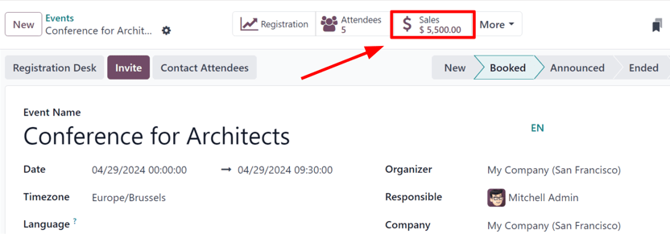
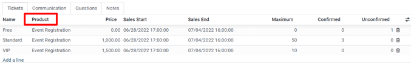
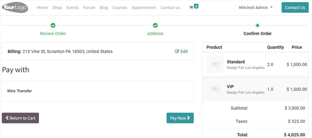

============
Sell tickets
============

Create custom ticket tiers (with various price points) for potential attendees to choose from,
directly on the event template form, under the :guilabel:`Tickets` tab. Odoo simplifies the
ticket-purchasing process by providing plenty of payment method options.

Configuration
=============

First, in order to enable the creation (and selling of) event tickets, go to
:menuselection:`Configuration --> Settings`, then enable the :guilabel:`Tickets` and
:guilabel:`Online Ticketing` features.

The :guilabel:`Tickets` feature allows tickets to be sold for an event.

The :guilabel:`Online Tickets` feature allows for the sale of tickets to occur through the website.

.. note::
   If these options are *not* enabled, a default :guilabel:`Register` button will be available for
   free registrations.

Sell tickets through sales orders
=================================

In the :guilabel:`Sales` application, choose a previously-created Event Registration (as if it were
a product), and add it as a product line. Upon adding the registration, a pop-up appears, which
allows for the selection of a specific event (and ticket tier). That specific event ticket is then
attached to the sales order.

Events with tickets sold online or through sales orders have a :guilabel:`Sales Smart Button`
shortcut, located at the top of the event template form (in the :guilabel:`Events` application).

Clicking the :guilabel:`Sales Smart Button` reveals a page with all the sales orders related to that
event.

         Events.

Sell tickets through the website
================================

With tickets purchased through the website, the process is similar to creating a :guilabel:`Sales
Order` with a specific :guilabel:`Registration` product. Here, tickets are added to a virtual cart,
and the transaction can be completed as usual - utilizing any of the pre-configured payment methods
options that have been set up on the website.

The completed purchase is automatically produced in a :guilabel:`Sales Order`, which can be easily
accessed in the back end of the database.

