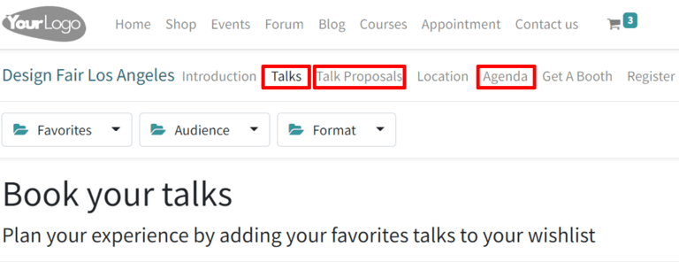
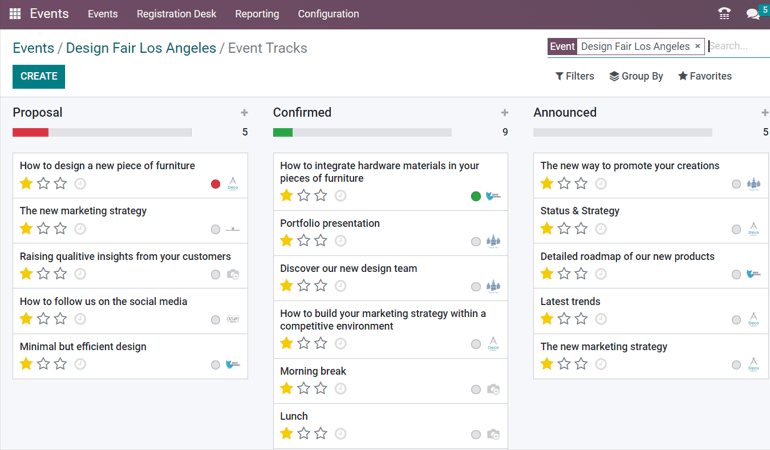
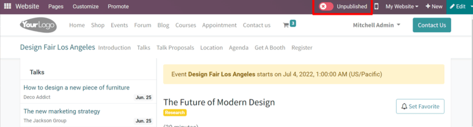
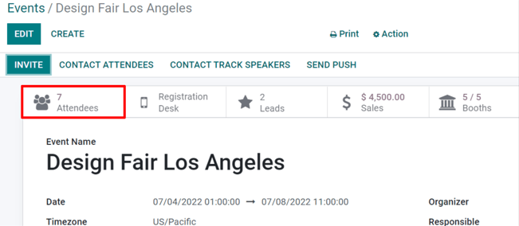
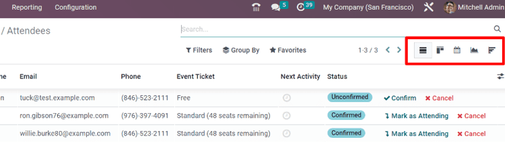
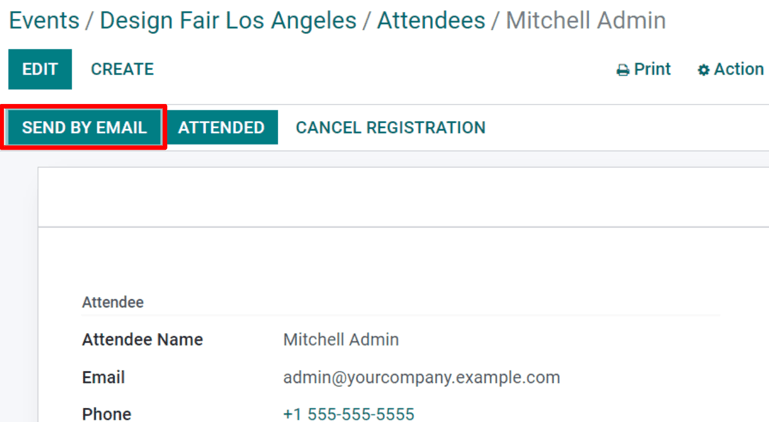
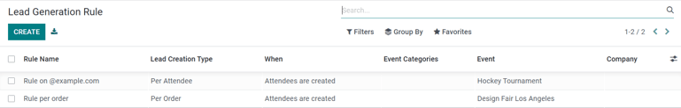
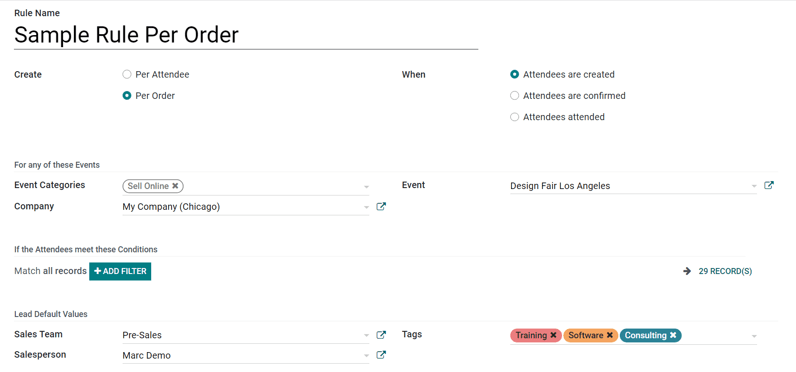

======================
Track and manage talks
======================

With Odoo Events, it's possible to provide attendees with the power to propose presenters to speak
at events.

Configuration
=============

First, go to :menuselection:`Events --> Configuration --> Settings` and enable :guilabel:`Schedule &
Tracks`.

When that feature is enabled, two more options become available: *Live Broadcast* and *Event
Gamification*.

:guilabel:`Live Broadcast` allows for the airing of tracks online through a YouTube integration.

:guilabel:`Event Gamification` allows for the sharing of a quiz with your attendees, once a track
(talk) is over.

.. tip::
   :guilabel:`Event Gamification` isn't necessary for tracks to appear on the event page on the
   website, but it can enhance the engagement and overall enjoyablity of the event for attendees.

Talks, talk proposals, and agenda
=================================

Once those two features are enabled, the following links are automatically added to the sub-header
menu, located on the event page on the website: :guilabel:`Talks`, :guilabel:`Talk Proposals`, and
:guilabel:`Agenda`. Any attendee can freely access these menu items and their corresponding content.

The :guilabel:`Talks` link takes the attendee to a page full of all the talks for that event.

The :guilabel:`Talks Proposals` link takes the attendee to a form page, where they can propose
talks for the event.

The :guilabel:`Agenda` link takes the attendee to a page with all the talks for the event, but in a
calendar/time-slot format.

Manage talk proposals
=====================

When attendees fill out and submit a talk proposal form on the website, a new :guilabel:`Proposal`
is instantly created in the back end for the event.

.. note::
   All talks (Proposals, Confirmed, Announced, etc.) are accessible via the :guilabel:`Tracks`
   smart button on the event form.

If a proposal is accepted, move the :guilabel:`Event Track` to the appropriate stage in the Kanban
view (e.g. `Confirmed`, etc.). Then, go to that particular event's template form, and click the
:guilabel:`Go to Website` smart button to reach that specific talk's page on the website.

In the upper right corner, toggle the switch from :guilabel:`Unpublished` to :guilabel:`Published`,
and the talk is instantly accessible on the website.

.. note::
   Without publishing a talk, attendees will never be able to access it.

Attendees list and attendance
-----------------------------

Once attendees have registered for a specific event, they are added to the :guilabel:`Attendee List`
for that event, which is accessible via the :guilabel:`Attendees` smart button on the event template
form, or :menuselection:`Reporting --> Attendees` and sorted by event.

.. note::
   When an attendee arrives at the event, they will be marked as attending (:guilabel:`Confirmed
   Attendance`), and the status of that attendee will change to :guilabel:`Attended.`

When analyzing an :guilabel:`Attendees list`, Odoo provides different ways to view the information.
Each view option presents the same information, but in a slightly different layout. To change the
view, click on the icons in the upper right hand of the screen.

In the :guilabel:`Kanban` view, it can be confirmed whether the attendees have already paid or
remain unpaid.

The :guilabel:`List` view provides information in a more traditional list formation.

The :guilabel:`Calendar` view provides a clear schedule visualization of which attendees are
arriving on specific dates of the event.

The :guilabel:`Graph` view provides graphical representations of that event's attendees, along with
numerous filters and customizable measures for deeper analysis.

The :guilabel:`Cohort` view lays out attendee data to better analyze the number of registration
dates.

.. note::
   Tickets sold through sales orders validate attendees as soon as the quotation is confirmed.

Manage registrations
--------------------

Upon selecting an attendee, Odoo reveals that specific attendee's detail form.

From here, event badges can be sent manually, by selecting :guilabel:`Send By Email`. The
:guilabel:`Attendee` can also be marked as :guilabel:`Attended`, or the registration can be
canceled altogether via the :guilabel:`Cancel Registration` button.

         Events.

Lead Generation Rules
---------------------

With Odoo, leads can be generated from events.

To create and configure a :guilabel:`Lead Generation Rule` related to events, navigate to
:menuselection:`Events app --> Configuration --> Lead Generation`.

On the :guilabel:`Lead Generation Rule` page, every configured :guilabel:`Lead Generation Rule`
can be found, along with pertinent data related to those rules.

To create a new :guilabel:`Lead Generation Rule`, click :guilabel:`Create`, and fill out the
:guilabel:`Lead Generation Rule` form.

After naming the rule, configure *how* the lead should be created (either :guilabel:`Per Attendee`
or :guilabel:`Per Order`), and *when* they should be created, (when
:guilabel:`Attendees are created`, when :guilabel:`Attendees are confirmed`, or when
:guilabel:`Attendees attended` the event).

In the :guilabel:`For any of these Events` section, there are fields to attach this rule to any
specific event categories, company, and/or event. To add even more specificity to the rule, a
domain filter rule can be configured to ensure the rule only applies to a specific target audience
of attendees (found in the :guilabel:`If the Attendees meet these Conditions` section).

Lastly, in the :guilabel:`Lead Default Values` section, designate a :guilabel:`Lead Type`, then
assign it to a specific :guilabel:`Sales Team` (and/or :guilabel:`Salesperson`), and attach tags to
the rule, if necessary.
