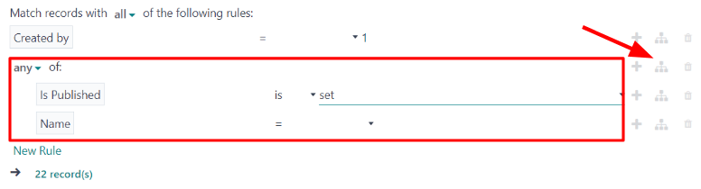

:show-content:
:hide-page-toc:

====================
Marketing Automation
====================

The Odoo *Marketing Automation* app automates a variety of marketing tasks by combining specific
rules and filters to generate timed actions. Instead of manually having to build each stage of a
campaign (like a series of timed massmails), the *Marketing Automation* app allows marketers to
build the entire campaign, and all of its stages, in one place---on one dashboard.

.. seealso::
   `Odoo Tutorials: Marketing <https://www.odoo.com/slides/marketing-27>`_

Campaign configuration
======================

To create a new automated marketing campaign, navigate to :menuselection:`Marketing Automation app
--> New` to reveal a blank campaign form.

.. image:: marketing_automation/blank-marketing-campaign-form.png
   :align: center
   :alt: A blank marketing automation campaign form in Odoo Marketing Automation application.

After entering a name for the marketing campaign, configure the target audience in the remaining
fields.

A target audience can be configured by entering specific criteria for Odoo to use when determining
to whom this marketing automation campaign should be sent.

In the :guilabel:`Target` field, use the drop-down menu to choose which model the target audience
filters should be based on (e.g. :guilabel:`Contact`, :guilabel:`Lead/Opportunity`,
:guilabel:`Sales Order`, etc.).

Select :guilabel:`Search More...` from the drop-down menu to reveal a :guilabel:`Search: Target`
pop-up window containing all of the available targeting options.

Once a :guilabel:`Target` is selected, there's a :guilabel:`Unicity based on` field. This field is
used to avoid duplicates based on the model chosen in the :guilabel:`Target` field.

.. example::
   If :guilabel:`Customers` is chosen as the :guilabel:`Target`, select :guilabel:`Email` in the
   :guilabel:`Unicity based on` field so Odoo only processes one record for each customer email
   address.

Select :guilabel:`Search More...` from the :guilabel:`Unicity based on` drop-down menu to reveal all
available options in a pop-up window.

Last on the campaign form is the :guilabel:`Filter` field. This is where more specific targeting
options can be layered into the campaign to further narrow the number and type of recipients that
receive the marketing automation material.

If left alone, the :guilabel:`Filter` field reads: :guilabel:`Match all records`. That means Odoo
uses the :guilabel:`Target` and :guilabel:`Unicity based on` fields to determine who the recipients
will be. The number of recipients is represented beneath as :guilabel:`record(s)`.

Campaign filter rules
---------------------

To add a more specific filter to a marketing automation campaign, click the :guilabel:`Add
condition` button in the :guilabel:`Filter` field. Doing so reveals a series of other configurable
filter rule fields.

In the rule fields, customizable equations can be configured for Odoo to use when filtering who to
include or exclude in this specific marketing campaign.

.. image:: marketing_automation/filter-node-equation-fields.png
   :align: center
   :alt: How the filter rule equation fields look in Odoo Marketing Automation campaigns.

.. note::
   :guilabel:`Records` refer to contacts in the system that fit the specified criteria for a
   campaign.

Also, once :guilabel:`Add condition` is clicked, the ability to :guilabel:`Save as Favorite Filter`
becomes available on the campaign form.

There is also the option to match records with :guilabel:`all` or :guilabel:`any` of the rules
configured in the :guilabel:`Filter` field.

To choose either of those options, click :guilabel:`all` from the middle of the sentence
":guilabel:`Match records with all of the following rules`" to reveal a drop-down menu with those
options.

.. image:: marketing_automation/match-all-any-rules-drop-down.png
   :align: center
   :alt: Match records with all or any of the rules in Filter field for marketing campaigns.

When the first field of the rule equation is clicked, a nested drop-down menu of options appears on
the screen where specific criteria is chosen based on needs of the campaign.

The remaining fields on the rule equation further define the criteria, which is used to determine
which records in the database to include or exclude in the execution of the campaign.

To add another rule, either click the :guilabel:`➕ (plus sign)` icon to the right of the filtering
rule, or click :guilabel:`New Rule` beneath the rule equation fields. When either are clicked, a new
series of rule fields appears.

To add a branch of multiple rules at the same time, click the :guilabel:`branch` icon, located to
the right of the :guilabel:`➕ (plus sign)` icon. When clicked, two additional sub-rule equation
fields appear beneath the initial rule.

There is also the option to have the filter apply to :guilabel:`any` or :guilabel:`all` of the
configured branch rules.

For further information on marketing automation campaign filter configuration, refer to the
:doc:`marketing_automation/target_audience` documentation.

.. seealso::
   - :doc:`marketing_automation/target_audience`
   - :doc:`marketing_automation/workflow_activities`
   - :doc:`marketing_automation/testing_running`
   - :doc:`marketing_automation/understanding_metrics`

.. toctree::
   :titlesonly:

   marketing_automation/target_audience
   marketing_automation/workflow_activities
   marketing_automation/testing_running
   marketing_automation/understanding_metrics
