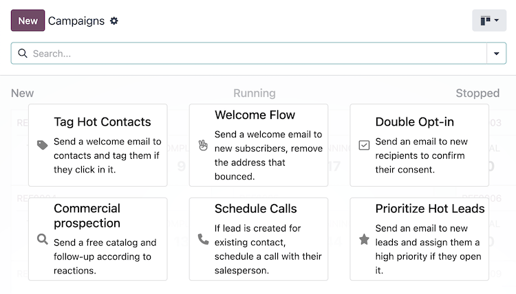

:show-content:

====================
Marketing Automation
====================

The Odoo *Marketing Automation* application enables users to create dynamic campaigns with actions
that automatically occur within a defined duration, such as sending a series of timed mass emails or
engaging with leads based on their interactions with marketing campaigns.

While the application is designed to be user-friendly for quickly creating, launching, and reviewing
marketing campaigns, it also provides advanced features to automate repetitive tasks throughout the
database.

Get started by creating a :ref:`new campaign from scratch <marketing_automation/campaigns>` or start
with a :ref:`campaign template <marketing_automation/campaign-templates>`.

.. seealso::
   `Odoo Tutorials: Marketing <https://www.odoo.com/slides/marketing-27>`_

.. cards::

   .. card:: Audience targeting
      :target: marketing_automation/target_audience

      Configure the target audience for a campaign.

   .. card:: Workflow activities
      :target: marketing_automation/workflow_activities

      Define the activities that occur within a campaign.

   .. card:: Testing/running campaigns
      :target: marketing_automation/testing_running

      Launch a test or run a campaign.

   .. card:: Campaign metrics
      :target: marketing_automation/understanding_metrics

      Review the metrics of a campaign.

Configuration
=============

To install the *Marketing Automation* application, navigate to the :menuselection:`Apps application`
and search for `Marketing Automation`.

In the list of results, click the :guilabel:`Activate` button on the :guilabel:`Marketing
Automation` application to install it.

.. important::
   Installing the *Marketing Automation* application also installs the :doc:`Email Marketing
   <email_marketing>` app, as most features of Odoo *Marketing Automation* are dependent on that
   specific application.

   Additionally, install the :doc:`CRM <../sales/crm>` and :doc:`SMS Marketing <sms_marketing>`
   applications to access *all* of the features available in *Marketing Automation*.

   The following documentation assumes that all three of these dependent applications are installed
   on the database.

.. _marketing_automation/campaigns:

Campaigns
=========

A *campaign* refers to a workflow of activities that are automatically executed to a target
audience, based on predefined filters, triggers, and durations of activities.

A new campaign can be created from scratch or from a :ref:`template
<marketing_automation/campaign-templates>`.

To create a campaign, navigate to the :menuselection:`Marketing Automation` application, from the
main Odoo dashboard, to open the :guilabel:`Campaigns` dashboard. From here, click the
:guilabel:`New` button to reveal a new campaign form.

.. _marketing_automation/campaign-templates:

Campaign templates
------------------

Odoo provides six campaign templates to help users get started. The campaign template cards **only**
display when there are no existing campaigns in the database. Once a campaign has been created, the
template cards on the *Campaigns* dashboard are replaced with a Kanban view of the existing
campaigns.

To get started with a template, navigate to the :menuselection:`Marketing Automation` application,
from the main Odoo dashboard, to open the :guilabel:`Campaigns` dashboard, which displays six
:doc:`campaign template <marketing_automation/campaign_templates>` cards:

- | :guilabel:`🏷️ Tag Hot Contacts`
  | :guilabel:`Send a welcome email to contacts and tag them if they click it.`
- | :guilabel:`✌️ Welcome Flow`
  | :guilabel:`Send a welcome email to new subscribers, remove the address that bounced.`
- | :icon:`fa-check-square` :doc:`Double Opt-in
    <marketing_automation/campaign_templates/double_optin>`
  | :guilabel:`Send an email to new recipients to confirm their consent.`
- | :guilabel:`🔍 Commercial prospection`
  | :guilabel:`Send a free catalog and follow-up according to reactions.`
- | :guilabel:`📞 Schedule Calls`
  | :guilabel:`If a lead is created for existing contact, schedule a call with their salesperson.`
- | :guilabel:`⭐️ Prioritize Hot leads`
  | :guilabel:`Send an email to new leads and assign them a high priority if they open it.`

These templates are designed to be used as starting points for creating new campaigns. Click one of
the template cards to open the campaign form.

.. tip::
   To display the campaign template cards again after a campaign has been created, type the name of
   a campaign that does **not** exist in the database into the :guilabel:`Search...` bar, then press
   :kbd:`Enter`.

   For example, searching for `empty` displays the campaign template cards again, as long as there
   is not a campaign with the name "empty" in the database.

Targets and filters
===================

On the campaign form, the :guilabel:`Target` and :guilabel:`Filter` section, also referred to as the
domain, contains the fields used to define the target audience for the campaign's reach (i.e.,
the unique contact records in the database).

The target audience specifies the type of records available for use in the campaign, such as
*Lead/Opportunity*, *Event Registration*, *Contact*, and more.

Records
-------

The contacts in the system that fit the specified criteria for a campaign are referred to as
*records*.

The number of records that are displayed next to the campaign :guilabel:`Filter` represent the total
number of records the campaign is targeting.

Participants
------------

The records that are engaged by the campaign are referred to as *participants*.

The number of participants engaged in a test run are shown in the *Tests* smart button, which
displays on the top of the campaign form after a test has been run.

The number of participants engaged in a running, or stopped, campaign are shown in the
*Participants* smart button at the top of the campaign form.

.. seealso::
   :doc:`Audience targeting <marketing_automation/target_audience>`

Workflow
========

A *workflow* consists of an activity, many activities, or a sequence of activities organized in a
campaign. A campaign's workflow is defined in the :guilabel:`Workflow` section of the campaign form.

Activities
----------

*Activities* are the methods of communication or server actions, organized in a workflow, that are
executed within a campaign. Once running, each activity displays the number of participants that
are engaged by the activity as *Success* and *Rejected* counts.

To create one of the following activities, click :guilabel:`Add new activity` in the
:guilabel:`Workflow` section of the campaign form:

- :ref:`Email <marketing_automation/email-activity-type>`: an email that is sent to the target
  audience.
- :ref:`Server action <marketing_automation/sa-activity-type>`: an internal action within the
  database that is executed.
- :ref:`SMS <marketing_automation/sms-activity-type>`: a text message that is sent to the target
  audience.

.. seealso::
   :doc:`marketing_automation/workflow_activities`

Testing and running
===================

Once a campaign has been created, it can be tested to ensure the workflow is functioning as
expected, to check for errors, and correct any mistakes before it reaches its target audience.

After testing, the campaign can be launched to start engaging the target audience. The campaign can
also be launched *without* testing, if the user is confident in the workflow.

.. seealso::
   :doc:`marketing_automation/testing_running`

Reporting
=========

A range of reporting metrics are available to measure the success of each campaign. Navigate to
:menuselection:`Marketing Automation app --> Reporting` to access the following menu options:

- :guilabel:`Link Tracker`: displays the metrics of links to track the number of clicks.
- :guilabel:`Traces`: displays the results of all activities from all campaigns.
- :guilabel:`Participants`: displays an overview of the participants of all campaigns.

Additionally, each activity within the workflow of a campaign displays its engagement metrics.

.. seealso::
   :doc:`marketing_automation/understanding_metrics`

.. toctree::
   :titlesonly:

   marketing_automation/target_audience
   marketing_automation/workflow_activities
   marketing_automation/testing_running
   marketing_automation/understanding_metrics
   marketing_automation/campaign_templates
