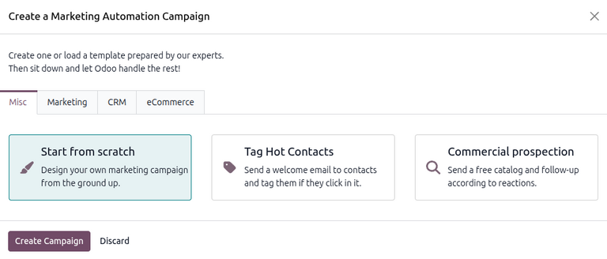

:show-content:

====================
Marketing Automation
====================

Use the Odoo **Marketing Automation** application to create dynamic campaigns with actions that
automatically occur within a defined duration, such as sending a series of timed mass emails or
engaging with leads based on their interactions with marketing campaigns.

While the application is designed to be user-friendly for creating, launching, and reviewing
marketing campaigns, it also provides advanced features to automate repetitive tasks throughout the
database.

.. seealso::
   - `Odoo Tutorials: Marketing <https://www.odoo.com/slides/marketing-27>`_
   - `Magic Sheet - Marketing Automation [PDF]
     <https://drive.google.com/drive/folders/1MMMGcYIG1tm160jC2JaXVc_D5b6x3cJd>`_

.. cards::

   .. card:: Audience targeting
      :target: marketing_automation/target_audience

      Configure the target audience for a campaign.

   .. card:: Workflow activities
      :target: marketing_automation/workflow_activities

      Define the activities that occur within a campaign.

   .. card:: Testing/running campaigns
      :target: marketing_automation/testing_running

      Launch a test or run a campaign.

   .. card:: Campaign metrics
      :target: marketing_automation/understanding_metrics

      Review the metrics of a campaign.

.. _marketing_automation/marketing_automation/configuration:

Configuration
=============

To begin, make sure the **Marketing Automation** application is :ref:`installed <general/install>`.

.. important::
   Installing the **Marketing Automation** application also installs the :doc:`Email Marketing
   <email_marketing>` app, as most features of Odoo **Marketing Automation** are dependent on that
   specific application.

   Additionally, install the :doc:`CRM <../sales/crm>` and :doc:`SMS Marketing <sms_marketing>`
   applications to access *all* of the features available in **Marketing Automation**.

   The following documentation assumes that all three of these dependent applications are installed
   on the database.

.. _marketing_automation/marketing_automation/campaigns:

Campaigns
=========

A *campaign* refers to a :ref:`workflow <marketing_automation/marketing_automation/workflow>` of
activities that are automatically executed to a target audience based on customizable filters,
triggers, and durations of activities.

To access a dashboard of marketing campaigns, navigate to :menuselection:`Marketing Automation app
--> Campaigns`. By default, the dashboard displays a :icon:`oi-view-kanban` :guilabel:`(Kanban)`
view, staged by *New*, *Running*, or *Stopped* campaigns.

To create a campaign, navigate to the :menuselection:`Marketing Automation` application and click
:guilabel:`New`. On the *Create a Marketing Automation Campaign* pop-up window, select a
:ref:`campaign template <marketing_automation/marketing_automation/campaigns/campaign-templates>` or
select :icon:`fa-paint-brush` :guilabel:`Start from scratch` to :ref:`create one from scratch
<marketing_automation/marketing_automation/campaigns/create-campaign>`.

Then, click :guilabel:`Create Campaign` to customize the campaign form.

.. _marketing_automation/marketing_automation/campaigns/create-campaign:

Create a campaign from scratch
------------------------------

On the new campaign form, enter a :guilabel:`Name` for the campaign.

The :guilabel:`Target`, :guilabel:`Unicity based on`, and :guilabel:`Filter` can be modified to
specify the target for the audience.

Finally, below the form, click :guilabel:`Add new activity` to add an activity in the campaign
:ref:`workflow <marketing_automation/marketing_automation/workflow>`.

.. seealso::
   For specific information about defining target audiences and activities, see the following
   documentation:

   - :doc:`marketing_automation/target_audience`
   - :doc:`marketing_automation/workflow_activities`

.. _marketing_automation/marketing_automation/campaigns/campaign-templates:

Campaign templates
------------------

Odoo provides the following campaign templates to help users get started.

Misc
~~~~

- :icon:`fa-paint-brush` :ref:`Start from scratch
  <marketing_automation/marketing_automation/campaigns/create-campaign>`: Design your own marketing
  campaign from the ground up.
- :icon:`fa-tag` :guilabel:`Tag Hot Contacts`: Send a welcome email to contacts and tag them when
  they click it.
- :icon:`fa-search` :guilabel:`Commercial prospection`: Send a free catalog and follow-up according
  to reactions.

Marketing
~~~~~~~~~

- :icon:`fa-hand-peace-o` :guilabel:`Welcome Flow`: Send a welcome email to new subscribers, and
  remove the address that bounced.
- :icon:`fa-check-square` :doc:`Double Opt-in
  <marketing_automation/campaign_templates/double_optin>`: Send an email to new recipients to
  confirm their consent.

CRM
~~~

- :icon:`fa-phone` :guilabel:`Scheduled Calls`: If lead is created for an existing contact, schedule
  a call with their salesperson.
- :icon:`fa-star` :guilabel:`Prioritize Hot Leads`: Send an email to new leads and assign them a
  high priority if they open it.

eCommerce
~~~~~~~~~

- :icon:`fa-birthday-cake` :guilabel:`Anniversary Discount`: Celebrate contacts that registered one
  year ago.
- :icon:`fa-shopping-cart` :guilabel:`Purchase Follow-up`: Send an email to customers that bought a
  specific product after their purchase.
- :icon:`fa-star` :guilabel:`Create Repeat Customers`: Turn one-time visitors into repeat buyers.

.. _marketing_automation/marketing_automation/workflow:

Workflow
========

A *workflow* consists of an activity, many activities, or a sequence of activities organized in a
campaign. A campaign's workflow is defined in the section below the campaign form.

.. _marketing_automation/marketing_automation/workflow/activities:

Activities
----------

*Activities* are the methods of communication or server actions, organized in a workflow, that are
executed within a campaign. Once running, each activity displays the number of participants that are
engaged by the activity as *Success* and *Rejected* counts.

To create one of the following activities, click :guilabel:`Add new activity` and configure the
activity.

.. seealso::
   See the :doc:`marketing_automation/workflow_activities` documentation for more information about
   configuring activities.

.. _marketing_automation/marketing_automation/testing-running:

Testing and running
===================

Once a campaign has been created, it can be tested to ensure the workflow is functioning as
expected, to check for errors, and correct any mistakes before it reaches its target audience.

After testing, the campaign can be launched to start engaging the target audience. The campaign can
also be launched *without* testing if the user is confident in the workflow.

.. seealso::
   See the :doc:`marketing_automation/testing_running` documentation for more information about
   testing campaigns.

.. _marketing_automation/marketing_automation/reporting:

Reporting
=========

A range of reporting metrics are available to measure the success of each campaign. Navigate to
:menuselection:`Marketing Automation app --> Reporting` to access the following menu options:

- :guilabel:`Link Tracker`: Track the number of clicks through links.
- :guilabel:`Traces`: Track the status of all activities across all campaigns.
- :guilabel:`Participants`: Track participant metrics across all campaigns.

Additionally, each activity within the workflow of a campaign displays its engagement metrics.

.. seealso::
   See the :doc:`marketing_automation/understanding_metrics` documentation for more information
   about tracking campaign metrics.

.. toctree::
   :titlesonly:

   marketing_automation/target_audience
   marketing_automation/workflow_activities
   marketing_automation/testing_running
   marketing_automation/understanding_metrics
   marketing_automation/campaign_templates
