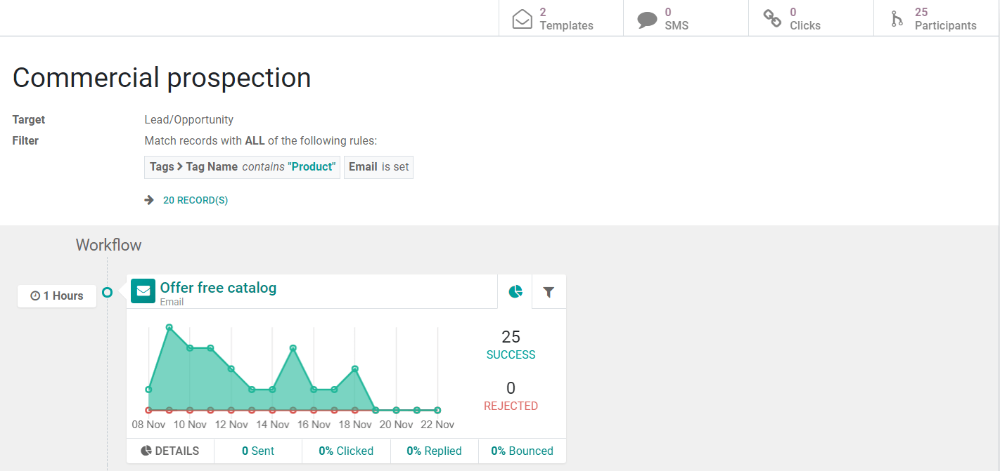

=====================
Understanding Metrics
=====================
Metrics are values that help you measure progress and can be a powerful way of linking your
employees to goals.

| When you create a workflow in Odoo, its visual content already shows metrics in a graph form and
  in numbers.
| Let’s consider the example below:

| The *Target* - business object - is *Lead/Opportunity* and was narrowed down to the ones whose
  *Tag Name* contain the description “Product”, and have an email address set.
| A total number of 20 records match the criteria.

.. image:: understanding_metrics/metrics2.png
   :align: center
   :alt: Metrics in Odoo Marketing Automation

Out of those 20 records, 25 have become participants, in other words, they have matched the criteria.

.. image:: understanding_metrics/metrics3.png
   :align: center
   :alt: Metrics in Odoo Marketing Automation

Every time the system runs, updating numbers and triggering actions, it will look at the *Target*
model and check if new records have been added or modified, keeping the flow up-to-date.

.. note::
   The filter here is applied to *all* activities. Leads that lose the tag in the meantime will be
   excluded from later activities.

*Records* is a real-time number, therefore while the workflow is running, changes in opportunity
records can be made - delete, add, adjustment - updating the number of records, but not changing the
number of participants, as the metric *will not* exclude opportunities that have been set as
participants before. It will just add new ones. For this reason, the number of *Records* can be
different from the number of *Participants*.

.. tip::
   | You can also have filters applied to activities individually, under *Domain*. A useful feature
     to specify an individual filter that will only be performed if the records satisfied both
     filters, the activity and its domain one.
   | Example: for an activity sending an SMS, you could make sure a phone number is set to
     avoid triggering a SMS that would never be sent and crash.

   .. image:: understanding_metrics/metrics4.png
      :align: center
      :alt: Metrics in Odoo Marketing Automation

| *Success* is the number of times the searching for participants - that match the filter(s) of that
  activity - was performed successfully in relation to the total number of participants.
| If a participant does not match the conditions, it will be added to *Rejected*.

.. image:: understanding_metrics/metrics5.png
   :align: center
   :alt: Metrics in Odoo Marketing Automation

Hovering over the graph, you can see the number of successful and rejected participants, per day,
for the last 15 days.

.. note::
   Every time a new record is added to the *Target* model, it will be automatically added to the
   workflow, and, it will start the workflow from the beginning (parent action).