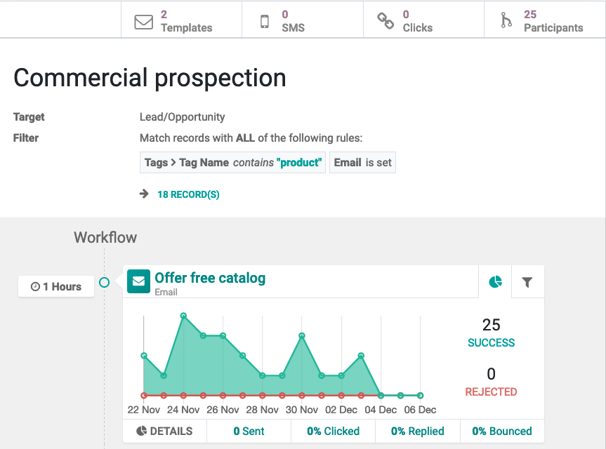
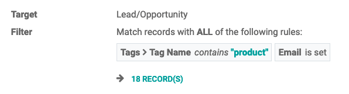
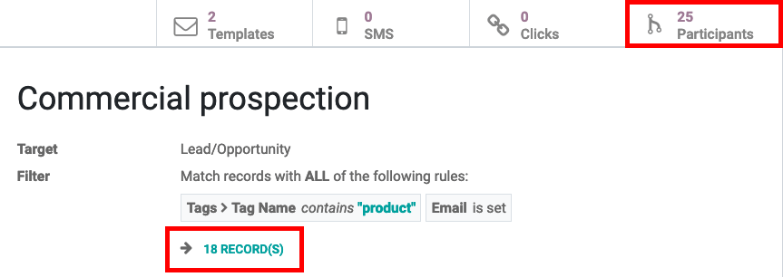
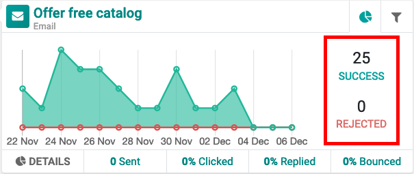

=====================
Understanding metrics
=====================

Metrics are detailed statistics that measure the progress (and success) of marketing campaigns.
When creating marketing activities in a workflow, Odoo will visually display various metrics
related to the campaign with graphs and data.

Consider the following example:

In this case, the :guilabel:`Target` of this campaign is set to :guilabel:`Lead/Opportunity` and
was narrowed down to only focus on the Leads (or Opportunities) whose :guilabel:`Tag Name` contain
a value of `product` and they *also* have an email address set up in the database.

Beneath the filter nodes, Odoo will display how many records in the database fall into the
previously-specified criteria filter. In this example, there are 18 records in the database that
match the criteria.

At the top of the marketing automation form, there are a series of smart buttons. The
:guilabel:`Participations` smart button in this example indicates that, out of those 18 records, 25
have become participants. In other words, they have matched the criteria, and have already
interacted with the campaign in one way or another.

.. note::
   :guilabel:`Records` represent a real-time number. Therefore, while the workflow is running,
   changes in opportunity records (deletions, additions, adjustments) may occur. This means there
   will be real-time updates to the number of :guilabel:`Records`, but such updates do *not* change
   the number of :guilabel:`Participants`, as the metric *will not* exclude opportunities that have
   already been set as :guilabel:`Participants` before - Odoo will just add new ones. That's why
   the number of :guilabel:`Records` can be different from the number of :guilabel:`Participants`
   from time to time.

Whenever the system runs, updating numbers and triggering actions, it will look at the
:guilabel:`Target` model, and check if new :guilabel:`Records` have been added (or modified),
which always keeps the flow up-to-date.

.. note::
   The filter here is applied to *all* activities. Leads that lose that specific :guilabel:`Tag`
   in the meantime will be excluded from later activities.

.. tip::
   Filters can also be applied to individual activities, in the :guilabel:`Domain` section of the
   activity pop-up form. Use this feature to specify an individual filter that will only be
   performed if the records satisfy *both* filter criteria - the activity filter and its specific
   domain filter.

   (*Example*: when configuring an SMS activity, make sure a certain phone number is set,
   in order to avoid triggering a SMS that would never be sent.)

   .. image:: understanding_metrics/individual-filter-to-activity.png
      :align: center
      :alt: A relevant targeting filter that applies to a type of individual activity.

:guilabel:`Success` represents the number of times the searching for participants - who match the
criteria filter(s) of that activity - was performed successfully, in relation to the total number
of participants. If a participant does *not* match the conditions, it will be added to
:guilabel:`Rejected`.

Hovering over the graph, Odoo displays the number of successful and rejected participants, per day,
over the last 15 days.

.. note::
   Whenever a new record is added to the :guilabel:`Target` model, it will automatically be added
   to the workflow, and it will start the workflow from the beginning (:guilabel:`Parent Action`).
