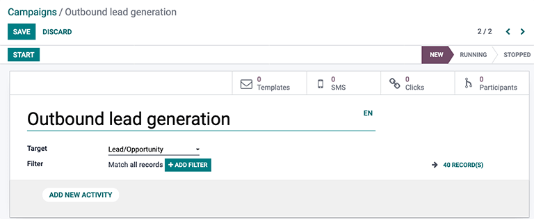
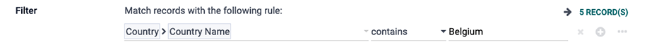

===============
Getting started
===============

The Odoo *Marketing Automation* app automates a variety of marketing tasks, by combining specific
rules and filters to generate timed actions. Instead of manually having to build each stage of a
campaign (such as a series of timed massmails), the *Marketing Automation* app allows marketers to
build the entire campaign, and all of its stages, in one place on a single dashboard.

Create a campaign
=================

To create a new automated marketing campaign, open the :menuselection:`Marketing Automation` app,
and click the :guilabel:`Create` button in the upper-left corner. Doing so reveals a blank marketing
automation campaign detail form on a separate page.

On the blank marketing automation campaign page, the following smart buttons and fields are
available:

**Smart buttons**

- :guilabel:`Templates`: represents the number of pre-configured mail templates being used in this
  particular campaign. (Templates can always be created on-the-fly, as well).
- :guilabel:`SMS`: represents the number of personalized SMS messages connected to this campaign.
- :guilabel:`Clicks`: represents the number of times attached links have been clicked by recipients
  of this campaign.
- :guilabel:`Participants`: represents the number of contacts that have directly participated in
  this campaign.

**Fields**

- :guilabel:`Name`: represents the name of the marketing automation campaign being created.
- :guilabel:`Target`: this field is a drop-down menu to choose which model is targeted by this
  campaign (i.e., by Contacts, Sales Order, Lead/Opportunity, etc.).
- :guilabel:`Filter`: this field provides numerous configurable criteria that can be used to further
  narrow down the target recipients/audience for the marketing automation campaign.

Campaign filters
================

To add a :guilabel:`Filter` to the target audience, click :guilabel:`Add Filter`, and a node field
appears. In the node field, a custom equation can be configured for Odoo to use when filtering who
to include (and exclude) in this specific marketing campaign.

When the first field of the node is clicked, a nested drop-down menu of options appears on the
screen, wherein specific criteria is chosen based on needs of the campaign. The remaining fields on
the node further define the criteria determining which records to include (or exclude) in the
execution of the campaign.

To add another node, click the :guilabel:`➕ (plus sign)` icon to the right of the filtering rule. To
add a branch of multiple nodes at the same time, click the :guilabel:`⋯ (ellipses)` icon.

For further information on filters, refer to :doc:`this documentation page
</applications/marketing/marketing_automation/getting_started/target_audience>`.

.. note::
   :guilabel:`Records` represent the number of contacts in the system that fit the specified
   criteria for a campaign.

.. seealso::
   - :doc:`/applications/marketing/marketing_automation/getting_started/testing_running`
   - :doc:`/applications/marketing/marketing_automation/getting_started/workflow_activities`
