=======================
Target audience filters
=======================

When trying to grow a business, it is paramount for companies to send marketing campaigns to the
*right* audience.

The Odoo *Marketing Automation* application helps marketers to do just that by providing detailed
target audience filtering tools, which can be as simple or as complex as necessary, to reach the
right customers at the right time.

Configure target filters
========================

The following is working off basic marketing automation campaign information covered in the
:doc:`marketing automation campaigns documentation <first_campaign>`.

First, it should be noted that, if the :guilabel:`Filter` field is left alone, the field reads:
:guilabel:`Match **all records**`. That means Odoo uses the models specified in the
:guilabel:`Target` and :guilabel:`Unicity based on` fields to determine who the campaign recipients
will be. The number of recipients is represented beneath as :guilabel:`record(s)`.

If a detailed campaign audience filter is desired, click :guilabel:`Add condition` to reveal three
configurable filter rule fields in an equation-like format.

.. note::
   When target filter rules are created, the option to match records with :guilabel:`all` or
   :guilabel:`any` of the rules configured in the :guilabel:`Filter` field becomes available.

   To choose either of those options, click the default :guilabel:`all` from the middle of the
   sentence, ":guilabel:`Match records with **all** of the following rules:`". Then, select the
   desired option. This option can be changed/modified at any time.

Clicking the first field of that equation-like format reveals a mini pop-up window containing all
the options to choose from.

Some options in the various drop-down menus of the rule equation fields have an :guilabel:`>
(arrow)` icon beside them. The :guilabel:`> (arrow)` icon means that particular filter has more
refined parameters *within* it that can be customized.

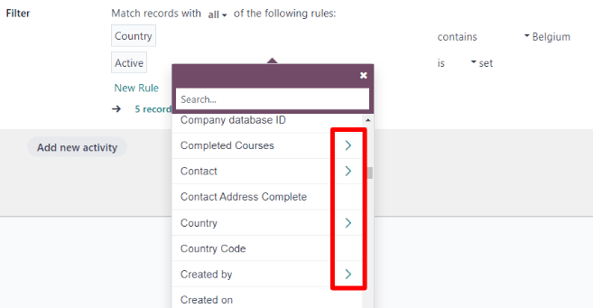

When those are clicked, a different page of the same pop-up window appears, in which futher, more
detailed configurations based on the initial rule field option can be made.

Filters can also be extended by adding additional rules or rule branches.

To add another rule, either click the :guilabel:`➕ (plus sign)` icon to the right of the filtering
rule. Or click :guilabel:`New Rule` beneath the rule equation fields. When either are clicked, a new
series of rule fields appears.

To add a branch of multiple rules at the same time, click the :guilabel:`branch` icon, located to
the right of the :guilabel:`➕ (plus sign)` icon. When clicked, two additional sub-rule equation
fields appear beneath the initial rule.

To delete a rule or branch of rules from the :guilabel:`Filter` field, click the :guilabel:`🗑️
(trash icon)`.

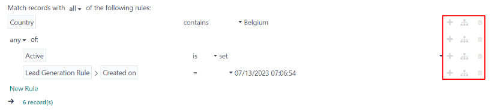

Target audience use cases
=========================

The following scenarios outline different combinations of common filters a marketing campaign might
use.

Scenario #1: Target new opportunities in the pipeline
-----------------------------------------------------

To configure a marketing campaign to target new opportunities in the pipeline, begin by opening a
new, blank campaign detail form by navigating to :menuselection:`Marketing Automation app --> New`.

On the campaign detail form, give the campaign a title similar to accurately reflect its intentions
of targeting new opportunities in the pipeline.

Then, click the :guilabel:`Target` field drop-down menu, and select :guilabel:`Search More...` to
reveal a :guilabel:`Search: Target` pop-up window, containing 155 different target options.

On this pop-up window, search for :guilabel:`Lead/Opportunity` and select it.

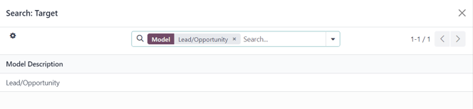

Next, since this campaign is aimed at *new* opportunities (e.g. leads that recently appeared in the
pipeline), the :guilabel:`Unicity based on` field can be left blank, as there won't likely be any
duplicates to worry about.

However, if more specificity is desired, the :guilabel:`Is Won (crm.lead)` can be selected in the
:guilabel:`Unicity based on` field to ensure the campaign avoids any leads/opportunities that have
already been won.

To do that, click the empty :guilabel:`Unicity based on` field to reveal a drop-down menu, and
select :guilabel:`Search More...` to reveal a :guilabel:`Search: Unicity based on` pop-up window.

In that :guilabel:`Search: Unicity based on` pop-up window, search for `Is Won (crm.lead)` and
select it.

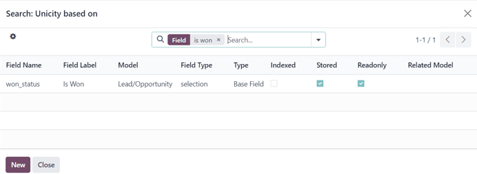

Next, click :guilabel:`Add condition` in the :guilabel:`Filter` field to reveal the filter rule
equation fields. In the first rule equation field, click the default :guilabel:`Country` option to
reveal a pop-up window of various model options to choose from. On that pop-up window, scroll down
to (or search for) :guilabel:`Type`, and select it.

Keep the second portion of the filter equation on the default :guilabel:`🟰 (equal sign)` icon.

Then, in the third portion of the filter rule equation, click the default :guilabel:`Lead` option to
reveal a mini drop-down menu. From that drop-down menu, select :guilabel:`Opportunity`, because this
specific campaign is focused on new opportunities in the pipeline.

.. note::
   The number of :guilabel:`Records` that fit this specific filter equation changes as the equation
   is customized.

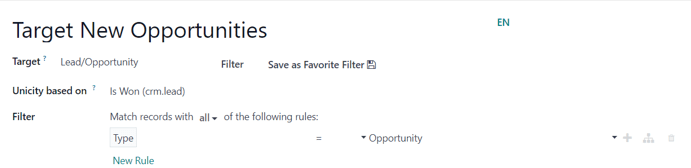

Now, add a new rule to the :guilabel:`Filter` field by clicking the :guilabel:`➕ (plus sign)` icon
to the right of the equation, or by clicking :guilabel:`New Rule` beneath the current filter rule.
Doing so reveals a fresh filter rule equation to be configured.

Remember, **new** opportunities are the target of this campaign, this second filter rule should
focus on *only* locating opportunities that are in the :guilabel:`New` stage of the pipeline.

To do that, click the default :guilabel:`Country` in the first field of the second filter rule
equation line to reveal a pop-up window containing all the model options, scroll down to (or search
for) :guilabel:`Stage`.

Then, select the :guilabel:`> (arrow)` icon beside :guilabel:`Stage` in the pop-up window, which
reveals a new sub-list in the same pop-up window, to add specificity to the previously selected
model.

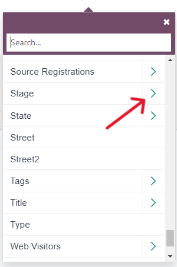

From this sub-list, scroll down to (or search for) :guilabel:`Stage Name`, and select it. Upon
selecting that, the pop-up window will disappear, and the first field in the second filter
equation rule reads: :guilabel:`Stage > Stage Name`.

In the second field of the second equation filter rule, the default :guilabel:`🟰 (equal sign)` icon
can stay. Or, if desired, the :guilabel:`🟰 (equal sign)` icon can be clicked to reveal a drop-down
menu of options. From that drop-down menu, select :guilabel:`contains`.

Again, both the :guilabel:`🟰 (equal sign)` icon and the :guilabel:`contains` option work equally
well in this scenario.

Lastly, in the third field of the second filter equation, type in `New`.

With that in place, the two :guilabel:`Filter` rules are configured for Odoo to only target
opportunities that are in the "New" stage of the pipeline, just as intended.

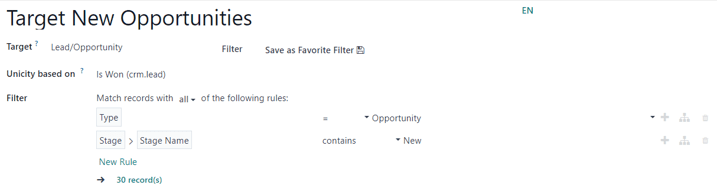

Scenario #2: Target event attendees who bought specific tickets
---------------------------------------------------------------

To configure a marketing campaign to target event attendees who bought specific tickets, begin by
opening a new, blank campaign detail form by navigating to :menuselection:`Marketing Automation app
--> New`.

On the campaign detail form, give the campaign a title similar to accurately reflect its intentions
of targeting new opportunities in the pipeline.

Then, click the :guilabel:`Target` field drop-down menu, and select :guilabel:`Search More...` to
reveal a :guilabel:`Search: Target` pop-up window, containing 155 different target options.

On this pop-up window, search for (or scroll to) `Event Registration` and select it.

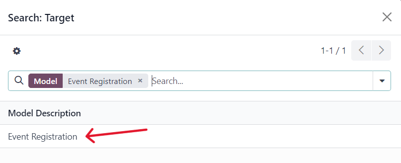

Next, to avoid sending duplicate communications to the same email address attached to an event
registration, click the :guilabel:`Unicity based on` field to reveal the drop-down menu, and select
:guilabel:`Search More...`. Doing so reveals a :guilabel:`Search: Unicity based on` pop-up window
containing all the possible options.

On that pop-up window, search for (or scroll to) `Email` and select it.

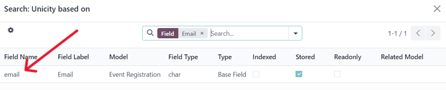

Then, click :guilabel:`Add condition` in the :guilabel:`Filter` field to reveal the filter rule
equation fields. In the first rule equation field, click the default :guilabel:`Booked by` option to
reveal a pop-up window of various model options to choose from. On that pop-up window, scroll down
to (or search for) :guilabel:`Event` and select it.

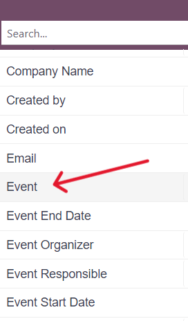

Next, click the default :guilabel:`🟰 (equal sign)` icon in the second field  of the filter equation.
This reveals a drop-down menu. From this drop-down menu, select :guilabel:`contains`.

In the third field of the filter equation, type in `Design`, since this campaign is aimed at
targeting people who attended the "Design Fair."

Then, add another rule to this filter, either by clicking the :guilabel:`➕ (plus sign)` icon to the
right of the equation, or by clicking :guilabel:`New Rule` beneath the first filter rule.

This second filter rule equation will focus on the specific type of ticket sold for the
previously-configured event, which was established in the first filter rule.

With that in mind, select the default :guilabel:`Booked by` option in the first field of the second
filter rule equation to reveal a pop-up menu. From this pop-up menu, scroll down to (or search for)
:guilabel:`Event Ticket`. Then, click the :guilabel:`> (arrow)` icon beside :guilabel:`Event
Ticket`.

Doing so reveals another sub-list on the same pop-up menu. From this sub-list pop-up menu, scroll
down to (or search for) :guilabel:`Name`, and select it.

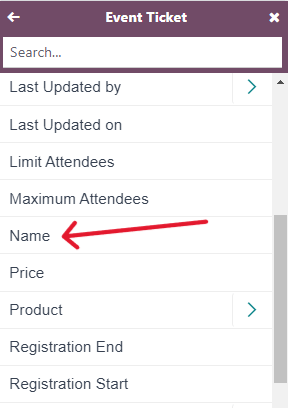

Selecting that removes the pop-up menu, and the first field of the second filter rule equation
reads: :guilabel:`Event Ticket > Name`.

In the second field of the second equation filter rule, the default :guilabel:`🟰 (equal sign)` icon
can stay. Or, if desired, the :guilabel:`🟰 (equal sign)` icon can be clicked to reveal a drop-down
menu of options. From that drop-down menu, select :guilabel:`contains`.

Again, both the :guilabel:`🟰 (equal sign)` icon and the :guilabel:`contains` option work equally
well in this scenario.

Lastly, in the third (and final) portion of the second filter equation, which is blank, type in the
name of the ticket type that should be used for the filter. In this case, `Standard` is the name of
the event ticket type for this sample filter.

With that in place, the campaign is aimed to target people who attended the Design Fair event, and
bought the specific "Standard" level ticket.

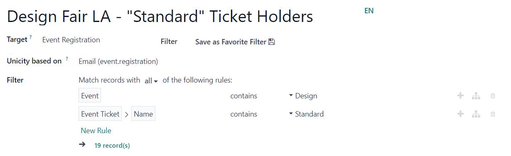

.. seealso::
   - :doc:`first_campaign`
   - :doc:`workflow_activities`
