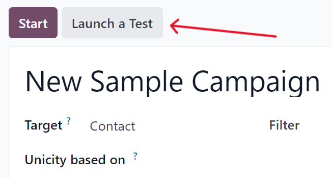
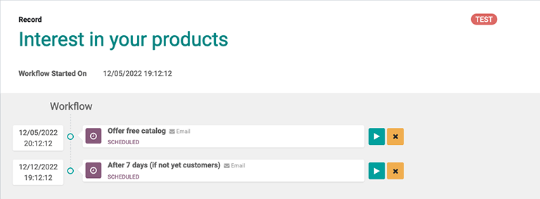
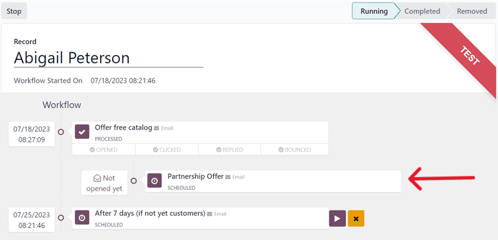

=========================
Testing/running campaigns
=========================

Odoo gives users the ability to test marketing campaigns (and mailings) before officially running
them.

First, open the :menuselection:`Marketing Automation` application, and select the desired campaign,
which reveals that campaign's detail form.

On the campaign detail form, make sure the campaign already has activities configured (or build a
campaign by following the directions here on :doc:`this documentation
</applications/marketing/marketing_automation/getting_started/workflow_activities>`).

To start a test, click the :guilabel:`Launch a Test` button at the top of the campaign form.

When clicked, a :guilabel:`Launch a test` pop-up window appears. In the drop-down field, choose an
existing record (or create a new one) to run the test on. To create a brand new record, click the
:guilabel:`Search More...` link at the bottom of the drop-down menu, and then click the
:guilabel:`Create` button.

Doing so reveals a blank contact form, in which the :guilabel:`Name` and :guilabel:`Email` **must**
be entered. When all the necessary information has been entered, click :guilabel:`Save`, and Odoo
returns to the :guilabel:`Launch a test` pop-up, with that new record in the :guilabel:`Choose an
existing record or create a new one to test` field.

Once a record is selected, click :guilabel:`Continue`, and Odoo reveals the campaign test page.

On the campaign test page, the name of the :guilabel:`Record` being tested is visible, along with
the precise time this test workflow was started in the :guilabel:`Workflow Started On` field.
Beneath that, in the :guilabel:`Workflow` section is the first activity (or activities) in the
workflow that's being tested.

To start a test, click the :guilabel:`Run` button, represented by a :guilabel:`▶️ (play button)`
icon beside the first activity in the workflow. When clicked, the page reloads, and Odoo shows the
various results (and analytics) connected to that specific activity as they occur, in real-time.

Once all the workflow activities are completed, the test will end, and move to the
:guilabel:`Completed` stage. To stop a test before all the workflow activities are completed, click
the :guilabel:`Stop` button in the upper-left corner of the campaign test page.
