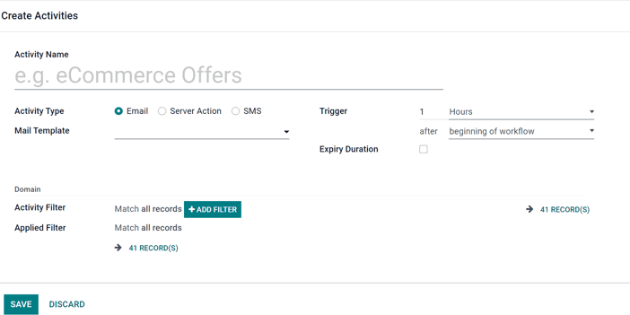
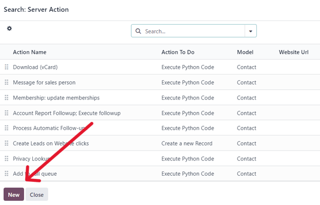
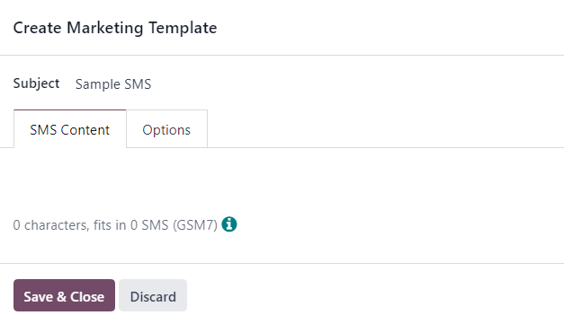
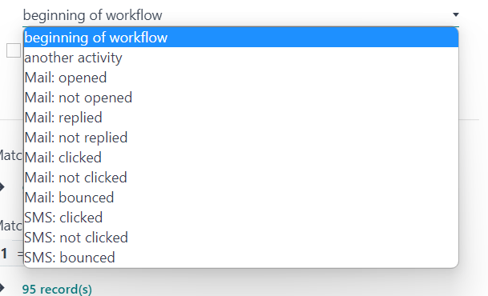
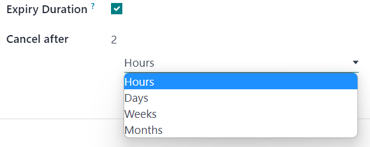
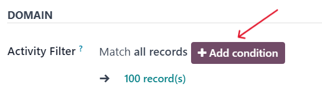
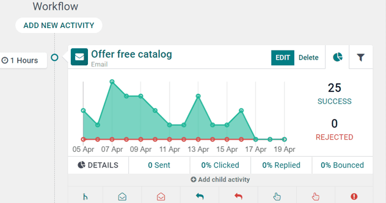
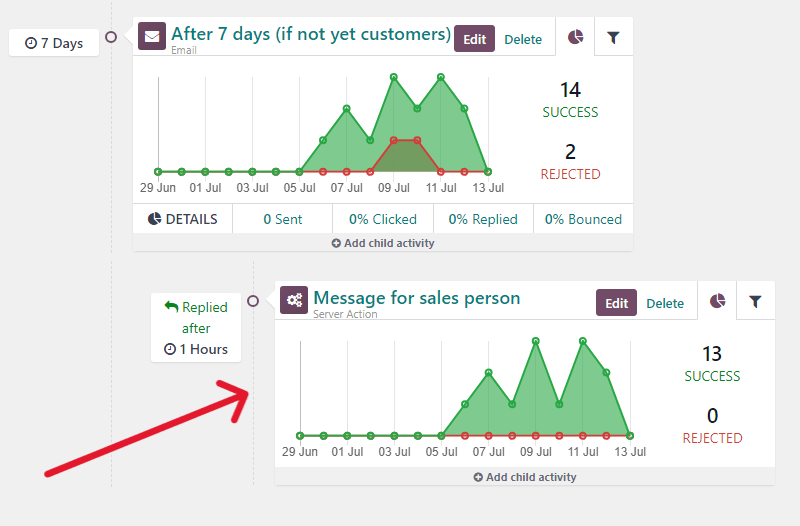

============================
Campaign workflow activities
============================

When creating a marketing campaign in the *Marketing Automation* app, users can plan marketing
activities that can be triggered when certain actions or inactions occur. These can be activities
such as, automated emails, SMS, or internal server actions.

Add workflow activities
=======================

To add workflow activities to a marketing campaign, navigate to the bottom of a pre-existing or new
campaign detail form, beneath the target audience configuration fields, and click :guilabel:`Add new
activity`.

Doing so reveals a :guilabel:`Create Activities` pop-up window. This pop-up window is a blank
activity template, where specific parameters can be set for that particular activity.

First, enter a name for the activity in the :guilabel:`Activity Name` field. Then, proceed to
configure the following options.

Once ready, either click: :guilabel:`Save & Close` to save the activity and close the pop-up form,
:guilabel:`Save & New` to save the activity and instantly create an additional activity on a fresh
:guilabel:`Create Activities` pop-up form, or :guilabel:`Discard` to delete the activity.

Activity types
--------------

Then, select the :guilabel:`Activity Type`. Choose between :guilabel:`Email`, :guilabel:`Server
Action` (an internal action within the database), or :guilabel:`SMS`.

The field below the :guilabel:`Activity Type` changes, depending on the chosen :guilabel:`Activity
Type`.

Email activity
~~~~~~~~~~~~~~

If :guilabel:`Email` is the :guilabel:`Activity Type`, the option to choose a premade/pre-configured
:guilabel:`Mail Template` becomes available. A mail template can also be created on-the-fly, as
well.

To create a new template directly from the :guilabel:`Mail Template` field, start typing the title
of the new template into the blank field beside :guilabel:`Mail Template`, and select
:guilabel:`Create and edit...` to reveal a :guilabel:`Create Marketing Template` pop-up window.

.. image:: workflow_activities/email-activity-create-edit.png
   :align: center
   :alt: The create and edit email drop-down option on create activities pop-up window.

In that pop-up window, proceed to create and configure the new email template.

.. image:: workflow_activities/create-marketing-template-popup-window.png
   :align: center
   :alt: The create marketing template email pop-up window in Odoo Marketing Automation.

Server action activity
~~~~~~~~~~~~~~~~~~~~~~

If :guilabel:`Server Action` is the :guilabel:`Activity Type`, the option to choose a specific
:guilabel:`Server Action` (e.g. Message for sales person, Create Leads on Website clicks, etc.)
becomes available.

The option to create a new server action directly from the :guilabel:`Server Action` is also
available. To do that, type in the name of the new action, then click :guilabel:`Create and Edit...`
from the drop-down menu.

.. image:: workflow_activities/server-action-create-edit-option.png
   :align: center
   :alt: The create and edit option in the server action field on campaign detail form.

Or, as an alternative, click the empty :guilabel:`Server Action` field to reveal a drop-down menu,
and select :guilabel:`Search More...` to reveal a :guilabel:`Search: Server Action` pop-up window,
containing all the pre-configured server action options to choose from.

To create a new server action from this pop-up window, and click :guilabel:`New`.

Either option reveals a blank :guilabel:`Create Server Action` pop-up, wherein a custom server
action can be created and configured.

SMS activity
~~~~~~~~~~~~

If :guilabel:`SMS` is the :guilabel:`Activity Type`, the option to choose a premade/pre-configured
:guilabel:`SMS Template` becomes available. A SMS template can also be created on-the-fly directly
from this field.

To create a new template directly from the :guilabel:`SMS Template` field, start typing the title
of the new template into the blank field beside :guilabel:`SMS Template`, and select
:guilabel:`Create and edit...` from the drop-down menu.

.. image:: workflow_activities/create-edit-sms-option.png
   :align: center
   :alt: The create and edit email drop-down option on create activities pop-up window.

Doing so reveals a :guilabel:`Create Marketing Template` pop-up window. In that pop-up window,
proceed to create and configure the new SMS template.

Trigger
-------

The :guilabel:`Trigger` field on the :guilabel:`Create Activities` pop-up form allows users to
choose when the designated workflow activity should be triggered.

Start by selecting a number in the top field. In the next :guilabel:`Trigger` field, designate if
it should be :guilabel:`Hours`, :guilabel:`Days`, :guilabel:`Weeks`, or :guilabel:`Months`. Then,
click the final field, where it reads :guilabel:`beginning of the workflow` be default to reveal a
a drop-down menu of other trigger options.

The trigger options are as follows:

- :guilabel:`beginning of the workflow`: the activity will be triggered at the previously-configured
  time after the beginning of the entire workflow.
- :guilabel:`another activity`: the activity will be triggered at the previously-configured time
  after another specific activity in the workflow.
- :guilabel:`Mail:opened`: the activity will be triggered at the previously-configured time if the
  sent mail in the workflow has been opened by the recipient.
- :guilabel:`Mail:not opened`: the activity will be triggered at the previously-configured time if
  the sent mail in the workflow has not been opened by the recipient.
- :guilabel:`Mail: replied`: the activity will be triggered at the previously-configured time if the
  sent mail in the workflow has been replied to by the recipient.
- :guilabel:`Mail: not replied`: the activity will be triggered at the previously-configured time if
  the sent mail in the workflow has not been replied to by the recipient.
- :guilabel:`Mail: clicked`: the activity will be triggered at the previously-configured time if the
  sent mail in the workflow has been clicked by the recipient, after it's been opened.
- :guilabel:`Mail: not clicked`: the activity will be triggered at the previously-configured time if
  the sent mail in the workflow has not been clicked by the recipient, after it's been opened.
- :guilabel:`Mail: bounced`: the activity will be triggered at the previously-configured time if the
  sent mail in the workflow has been bounced back for any reason.
- :guilabel:`SMS: clicked`: the activity will be triggered at the previously-configured time if the
  sent SMS in the workflow has been clicked by the recipient, after it's been opened.
- :guilabel:`SMS: not clicked`: the activity will be triggered at the previously-configured time if
  the sent SMS in the workflow has not been clicked by the recipient, after it's been opened.
- :guilabel:`SMS: bounced`: the activity will be triggered at the previously-configured time if the
  sent SMS in the workflow has been bounced back for any reason.

Expiry duration
---------------

Next, on the :guilabel:`Create Activities` pop-up form is the :guilabel:`Expiry Duration` option.

The :guilabel:`Expiry Duration` checkbox provides the option to configure the activity to stop the
actions after a specific amount of time (after the scheduled date).

When selected, a :guilabel:`Cancel after` field appears, in which the number of :guilabel:`Hours,
Days, Weeks, or Months` can be configured for the actions to cease after the initial date.

Activity and applied filters
----------------------------

Moving down into the :guilabel:`Domain` section of the :guilabel:`Create Activities` pop-up form,
there is the :guilabel:`Activity Filter` and :guilabel:`Applied Filter` fields.

The :guilabel:`Activity Filter` field provides the option to configure a recipient filter domain
that applies to this activity *and* its child activities. In works in the same fashion as a typical
target audience filter.

To add an activity filter, click :guilabel:`Add condition` in the :guilabel:`Activity Filter` field
and proceed to configure a custom activity filter equation rule(s).

This option is not a required field. If left alone, the activity applies to all records related to
the target audience of the overall campaign.

.. seealso::
   - :doc:`target_audience`

The :guilabel:`Applied Filter` field is non-configurable. It's simply a summary of when the activity
will be performed, *only* if it satisfies the specified domain (e.g. the rules configured in the
:guilabel:`Activity Filter` field).

.. note::
  After the activity's settings are fully configured, click :guilabel:`Save & Close` to save the
  activity and return to the marketing automation campaign form, :guilabel:`Save & New` to save the
  activity and immediately create another one in a fresh :guilabel:`Create Activities` pop-up
  window, or :guilabel:`Discard` to delete the activity and return to the marketing automation
  campaign form.

Workflow activity
=================

Once an activity is created and saved, it appears as an activity card in the :guilabel:`Workflow`
section, located at the bottom of the marketing automation campaign form. The analytics related to
each activity is displayed as a line graph.

The configured :guilabel:`Trigger` time for that activity can be found to the left of the
:guilabel:`Workflow Activity` card in the :guilabel:`Workflow` section.

Once the activity has been triggered, a figure representing the number of :guilabel:`Success` or
:guilabel:`Rejected` activities will be displayed to the right of the graph.

.. tip::
   If the :guilabel:`Activity Type` of the activity is set to :guilabel:`Email` or :guilabel:`SMS`,
   there are more in-depth analytics beneath the activity graph data, detailing how many messages
   have been :guilabel:`Sent`, and what percentage of those have been :guilabel:`Clicked`,
   :guilabel:`Replied` to, or :guilabel:`Bounced`.

Child activities
================

There is also the option to add a *child activity* by clicking :guilabel:`Add child activity`,
located at the bottom of each activity block in the :guilabel:`Workflow` section of a marketing
campaign form.

Child activities are sub-activities that are connected to and triggered by the activity above it,
which is known as its *parent activity*. A child activity is easy to recognize, as its slightly
indented beneath its parent activity.

Odoo provides a number of triggering options to launch a child activity - all of which depend on the
trigger configurations related to its parent activity. Under the desired parent activity, hover over
:guilabel:`Add child activity`, to reveal a menu of child activity trigger options.

.. image:: workflow_activities/child-activity-trigger-options.png
   :align: center
   :alt: The various child activity trigger options in the workflow section of a campaign.

Select any of the following child activity triggers:

- :guilabel:`Add Another Activity`: instantly adds another activity.
- :guilabel:`Opened`: the next activity will be triggered if the recipient opens the mailing.
- :guilabel:`Not Opened`: the next activity will be triggered if the recipient does not open the
  mailing.
- :guilabel:`Replied`: the next activity will be triggered if the recipient replies to the mailing.
- :guilabel:`Not Replied`: the next activity will be triggered if the recipient does not reply to
  the mailing.
- :guilabel:`Clicked`: the next activity will be triggered if the recipient clicks on a link
  included in the mailing.
- :guilabel:`Not Clicked`: the next activity will be triggered if the recipient does not click on a
  link included in the mailing.
- :guilabel:`Bounced`: the next activity will be triggered if the mailing is bounced (not sent).

Once a trigger is selected, the user can configure the child activity the same way they would for a
regular workflow activity.

.. seealso::
   - :doc:`testing_running`
