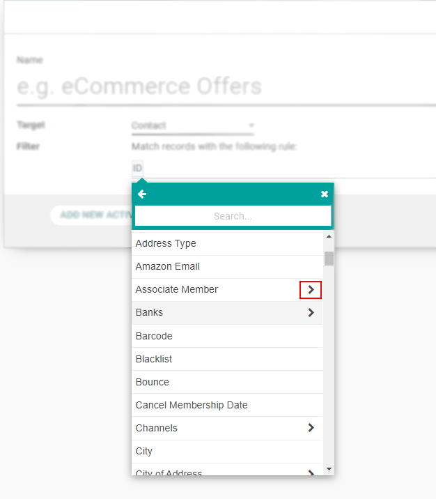
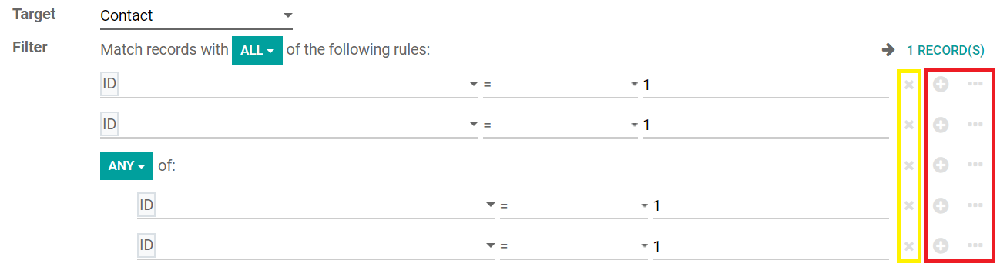

=================================
Segment the Database with Filters
=================================
Filters let you reach a granular level of detail in your records.

How to work with filters
========================
When working with filters, you will see that some of the rules have an arrow button next to it,
informing you that the parameter has more variables within it.

| More than one parameter line - *node* (+) - can be added under what is called a *branch* (...).
| To exclude a *node* or a *branch*, click on *Delete node* (x).

Every time a new branch is created, you can choose if you would like the records to match *all*
criteria of the upcoming rules, or *any*, meaning one rule or the other.

Use cases
=========

- **Scenario**: narrow the target down to new opportunities in the pipeline.

  .. image:: media/filters3.png
     :alt: Filters in Odoo Marketing Automation

- **Scenario**: narrow the target down to suppliers.

  .. image:: media/filters4.png
     :alt: Filters in Odoo Marketing Automation

- **Scenario**: narrow the leads down to the ones that contain a certain tag name.

  .. image:: media/filters5.png
     :alt: Filters in Odoo Marketing Automation

- **Scenario**: narrow the target down to the attendees of a specific event that purchase a specific
  category of ticket.

  .. image:: media/filters6.png
     :alt: Filters in Odoo Marketing Automation

- **Scenario**: narrow the target down to the employees who have kids.

  .. image:: media/filters7.png
     :alt: Filters in Odoo Marketing Automation

- **Scenario**: narrow the target down to records with a helpdesk ticket solved.

  .. image:: media/filters8.png
     :alt: Filters in Odoo Marketing Automation

.. seealso::
   - :doc:`automate_actions`
   - :doc:`/applications/general/tags`
