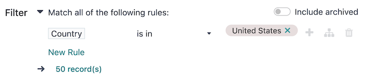

==================
Audience targeting
==================

The :guilabel:`Target` and :guilabel:`Filter` fields on the campaign form, also referred to as the
*domain*, contain the parameters used to define the target audience for the campaign's reach (i.e.,
the unique contact records in the database, and imported list, etc.).

- :guilabel:`Target`: specifies the type of records available for use in the campaign, such as
  :guilabel:`Lead/Opportunity`, :guilabel:`Event Registration`, :guilabel:`Contact`, The assigned
  records model determines the fields that are available throughout the campaign, including the
  fields available in the :guilabel:`Filter` section, and in dynamic placeholders.
- :guilabel:`Save as Favorite Filter`: saves the current :guilabel:`Filter` for future use with the
  current :guilabel:`Target` model, and can be managed from the :menuselection:`Marketing Automation
  app --> Configuration --> Favorite Filters` menu.
- :guilabel:`Unicity based on`: specifies the :guilabel:`Target` model field where duplicates should
  be avoided. Traditionally, the :guilabel:`Email` field is used, but any available field can be
  used.
- :guilabel:`Filter`: contains an interactive form with configurable logic to further refine the
  targeting parameters under the chosen :guilabel:`Target` model. See more details in the
  :ref:`marketing_automation/defining-filters` section.
- :guilabel:`Include archived`: allows or disallows the inclusion of archived records in the target
  audience.

.. tip::
   A :guilabel:`Responsible` user can be assigned to the campaign by activating
   :ref:`developer-mode`.

.. note::
   Each activity in a campaign's workflow can target a subset of the target audience; see the
   :doc:`workflow_activities` documentation for more information.

.. _marketing_automation/defining-filters:

Defining filters
================

The default campaign :guilabel:`Filter` configuration is set to :guilabel:`Match all records`,
indicating that the campaign is targeting **all** records of the :guilabel:`Target` model.

To refine the :guilabel:`Filter` rules of a campaign, click the :guilabel:`➕ Add condition` button
to reveal a new row with configurable rule parameters. See the :ref:`Search, filter, and group
records <search/custom-filters>` documentation for more information on how to create filter rules.

At the bottom of the filter rules is a :guilabel:`# record(s)` button, which indicates the total
number of records targeted by this domain. Select the :guilabel:`# record(s)` button to open a
:guilabel:`Selected records` pop-up window, in which the targeted records can be viewed.

.. tip::
   Activate :ref:`developer-mode` to reveal each field's technical name and data type, as well as
   the :guilabel:`# Code editor` text area below the filter rules, to view and edit the domain
   manually.

.. example::
   To target all leads and opportunities from the *CRM* app that are in the *New* stage, and have an
   expected revenue greater than $1,000, the following should be entered:

   - :guilabel:`Target`: `Lead/Opportunity`
   - :guilabel:`Unicity based on`: `Email (Lead/Opportunity)`
   - :guilabel:`Filter`: :guilabel:`Match` :guilabel:`all 🔽 (down arrow)` :guilabel:`of the
     following rules:`

     #. :guilabel:`Stage` :guilabel:`is in` :guilabel:`New`
     #. :guilabel:`Expected Revenue` :guilabel:`>` `1,000`
     #. :guilabel:`any 🔽 (down arrow)` :guilabel:`of:`

        - :guilabel:`Type` :guilabel:`=` :guilabel:`Lead`
        - :guilabel:`Type` :guilabel:`=` :guilabel:`Opportunity`

   With the above configuration, the campaign targets :guilabel:`157 record(s)`.

   .. image:: target_audience/filter-scenario-one.png
      :align: center
      :alt: A domain configuration in a Marketing Automation campaign.

.. seealso::
   - :ref:`Domain developer documentation <reference/orm/domains>`
   - :doc:`workflow_activities`
   - :doc:`testing_running`
   - :doc:`understanding_metrics`
