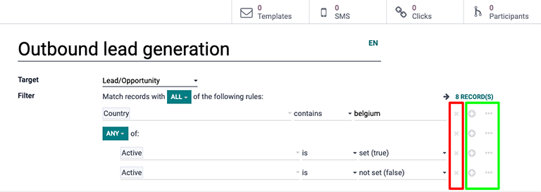

==================
Target an audience
==================

Delivering marketing campaigns to the right audience is paramount when trying to grow a business.
The Odoo *Marketing Automation* application helps marketers to do just that by providing detailed
filtering tools, which can be as simple (or as complex) as necessary, to reach the right customers
at the right time.

Configure target filters
========================

When configuring the target filters on a marketing campaign, there are some options that have an
:guilabel:`> (arrow)` icon beside them. The :guilabel:`> (arrow)` icon signifies that the particular
filter has more refined parameters within it that can be customized.

.. image:: target_audience/marketing-filters.png
   :align: center
   :alt: The drop-down filter menu in the Marketing Automation application.

Filters can be extended by adding *branches* and *nodes*. A *node* adds another filtering parameter
to a group of targeting conditions (e.g. a new line), and a *branch* creates a narrowly refined
cluster of parameters, allowing filters to be grouped with :guilabel:`ANY` or :guilabel:`ALL`
statements.

Every time a new branch is created, there are two options:

- Either the records can match :guilabel:`ALL` criteria for the upcoming rules (creating an AND
  statement where *all* criteria must match).
- Or, the records can match :guilabel:`ANY` criteria for the upcoming rules (creating an OR
  statement where *only one* of the criteria must match).

To change between these two options, simply click the drop-down arrow icon in the green box and
select :guilabel:`ANY` or :guilabel:`ALL`.

To add a node, click on the :guilabel:`➕ (plus sign)` icon, and to add another branch click on the
:guilabel:`⋯ (ellipses)` icon. To exclude a node or a branch, click on :guilabel:`✖ (delete)` icon
to delete it.

Use cases
=========

The following scenarios outline different combinations of filters a marketing campaign might
commonly use.

Scenario #1: Narrow target down to new opportunities in the pipeline
--------------------------------------------------------------------

While in *Edit mode* on a campaign template form (by clicking the :guilabel:`Edit` button), select
the :guilabel:`Target` field, and click :guilabel:`Search More` from the drop-down menu. Then,
search for :guilabel:`Lead/Opportunity`, and select it.

Next, click :guilabel:`Add Filter` in the :guilabel:`Filter` field. Then, click on the default
:guilabel:`ID` filter option in the first portion of the filter equation. Doing so reveals a
drop-down menu full of filter options. From this drop-down, scroll down (or search for)
:guilabel:`Type`.

Keep the second portion of the filter equation on the default :guilabel:`🟰 (equal sign)` icon.

Next, change the third (and final) portion of the filter equation from :guilabel:`Lead` to
:guilabel:`Opportunity`. The number of :guilabel:`Records` that fit this specific filter equation
changes as the equation is customized.

Add another node to this filter by clicking the :guilabel:`➕ (plus sign)` icon to the right of the
equation.

With "new" opportunities being the target of this filter, the second node will focus on *only*
locating opportunities that are in the :guilabel:`New` stage of the pipeline. To do that, select
the default :guilabel:`ID` from the first portion of the second filter equation, and scroll down (or
search for) :guilabel:`Stage` from the field drop-down menu.

Once again, leave the second portion of the filter equation on :guilabel:`🟰 (equal sign)` icon.

Lastly, highlight the default value in the third (and final) portion of the second filter equation,
and type in `New`. With that in place, Odoo only targets opportunities that are in the "New" stage
of the pipeline.

.. image:: target_audience/filters-opportunities.png
   :align: center
   :alt: A standard scenario using filters in the Odoo Marketing Automation app.

Scenario #2: Narrow down target to event attendees who purchased a specific ticket
----------------------------------------------------------------------------------

While in *Edit mode* on a campaign template form (by clicking the :guilabel:`Edit` button), select
the :guilabel:`Target` field, and click :guilabel:`Search More` from the drop-down menu. Then,
scroll down (or search for) :guilabel:`Event`, and select it.

Next, click :guilabel:`Add Filter` in the :guilabel:`Filter` field. Click on the default
:guilabel:`ID` filter option in the first portion of the filter equation. Doing so reveals a
drop-down menu full of filter options. From this drop-down, scroll down (or search for)
:guilabel:`Event`.

Click the default :guilabel:`🟰 (equal sign)` icon in the second portion of the filter equation. This
reveals a drop-down menu. From this drop-down menu, select :guilabel:`contains`.

In the third (and final) empty portion of the filter equation, type in the name of the event(s) that
Odoo should consider for this campaign filter.

Then, add another node to this filter by clicking the :guilabel:`➕ (plus sign)` icon to the right of
the equation.

The second node will focus on targeting this campaign to attendees who purchase a specific type of
ticket to the aforementioned event(s) mentioned in the first filter equation.

To do that, select the default :guilabel:`ID` from the first portion of the second filter equation,
and scroll down (or search for) :guilabel:`Event Ticket` from the field drop-down menu. Then, in
that same drop-down menu, select :guilabel:`Name`.

Once again, click the default :guilabel:`🟰 (equal sign)` icon in the second portion of the filter
equation, and select :guilabel:`contains`.

Lastly, in the third (and final) portion of the second filter equation, which is blank, type in the
name of the ticket type that should be used for the filter. In this case, :guilabel:`Standard` is
the name of the event ticket type for this sample filter.

.. image:: target_audience/filters-event-ticket.png
   :align: center
   :alt: An event ticket filter in the Odoo Marketing Automation application.
