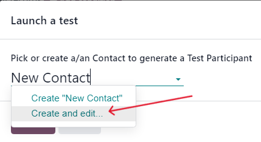
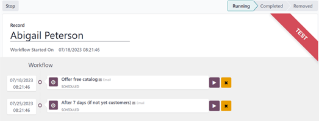
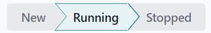
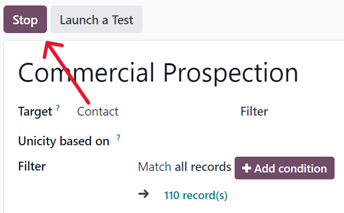

=========================
Testing/running campaigns
=========================

The Odoo *Marketing Automation* app allows users to test marketing campaigns (and mailings) before
officially running them to check for errors and correct any mistakes before it reaches its target
audience.

Test campaigns
==============

To test a marketing campaign, open the :menuselection:`Marketing Automation app`, and select the
desired campaign to test, which reveals the campaign's detail form.

On the campaign detail form, make sure the campaign already has activities configured in the
workflow (or build a campaign by following the directions on :doc:`workflow_activities`
documentation).

.. note::
   Testing marketing automation campaigns is meant to be performed in the production version of the
   database. Duplicate (or trial) databases have limited email sending capabilities.

To start a test, click the :guilabel:`Launch a Test` button at the top of the campaign form, to the
right of the :guilabel:`Start` button.

.. image:: testing_running/launch-test.png
   :align: center
   :alt: Launch a test button on a campaign detail form in Odoo Marketing Automation.

When clicked, a :guilabel:`Launch a test` pop-up window appears.

.. image:: testing_running/launch-test-popup-window.png
   :align: center
   :alt: Launch a test pop-up window that appears in Odoo Markting Automation.

In the :guilabel:`Launch a test` pop-up window, click the :guilabel:`Pick or create a/an Contact to
generate a Test Participant` field to reveal a drop-down menu of contacts. From this drop-down menu,
select an existing contact (or create a new one) to run the test on.

.. note::
   Only one contact can be selected from the :guilabel:`Launch a test` pop-up window.

To create a new contact directly from the :guilabel:`Launch a test` pop-up window, start typing the
name of the new contact in the blank field, and click :guilabel:`Create and edit...`.

Doing so reveals a blank :guilabel:`Create Record` pop-up form, in which the necessary contact
information (:guilabel:`Email`, :guilabel:`Mobile`, etc.) *must* be entered, in order for the test
to work. When the necessary information is entered, click :guilabel:`Save & Close`.

.. image:: testing_running/blank-contact-form.png
   :align: center
   :alt: A blank contact form from a launch test pop-up window in Odoo Marketing Automation.

When all the necessary fields have been entered, click :guilabel:`Save & Close` to return to the
:guilabel:`Launch a test` pop-up window.

Once a contact is selected, click :guilabel:`Launch` to reveal the campaign test page.

On the campaign test page, the name of the :guilabel:`Record` being tested is visible, along with
the precise time this test workflow was started in the :guilabel:`Workflow Started On` field.
Beneath that, in the :guilabel:`Workflow` section is the first activity (or activities) in the
workflow that's being tested.

To start a test, click the :guilabel:`Run` button, represented by a :guilabel:`▶️ (play button)`
icon beside the first activity in the workflow. When clicked, the page reloads, and Odoo shows the
various results (and analytics) connected to that specific activity as they occur, in real-time.

.. note::
   If a child activity is scheduled beneath a parent activity, that child activity will be revealed
   slightly indented in the workflow, once that parent activity has been run, via the :guilabel:`▶️
   (play button)` icon.

.. image:: testing_running/workflow-test-progress.png
   :align: center
   :alt: Workflow test progress in Odoo Marketing Automation.

Once all the workflow activities are completed, the test ends, and the status bar (in the
upper-right corner) moves to the :guilabel:`Completed` stage.

To stop a test before all the workflow activities are completed, click the :guilabel:`Stop` button
in the upper-left corner of the campaign test page.

Run campaigns
=============

To run a campaign, navigate to :menuselection:`Marketing Automation app`, and select the desired
campaign to run.

On the campaign detail form, with all the desired activities ready in the :guilabel:`Workflow`
section, click :guilabel:`Start` in the upper-left corner to officially run the campaign to the
configured target audience specified on the campaign detail form.

Clicking :guilabel:`Start` launches the campaign, and the status bar of the campaign switches to
:guilabel:`Running`, which is located in the upper-right corner of the campaign detail form.

.. note::
   If some participants are already running on a campaign, and was stopped for any reason, clicking
   the :guilabel:`Start` button again prompts a pop-up warning. This warning advises the user to
   click an :guilabel:`Update` button to apply any modifications made to the campaign.

   .. image:: testing_running/workflow-modification-warning.png
      :align: center
      :alt: The workflow has been modified warning pop-up window of a marketing campaign form.

   Be aware that participants that had already gone through an entire campaign in its original state
   **can** be reintroduced into the newly-modified campaign, and new traces could be created for
   them.

Then, as the mailings and actions are triggered in the :guilabel:`Workflow`, the various stats and
data related to each activity appear in each activity block. There is also a series of stat-related
smart buttons that appear at the top of the campaign detail form, as well.

These analytical smart buttons will *also* populate with real-time data as the campaign progresses:
:guilabel:`Templates`, :guilabel:`Clicks`, :guilabel:`Tests`, :guilabel:`Participants`.

.. image:: testing_running/campaign-smart-buttons.png
   :align: center
   :alt: The row of smart buttons that appear in a currently running marketing campaign in Odoo.

Stop campaigns
==============

To stop a campaign that's currently running, navigate to the :menuselection:`Marketing Automation
app`, and select the desired campaign to stop. On the campaign detail form, click the
:guilabel:`Stop` button in the upper-left corner.

When clicked, the campaign is officially stopped, and the status changes to :guilabel:`Stopped` in
the upper-right corner of the campaign detail form.

.. image:: testing_running/campaign-stopped-status-bar.png
   :align: center
   :alt: Marketing campaign's stopped status on a campaign detail form in Odoo Marketing Automation.

.. seealso::
   - :doc:`Campaign configuration <../marketing_automation>`
   - :doc:`target_audience`
   - :doc:`workflow_activities`
