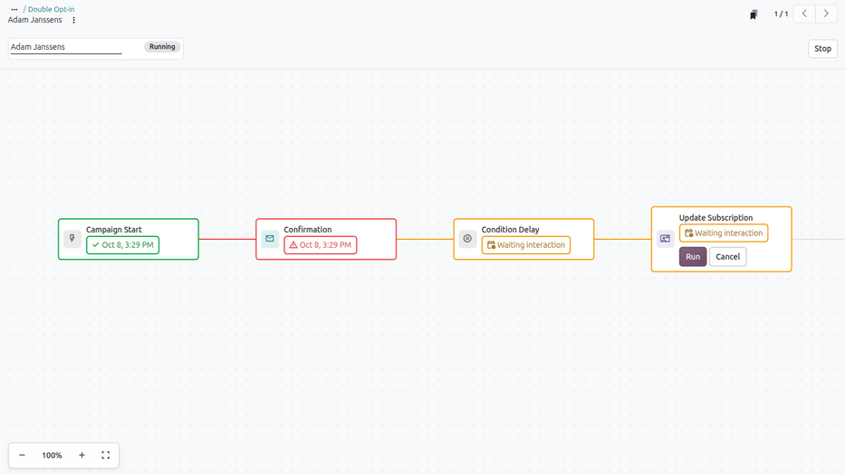
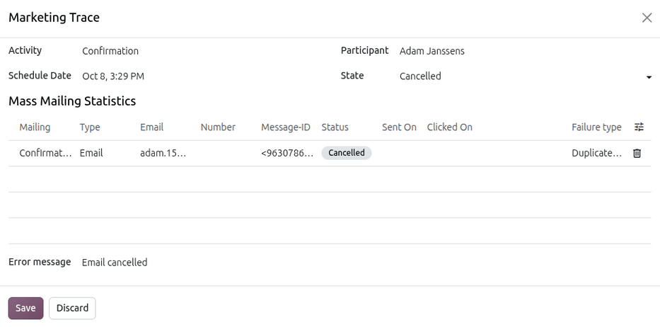

=========================
Testing/running campaigns
=========================

Before launching marketing campaigns to official target audiences, users may first run tests to
verify their workflows. This documentation covers how to test campaigns and run them.

.. note::
   Campaign tests are intended for production databases. Duplicate (or trial) databases have limited
   email sending capabilities.

.. _marketing_automation/testing_running/test:

Test campaigns
==============

To test a marketing campaign, open the :menuselection:`Marketing Automation app`, and select the
desired campaign. Ensure that :doc:`activities <workflow_activities>` are configured in the
workflow.

Click the :guilabel:`Test` button at the top. Then, in the :guilabel:`Launch a test` pop-up window,
create or select a contact from the drop-down menu.

.. note::
   A marketing campaign is tested on at most *one* contact at a time.

Once a contact is selected, click :guilabel:`Launch`. This opens the campaign test view, displaying
the entire workflow for the chosen participant.

Each step can be individually :guilabel:`Run` sequentially until the end of the workflow. A tested
step is then labeled with the date and time of completion and highlighted with its corresponding
status:

- *Green*: Completed successfully.
- *Orange*: Scheduled or waiting.
- *Red*: Cancelled or error.

To stop a test before all the workflow activities are completed, click the :guilabel:`Stop` button
at the top of the page.

View traces for each step
-------------------------

Users can view detailed information about each completed step by clicking its corresponding node.
The *Marketing Trace* pop-up window then displays the following data:

- :guilabel:`Activity`: The selected step.
- :guilabel:`Schedule Date`: The step's date and time of scheduling or completion.
- :guilabel:`Participant`: The selected test participant.
- :guilabel:`State`: The status of the step.
- :guilabel:`Mass Mailing Statistics`: A table of messages linked to this step. This table is
  **only** filled for Email, SMS, and *Whatsapp* steps.

.. note::
   The *Marketing Trace* window is intended for checking step information. It is **not** recommended
   to modify any fields.

.. _marketing_automation/testing_running/run:

Run campaigns
=============

To run a campaign, navigate to :menuselection:`Marketing Automation app`, and select the desired
campaign to run. At the top of the campaign page, click :guilabel:`Start` to launch the campaign.

.. note::
   Be aware that participants that had already gone through an entire campaign in its original state
   **can** be reintroduced into the newly-modified campaign, and new traces could be created for
   them.

As mailings and actions are triggered in the workflow, data related to each activity appears in
their corresponding nodes. Real-time engagement metrics are also shown in the smart buttons at the
top of the campaign.

To stop the campaign, click :guilabel:`Stop`.

.. seealso::
   - :doc:`Campaign configuration <../marketing_automation>`
   - :doc:`target_audience`
   - :doc:`workflow_activities`
