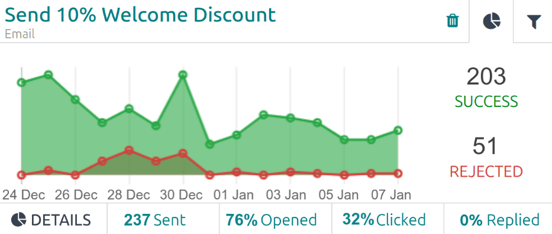
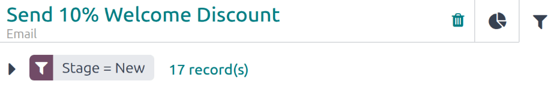
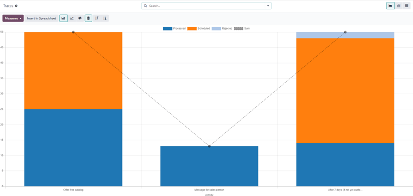
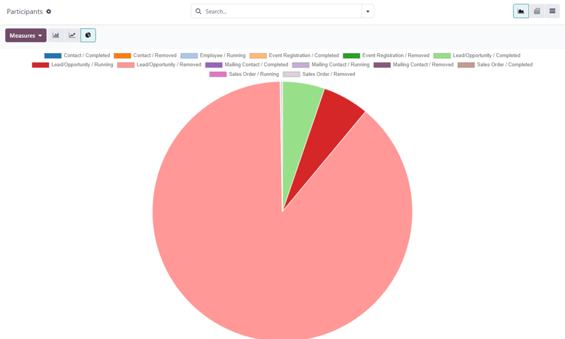

================
Campaign metrics
================

*Campaign metrics* are detailed statistics and analytics within a marketing campaign, measuring its
success and effectiveness. Triggered marketing activities populate relevant activity blocks with
real-time metrics, in the campaign detail form.

.. note::
   It is **not** possible to track email campaigns with 100% accuracy as some email service
   providers have security restrictions that do not allow senders to know when recipients have
   received, opened, or answered an email. This is something that cannot be controlled by Odoo, and
   is expected for any email marketing tool.

Activity analytics
==================

To view the various metrics for a campaign, open the **Marketing Automation** app and click on the
desired campaign Kanban card.

The default stages are :guilabel:`New`, :guilabel:`Running`, and :guilabel:`Stopped`.

A campaign in the :guilabel:`New` stage will not have any metrics to display, whereas a campaign in
the :guilabel:`Running` stage displays the currently available data. Campaigns in the
:guilabel:`Stopped` stage display all metrics.

The :guilabel:`Workflow` section of the selected campaign form displays all the various campaign
activities, the duration of time before the activities is triggered, and the various metrics for the
activity.

Each activity displays the following information:

- :icon:`fa-clock-o` :guilabel:`(Trigger Time)`: This indicates :doc:`when the activity starts
  <workflow_activities>` after the workflow begins. This is displayed in :guilabel:`Hours`,
  :guilabel:`Days`, :guilabel:`Weeks`, or :guilabel:`Months`. If the trigger time is dependent on
  another activity or triggering action (e.g. :guilabel:`Mail: Replied`) the time is displayed along
  with the necessary action for that activity to be triggered (e.g. `Replied after 2 Hours`).
- :guilabel:`Activity Type Icon`: The type of activity being triggered is displayed in a purple
  icon. The activity icons are:

  - :icon:`fa-envelope-o` :guilabel:`(Email)`: This action sends an email.
  - :icon:`fa-mobile` :guilabel:`(SMS)` : This action sends an SMS message.
  - :icon:`fa-whatsapp` :guilabel:`(WhatsApp Message)` : This action sends a WhatsApp message. This
    option is only available if the **WhatsApp** app is installed.
  - :icon:`fa-cogs`:guilabel:`(Server Action)`: This action creates a :ref:`server action
    <marketing_automation/sa-activity-type>`.

- :guilabel:`Activity Block`: Each activity displays a detailed :ref:`activity block,
  <marketing_automation/activity_blocks>` with the :guilabel:`Activity Name` appearing at the top.

  .. important::
     To delete an activity, click the :icon:`fa-trash` :guilabel:`(Delete)` icon to the right of the
     :guilabel:`Activity Name`. There is **no confirmation** pop-up window asking if the user wants
     to delete the activity. The activity is **immediately deleted**.

.. _marketing_automation/activity_blocks:

Activity blocks
===============

In every activity block, the :icon:`fa-pie-chart` :guilabel:`(Graph)` tab is open by default,
displaying related metrics in a line graph. The success metrics are represented in green and the
rejected metrics are represented in red.

Numerical representations of both :guilabel:`SUCCESS` and :guilabel:`REJECTED` activities are shown
to the right of the line graph.

.. tip::
   Hovering over any point in the line graph of the activity block reveals a notated breakdown of
   data for that specific date.

For email, SMS, or WhatsApp activity blocks, a :icon:`fa-pie-chart` :guilabel:`DETAILS` line
appears beneath the graph, displaying the following metrics:

- :guilabel:`Sent`: The number of messages or emails sent.
- :guilabel:`Opened`: The percentage of recipients that opened the message or email.
- :guilabel:`Clicked`: The percentage of recipients that clicked on a link inside the message or
  email.
- :guilabel:`Replied`: The percentage of recipients that replied to the message or email.

.. tip::
   Click any of the metrics on the :icon:`fa-pie-chart` :guilabel:`DETAILS` line, and a separate
   page loads, containing the specific details for that particular data point.

Filter tab
----------

Click the :icon:`fa-filter` :guilabel:`(Filter)` tab, located next to the :icon:`fa-pie-chart`
:guilabel:`(Graph)` tab, to reveal the specific filters set for campaign activity. This tab displays
how many records in the database that match the specific criteria.

.. tip::
   Click the :guilabel:`# record(s)` link next to the filter, and a :guilabel:`Selected records`
   pop-up window loads, containing a list of all the records that match that specific campaign
   activity rules.

   .. image:: understanding_metrics/filter-contacts.png
      :alt: A list of contacts that result form the active filter.

Link statistics
===============

Odoo tracks all URLs used in marketing campaigns. These URLs are accessed by navigating to
:menuselection:`Marketing Automation app --> Reporting --> Link Tracker`. This reveals a
:guilabel:`Link Statistics` report, where all campaign-related URLs are displayed, by campaign.

The default view for the :guilabel:`Link Statistics` report is a :icon:`fa-database`
:guilabel:`(Stacked)` :icon:`fa-bar-chart` :guilabel:`(Bar Chart)`. The X-axis represents all the
individual URLs being tracked, and the Y-axis represents the total :guilabel:`Number of Clicks`.

.. example::
   In this example, the Facebook link had the most clicks, while the LinkedIn link had the fewest
   clicks. This indicates the Facebook link was the most successful in terms of clicks.

  .. image:: understanding_metrics/campaign-stats.png
     :alt: What a campaign activity filter tab looks like in Odoo Marketing Automation.

Traces
======

All automated marketing activities, such as emails, text messages, or server actions, are tracked by
Odoo, and are visible on the :guilabel:`Traces` report. These are accessed by navigating to
:menuselection:`Marketing Automation app --> Reporting --> Tracers`. This reveals a
:guilabel:`Tracers` report, where all actions are displayed in their own column.

The default view for the :guilabel:`Tracers` report is a :icon:`fa-database` :guilabel:`(Stacked)`
:icon:`fa-bar-chart` :guilabel:`(Bar Chart)`. The X-axis represents all the individual scheduled
actions, and the Y-axis represents the total :guilabel:`Count` for each action.

The actions are color-coded as follows:

- :guilabel:`Red`: Scheduled
- :guilabel:`Orange`: Processed
- :guilabel:`Blue`: Error
- :guilabel:`Green`: Cancelled
- :guilabel:`Yellow`: Rejected

Participants
============

Odoo tracks all participants related to every marketing campaign, which can be viewed in the
:guilabel:`Participants` report. To view the :guilabel:`Participants` report, navigate to
:menuselection:`Marketing Automation app --> Reporting --> Participants`.

The :guilabel:`Participants` report appears in a :icon:`fa-pie-chart` :guilabel:`(Pie Chart)` view,
by default.

A color key defines the types of participants in the graph. To hide any type of participant, click
on the name of the group, and the information is hidden on the pie chart, and the name of the group
is striked-out. Click on the name again to reveal the data.

