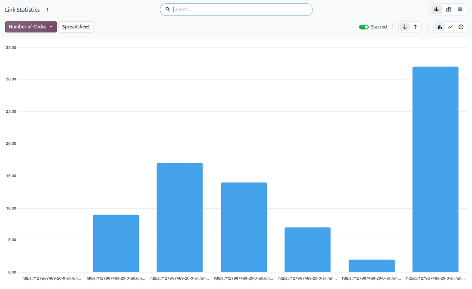
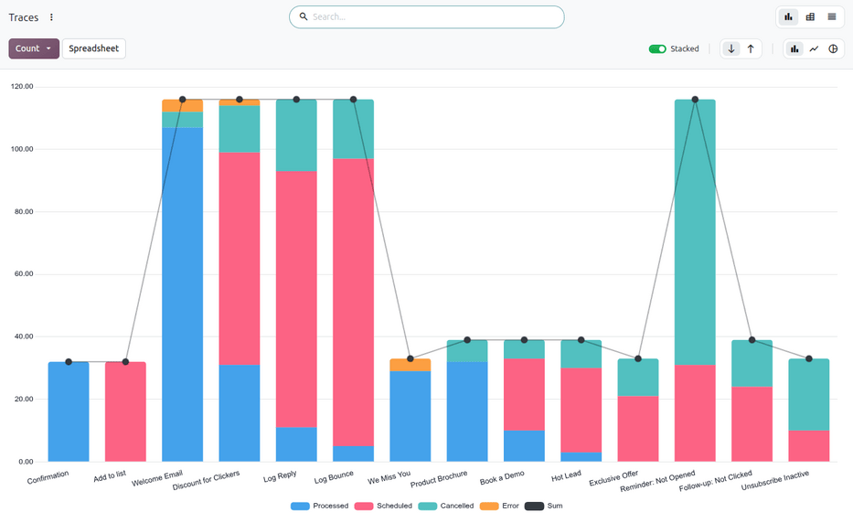
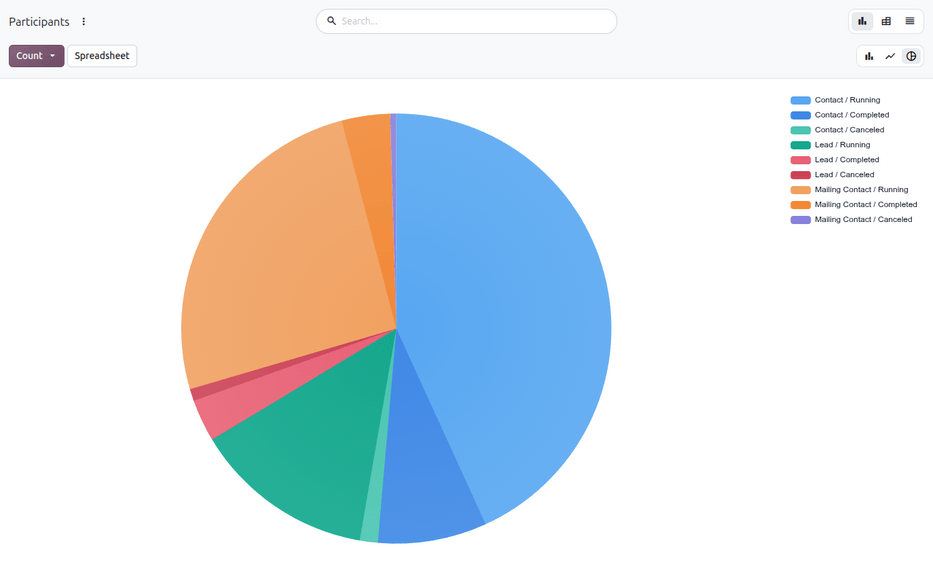

================
Campaign metrics
================

In Odoo **Marketing Automation**, users can track real-time engagement metrics for their campaigns
(e.g., counts of mailings, clicks, participants). This documentation covers different ways to track
these metrics.

.. note::
   It is **not** possible to track email campaigns with 100% accuracy. Due to security restrictions,
   some email service providers do not allow senders to know when recipients have received, opened,
   or answered an email.

.. _marketing_automation/understanding_metrics/overview:

Campaign overview
=================

For a broad overview of engagement across campaigns, open the **Marketing Automation** app. By
default, the Kanban dashboard displays three stages to track the campaign status: *New*, *Running*,
and *Stopped*. Each campaign Kanban card displays the following information:

- :guilabel:`Running`: Count of participants currently in the workflow.
- :guilabel:`Completed`: Count of participants at the end of the workflow.
- :guilabel:`Total`: Total count of :guilabel:`Running` and :guilabel:`Completed` participants.

To view engagement for a specific campaign, click on the desired campaign card. Depending on the
modules installed, the following clickable smart buttons may appear:

- :guilabel:`Mailings`: Count of emails sent. Click to open the list of emails.
- :guilabel:`SMS`: Count of SMS messages sent. Click to open the list of messages.
- :guilabel:`WhatsApp`: Count of *WhatsApp* templates used by the campaign. Click to open the list
  of templates.
- :guilabel:`Clicks`: Count of clicks on the campaign's tracked links. Click to open a reporting
  page of link statistics.
- :guilabel:`Tests`: Count of test participants. Click to open the list of participants.
- :guilabel:`Participants`: Total count of *Running* and *Completed* participants. Click to open the
  list of participants.

.. _marketing_automation/understanding_metrics/activity-metrics:

Activity metrics
================

In the workflow builder, communication-related activity nodes (e.g., email, *WhatsApp*) display the
following metrics:

- :guilabel:`Sent`: Count of communications sent.
- :guilabel:`Opened`: Count of recipients that opened the communication.
- :guilabel:`Clicks`: Count of recipients that clicked a tracked link in the communication.
- :guilabel:`Replied`: Count of recipients that responded to the communication.

.. note::
   SMS activity nodes display the :guilabel:`Sent` and :guilabel:`Opened` metrics **only**.

.. _marketing_automation/understanding_metrics/link-stats:

Link statistics
===============

Odoo tracks all URLs used in marketing campaigns. These metrics are accessed by navigating to
:menuselection:`Marketing Automation app --> Reporting --> Link Tracker`. By default, this opens a
*Link Statistics* report displaying a :icon:`fa-toggle-on` :guilabel:`Stacked` :icon:`fa-bar-chart`
:guilabel:`(Bar Chart)` of :guilabel:`Number of Clicks` by individual URL.

.. _marketing_automation/understanding_metrics/traces:

Traces
======

Odoo records each participant's history at each step (activity) of a campaign workflow. These
*traces* are accessed by navigating to :menuselection:`Marketing Automation app --> Reporting -->
Traces`. By default, this opens a *Traces* report displaying a :icon:`fa-toggle-on`
:guilabel:`Stacked` :icon:`fa-bar-chart` :guilabel:`(Bar Chart)` of the total :guilabel:`Count` of
participants for each scheduled action.

.. _marketing_automation/understanding_metrics/participants:

Participants
============

Odoo tracks all participants across marketing campaigns. These metrics can be accessed by navigating
to :menuselection:`Marketing Automation app --> Reporting --> Participants`. By default, this opens
a *Participants* report displaying a :icon:`fa-pie-chart` :guilabel:`(Pie Chart)` distribution of
records and their status.

