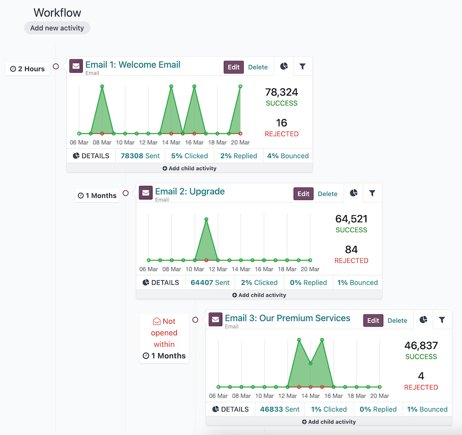
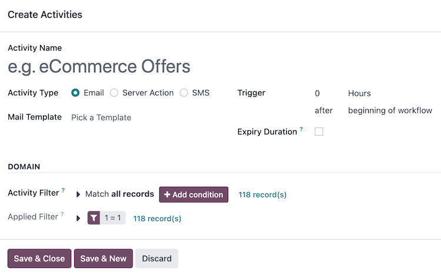
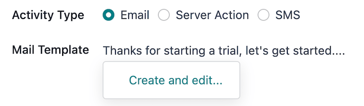
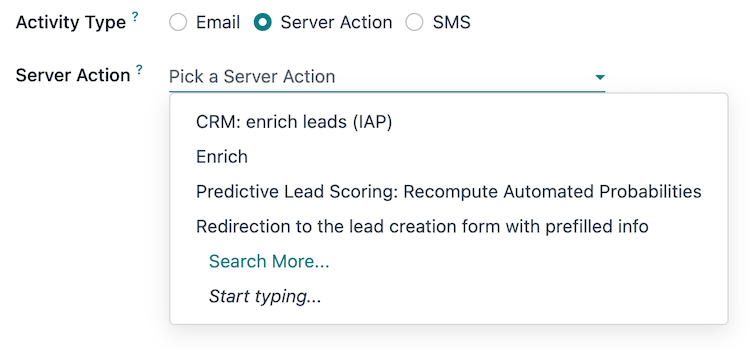
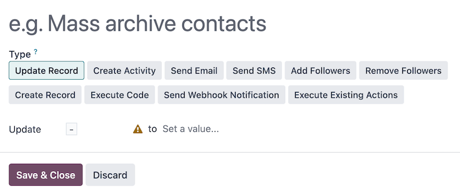
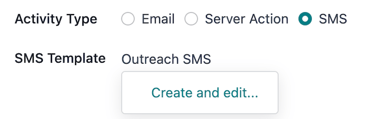
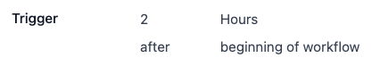

============================
Campaign workflow activities
============================

A *workflow* is the overall *activity* structure of a marketing automation campaign. There can only
be a single workflow in each campaign. However, a workflow can be made up of any number of
:ref:`activities <marketing_automation/activities>` to meet the needs of the campaign.

   Workflow sequence of three activities; the last child activity has a :ref:`trigger type
   <marketing_automation/trigger-type>` of **Mail: not opened**.

.. _marketing_automation/activities:

Activities
==========

Activities are the methods of communication or server actions, organized in a workflow, that are
executed within a campaign; they are the building blocks of the campaign's workflow.

A new activity can be added to the workflow on a campaign form by selecting an existing campaign or
:ref:`creating a new campaign <marketing_automation/campaigns>` from the :menuselection:`Marketing
Automation app --> Campaigns` dashboard, then clicking the :guilabel:`Add new activity` button in
the :guilabel:`Workflow` section. Doing so opens the :guilabel:`Create Activities` pop-up window.

First, define the name of the activity in the :guilabel:`Activity Name` field, and select the
:ref:`type of activity <marketing_automation/activity-types>` to be executed from the
:guilabel:`Activity Type` field.

Then, configure the activity's :ref:`Trigger <marketing_automation/trigger>`, and optionally, the
:ref:`Expiry Duration <marketing_automation/expiry-duration>` and the :ref:`DOMAIN
<marketing_automation/activity-domain>` of the activity.

Once the activity is fully configured, click :guilabel:`Save & Close` to add it to the campaign's
workflow, or click :guilabel:`Save & New` to add the activity to the workflow and open a new
:guilabel:`Create Activities` pop-up window to add another activity. Clicking :guilabel:`Discard`
closes the pop-up window without saving the activity.

.. _marketing_automation/activity-types:

Activity types
--------------

There are three different types of activities available in the *Marketing Automation* app:

- :ref:`Email <marketing_automation/email-activity-type>`: an email that is sent to the target
  audience.
- :ref:`Server action <marketing_automation/sa-activity-type>`: an internal action within the
  database that is executed.
- :ref:`SMS <marketing_automation/sms-activity-type>`: a text message that is sent to the target
  audience.

.. _marketing_automation/email-activity-type:

Email
~~~~~

If :guilabel:`Email` is selected as the :guilabel:`Activity Type`, the option to :guilabel:`Pick a
Template` in the :guilabel:`Mail Template` field is available.

To create a new template directly from the :guilabel:`Mail Template` field, start typing the title
of the new template, then select :guilabel:`Create and edit...` to reveal a :guilabel:`Create
Marketing Template` pop-up window. Proceed to create and configure the new email template.

Once the email template is configured, click :guilabel:`Save & Close` to save the activity, and
return to the :guilabel:`Create Activities` pop-up window, in order to continue to configure the
:ref:`trigger <marketing_automation/trigger>`.

.. note::
   The title used for the :guilabel:`Mail Template` **must** be unique from any other mail template
   titles in the campaign, and it also serves as the subject of the email.

.. seealso::
   :doc:`Creating and configuring email templates <../email_marketing>`

.. _marketing_automation/sa-activity-type:

Server action
~~~~~~~~~~~~~

If :guilabel:`Server Action` is selected as the :guilabel:`Activity Type`, the option to
:guilabel:`Pick a Server Action` in the :guilabel:`Server Action` field is available. This field is
a drop-down menu containing all the pre-configured server actions for the campaign's
:guilabel:`Target` model. Optionally, :ref:`create a new server action
<marketing_automation/create-sa>`.

After selecting a pre-configured server action, no other activity type configuration is needed.
Click :guilabel:`Save & Close` to save the activity, and return to the :guilabel:`Create Activities`
pop-up window, in order to configure the :ref:`trigger <marketing_automation/trigger>`.

.. tip::
   To view all server actions in the database, activate :ref:`developer-mode`, and navigate to
   :menuselection:`Settings app --> Technical --> Actions --> Server Actions` dashboard.

.. _marketing_automation/create-sa:

Create a new server action
**************************

The option to create a new server action is also available. To do so, type in the :guilabel:`Server
Action` field a title for the new action, then click :guilabel:`Create and edit...`. Doing so
reveals a blank :guilabel:`Create Server Action` pop-up window, wherein a custom server action can
be created and configured.

On the :guilabel:`Create Server Action` pop-up window, select the :guilabel:`Type` of server action.
The configuration fields change, depending on the selected :guilabel:`Type`:

- :guilabel:`Update Record`: update the values of a record.
- :guilabel:`Create Activity`: create an activity with the *Discuss* app.
- :guilabel:`Send Email`: post a message, a note, or send an email with the *Discuss* app.
- :guilabel:`Send SMS`: send an SMS, and log them on documents, with the *SMS* app.
- :guilabel:`Add Followers` or :guilabel:`Remove Followers`: add or remove followers on a record
  with the *Discuss* app.
- :guilabel:`Create Record`: create a new record with new values.
- :guilabel:`Execute Code`: execute a block of Python code.
- :guilabel:`Send Webhook Notification`: send a POST request to an external system.
- :guilabel:`Execute Existing Actions`: define an action that triggers several other server
  actions.

Once the server action is configured, click :guilabel:`Save & Close` to save the activity, and
return to the :guilabel:`Create Activities` pop-up window, in order to configure the :ref:`trigger
<marketing_automation/trigger>`.

.. tip::
   Some of the server action types have advanced configurations available when :ref:`developer-mode`
   is activated, such as specifying the :guilabel:`Allowed Groups` that can execute this server
   action.

.. _marketing_automation/sms-activity-type:

SMS
~~~

If :guilabel:`SMS` is selected as the :guilabel:`Activity Type`, the option to :guilabel:`Pick a
Template` in the :guilabel:`SMS Template` field is available.

To create a new template directly from the :guilabel:`SMS Template` field, start typing the title of
the new template, and select :guilabel:`Create and edit...` to reveal a :guilabel:`Create Marketing
Template` pop-up window. Proceed to create and configure the new SMS template.

Once the SMS template is configured, click :guilabel:`Save & Close` to save the activity, and return
to the :guilabel:`Create Activities` pop-up window, in order to configure the :ref:`trigger
<marketing_automation/trigger>`.

.. seealso::
   :doc:`Creating and configuring SMS templates <../sms_marketing/essentials/sms_essentials>`

.. _marketing_automation/trigger:

Trigger
-------

Once an :ref:`activity type <marketing_automation/activity-types>` is configured, the next step in
the :guilabel:`Create Activities` pop-up window is to define when the activity should be executed.
This is done in the :guilabel:`Trigger` field group.

To set an execution delay for the activity from when the :ref:`trigger type
<marketing_automation/trigger-type>` occurs, type a whole number in the *interval number* input
(e.g. `2` is valid, `0` is also valid, and `1.5` is not).

Next, select the unit of time for the interval number in the *interval type* drop-down menu, the
options are: :guilabel:`Hours`, :guilabel:`Days`, :guilabel:`Weeks`, and :guilabel:`Months`.

.. example::
   If the interval number is set to `0` and the interval type is set to :guilabel:`Hours`, the
   activity will be executed immediately after the trigger type occurs (at the next scheduled run of
   the :ref:`Mail: Email Queue Manager cron <email_issues/execution_time_email>`).

.. _marketing_automation/trigger-type:

Trigger type
~~~~~~~~~~~~

To define the event occurrence that sets the activity into motion, select a *trigger type* from the
drop-down menu:

- :guilabel:`beginning of workflow`: the activity is executed when the campaign is started.

All other trigger types reveal a drop-down menu :guilabel:`Activity` field containing all of the
other activities in the campaign. Selecting one of these types converts this activity into a
:ref:`child activity <marketing_automation/child-activities>` to be executed directly after the
selected :guilabel:`Activity`:

- :guilabel:`another activity`: to be executed after another activity in the campaign.
- :guilabel:`Mail: opened`: the activity's email was opened by the participant.
- :guilabel:`Mail: not opened`: the activity's email was **not** opened by the participant.
- :guilabel:`Mail: replied`: the activity's email was replied to by the participant.
- :guilabel:`Mail: not replied`: the activity's email was **not** replied to by the participant.
- :guilabel:`Mail: clicked`: a link in the activity's email was clicked by the participant.
- :guilabel:`Mail: not clicked`: a link in the activity's email was **not** clicked by the
  participant.
- :guilabel:`Mail: bounced`: the activity's email has bounced.
- :guilabel:`SMS: clicked`: a link in the activity's SMS was clicked by the participant.
- :guilabel:`SMS: not clicked`: a link in the activity's SMS was **not** clicked by the participant.
- :guilabel:`SMS: bounced`: the activity's SMS has bounced.

.. example::
   If the trigger type is set to :guilabel:`Mail: clicked`, this activity is converted to a
   :ref:`child activity <marketing_automation/child-activities>` and will execute **after** a
   participant clicks on a link from the parent activity defined in the :guilabel:`Activity` field.

.. _marketing_automation/expiry-duration:

Expiry duration
---------------

Optionally, an :guilabel:`Expiry Duration` can be defined in the :guilabel:`Create Activities`
pop-up window to cancel the execution of this activity after a specific amount of time. Selecting
this checkbox reveals the :guilabel:`Cancel after` field with *interval* and *interval type* inputs.

Type a whole number in the interval number input (e.g. `2` is valid, `0` is also valid, and `1.5`
is not). Then, select the unit of time for the interval number in the interval type drop-down menu,
the options are: :guilabel:`Hours`, :guilabel:`Days`, :guilabel:`Weeks`, and :guilabel:`Months`.

.. example::
   If the interval number is set to `2` and the interval type is set to :guilabel:`Days`, the
   activity will be cancelled if it has not been executed within 2 days of the trigger type.

.. _marketing_automation/activity-domain:

Activity domain
---------------

The :guilabel:`DOMAIN` section of the :guilabel:`Create Activities` pop-up window contains fields to
further filter the target audience of the activity.

The :guilabel:`Activity Filter` field focuses this activity, **and** its :ref:`child activities
<marketing_automation/child-activities>`, even further on a specific group of the campaign's filter.
The process is the same as :ref:`defining filters <marketing_automation/defining-filters>` for the
campaign, and the fields that are available to filter are also specific to the :guilabel:`Target`
of the campaign.

The :guilabel:`# record(s)` beside the :guilabel:`Activity Filter` field indicates how many records
are currently being targeted by this :guilabel:`Activity Filter`.

The :guilabel:`Applied Filter` displays the combined filters from the :guilabel:`Activity Filter`
and the inherited campaign :doc:`Filter <target_audience>`. This field is read-only.

The :guilabel:`# record(s)` beside the :guilabel:`Applied Filter` field indicates how many records,
in total, are currently being targeted by the activity.

.. _marketing_automation/child-activities:

Child activities
================

Activities that are connected to, and triggered by, another activity are known as, *child
activities*.

The activity that triggers a child activity is known as its *parent activity*.

A child activity can be added to a campaign's workflow by hovering over the :guilabel:`➕ Add child
activity` button, located beneath the desired parent activity.

The child activity's :ref:`trigger types <marketing_automation/trigger-type>` are specific to the
parent :ref:`activity type <marketing_automation/activity-types>` (*Email*, *SMS*, or *Server
Action*), and are as follows:

.. tabs::

   .. tab:: Email

      .. image:: workflow_activities/email-trigger-types.png
         :align: center
         :alt: The trigger types for child activities of an email activity.

      Each trigger the child activity on the following conditions of the parent activity:

      - :guilabel:`Add Another Activity`: to be executed after the parent activity.
      - :guilabel:`Opened`: the email was opened by the participant.
      - :guilabel:`Not Opened`: the email was **not** opened by the participant.
      - :guilabel:`Replied`: the email was replied to by the participant.
      - :guilabel:`Not Replied`: the email was **not** replied to by the participant.
      - :guilabel:`Clicked`: a link in the email was clicked by the participant.
      - :guilabel:`Not Clicked`: a link in the email was **not** clicked by the participant.
      - :guilabel:`Bounced`: the email has bounced.

   .. tab:: Server Action

      .. image:: workflow_activities/sa-trigger-types.png
         :align: center
         :alt: The trigger types for child activities of a server action activity.

      Triggers the child activity on the following condition of the parent activity:

      - :guilabel:`Add Another Activity`: to be executed after the parent activity.

   .. tab:: SMS

      .. image:: workflow_activities/sms-trigger-types.png
         :align: center
         :alt: The trigger types for child activities of an SMS activity.

      Each trigger the child activity on the following conditions of the parent activity:

      - :guilabel:`Add Another Activity`: to be executed after the parent activity.
      - :guilabel:`Clicked`: a link in the SMS was clicked by the participant.
      - :guilabel:`Not Clicked`: a link in the SMS was **not** clicked by the participant.
      - :guilabel:`Bounced`: the SMS has bounced.

Once a trigger type is selected, the :guilabel:`Create Activities` pop-up window opens to configure
the child activity. The process is the same as :ref:`creating a new activity
<marketing_automation/activities>`, with the exception that the :guilabel:`Trigger` field is
pre-filled with the selected trigger type, and the :guilabel:`Activity` field has the parent
activity selected.

.. seealso::
   - :doc:`testing_running`
   - :doc:`understanding_metrics`
   - :doc:`target_audience`
