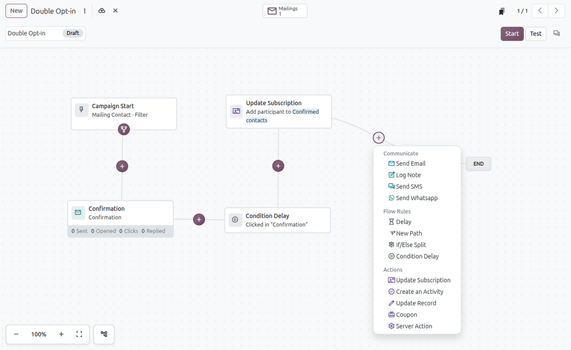

============================
Campaign workflow activities
============================

In Odoo **Marketing Automation**, a *workflow* defines the sequence of actions (i.e., *activities*)
executed for each participant in an automated campaign. An activity is an individual step in the
workflow that defines what happens to each participant at a particular point in the sequence (e.g.,
send a communication, create a server action). Each campaign contains a single workflow consisting
of any number of :ref:`activities <marketing_automation/activities>`.

This documentation covers how to design campaign workflows using a *workflow builder* interface.

.. _marketing_automation/create-flow:

Design a campaign flow
======================

To access the workflow builder, select an existing campaign or :ref:`create a new campaign
<marketing_automation/marketing_automation/campaigns>` from the :menuselection:`Marketing Automation
app --> Campaigns` dashboard.

.. important::
   If creating a new workflow, a :doc:`trigger <target_audience>` **must** be defined before any
   activities can added.

In the builder interface, a workflow is represented as a connected sequence of nodes (activities),
which can be dragged-and-dropped anywhere in the view. All workflows begin with the initial trigger
node and each subsequent node defines what happens to the participants records targeted by the
trigger.

To add a new node, click a :icon:`fa-plus` :guilabel:`(Add a step)` button anywhere in the flow. In
the popover, select a node from the :ref:`Communicate
<marketing_automation/activities/communicate>`, :ref:`Flow Rules
<marketing_automation/activities/communicate>`, or :ref:`Actions
<marketing_automation/activities/communicate>` sections.

After selecting a node, configure the activity, then click :guilabel:`Save` to add it to the
workflow, or :guilabel:`Discard` to cancel.

To remove an activity, click on its corresponding node, then click :guilabel:`Remove`.

.. _marketing_automation/activities:

Campaign activities
===================

The following section lists the available activities that can be added to a workflow.

.. _marketing_automation/activities/communicate:

Communicate
-----------

The *Communicate* section provides the following options to send communications to campaign
participants:

- :guilabel:`Send Email`: Create an email to send recipients, optionally specifying a filter.
- :guilabel:`Log Note`: Log a note in the chatter of the participant record.
- :guilabel:`Send SMS`: Create an :doc:`SMS message <../sms_marketing/create_sms>` to send
  recipients, optionally specifying a filter.
- :guilabel:`Send Whatsapp`: Create a :ref:`Whatsapp template <productivity/whatsapp/templates>` to
  send recipients, optionally specifying a filter.

.. _marketing_automation/activities/flow-rules:

Flow Rules
----------

The *Flow Rules* section provides the following options to define new paths or conditions in the
workflow:

- :guilabel:`Delay`: Wait for a number of hours, days, weeks, or months before the next activity.
- :guilabel:`New Path`: Create a new branch from the current node. Nodes on the same branch level
  run in parallel.
- :guilabel:`If/Else Split`: Create a split branch to sort participants into either branch depending
  on whether they match a :guilabel:`Filter` rule *or* whether they interacted (e.g., opened,
  replied, clicked, bounced) with a previous activity.
- :guilabel:`Condition Delay`: Create a delay for an activity until the records match a
  :guilabel:`Filter` rule *or* whether they interacted with a previous activity. Optionally, if the
  condition is not met, a :guilabel:`Time limit` can be set to wait before cancelling the step.

.. _marketing_automation/activities/actions:

Actions
-------

The *Actions* section provides the following options to modify data on participant records:

- :guilabel:`Update Subscription`: Add or remove a participant from a :doc:`Mailing List
  <../email_marketing/mailing_lists>`.
- :guilabel:`Create an Activity`: Schedule an :ref:`activity <activities/form>` on the participant's
  record.
- :guilabel:`Update Record`: Changes a specific field on the participant's record.
- :guilabel:`Coupon`: Create a coupon from a :guilabel:`Coupon Program` and email it to the
  participant's customers using the :guilabel:`Mail Template`. Only coupons of type *Coupons*,
  *Discount Code*, or *Next Order Coupons* can be created. This option is only available if the
  **Sales** app's :doc:`discount and loyalty programs
  <../../sales/sales/products_prices/loyalty_discount>` are enabled.
- :guilabel:`Server Action`: Execute a specific :ref:`server action
  <studio/automated-actions/action>` on the participant record.

.. tip::
   To view all server actions in the database, activate :doc:`../../general/developer_mode`, and
   navigate to :menuselection:`Settings app --> Technical --> Actions --> Server Actions`.

.. seealso::
   - :doc:`testing_running`
   - :doc:`understanding_metrics`
   - :doc:`target_audience`
