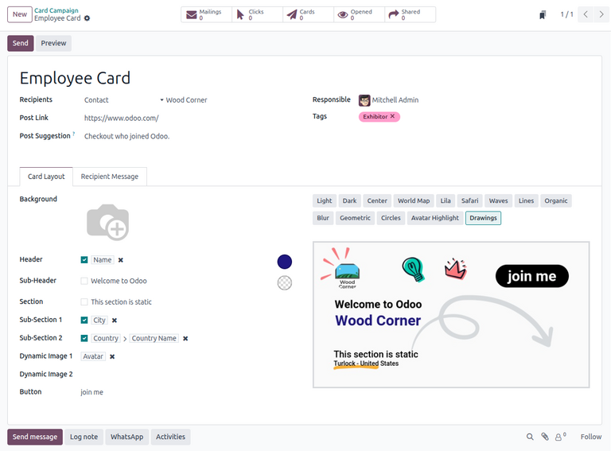
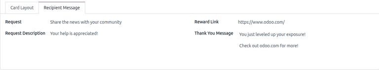
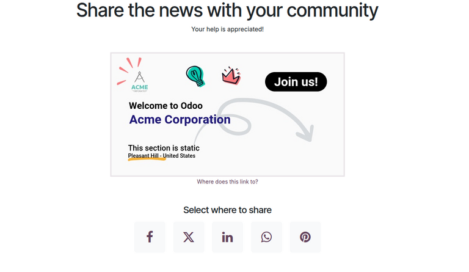
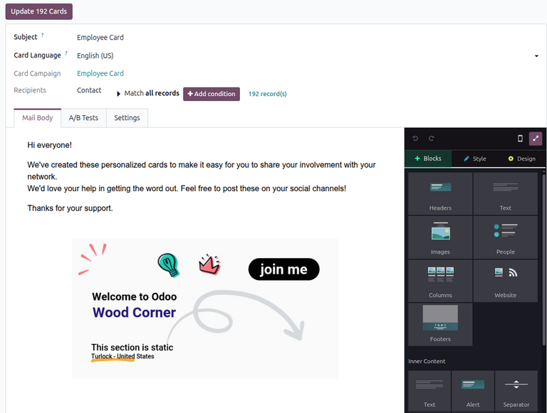

==============
Marketing Card
==============

The **Marketing Card** application allows users to create and manage promotional campaigns with
personalized, digital cards as well as view analytics about their campaign performance. Event
marketers can design dynamic card templates using different layouts. They can also expand their
reach by emailing cards to recipients in bulk and allow recipients to share the cards to their own
networks.

.. _marketing_card/card-campaigns:

Card campaigns
==============

To see a dashboard of all created card campaigns, navigate to the **Marketing Card** app. By
default, card campaigns appear in the :icon:`oi-view-list` :guilabel:`(List)` view, providing users
with detailed information about each campaign. Alternatively, the :icon:`oi-view-kanban`
:guilabel:`(Kanban)` view provides users with a card-view of all campaigns, along with icons
displaying each campaign's :ref:`performance metrics <marketing_card/metrics>`.

.. _marketing_card/create-campaign:

Create a campaign
=================

To create a campaign, click :guilabel:`New`. This opens a new campaign form, allowing users to
configure campaign information, design the :ref:`card layout
<marketing_card/create-campaign/card-layout>`, and customize the :ref:`campaign message
<marketing_card/create-campaign/recipient-message>`.

Begin by providing a name for the campaign in the :guilabel:`Name` field. This field is
**required**.

Then, in the :guilabel:`Recipients` drop-down menu, users **must** select the type of recipient of
the campaign. The following recipient types are provided:

- :guilabel:`Contact`: Send cards to existing contacts.
- :guilabel:`Event Booth`: Send cards contacts with registered :doc:`event booths
  <events/promote_monetize/event_booths>`.
- :guilabel:`Event Registration`: Send cards to contacts with :doc:`event registrations
  <events/promote_monetize/sell_tickets>`.
- :guilabel:`Event Track`: Send cards to contacts with :doc:`event tracks
  <events/attendee_experience/event_tracks>`.

Once selected, a :guilabel:`Preview on...` field appears, allowing the user to preview the campaign
on a specific contact from the selected recipient type. After choosing a preview target, a
:guilabel:`Preview` button appears above the campaign form.

Next, fill out the following fields:

- :guilabel:`Post Link`: Relative URL of a page on the user's Odoo website.
- :guilabel:`Post Suggestion`: Description below the card when sharing on X.
- :guilabel:`Responsible`: Internal user responsible for managing the card campaign.
- :guilabel:`Tags`: Relevant tags for the campaign.

.. note::
   If the :guilabel:`Post Link` is left unspecified, Odoo automatically sets the target to the
   chosen record's webpage. If the record is unpublished, the target defaults to the corresponding
   event's homepage.

.. _marketing_card/create-campaign/card-layout:

Card Layout tab
---------------

The :guilabel:`Card Layout` tab on the campaign form provides options to configure the text and
appearance of the card.

To customize the card, users can configure the following fields:

- :guilabel:`Background`: Upload an image to be displayed as the card background.
- :guilabel:`Header`: Enter the main header text.
- :guilabel:`Sub-Header`: Enter a sub-header text, displayed above the header.
- :guilabel:`Section`: Enter a text to be displayed in the lower section.
- :guilabel:`Sub-section 1`: Enter a text to be displayed below the lower section.
- :guilabel:`Sub-section 2`: Enter a text to be displayed next to :guilabel:`Sub-section 1`.
- :guilabel:`Dynamic Image 1`: Select an existing image from the selected recipient's model to be
  displayed in a corner of the card. This field only takes a :ref:`dynamic placeholder
  <marketing_card/create-campaign/card-layout/dynamic-placeholders>` as input.
- :guilabel:`Dynamic Image 2`: Select an existing image from the selected recipient's model to be
  displayed in a corner of the card. This field only takes a :ref:`dynamic placeholder
  <marketing_card/create-campaign/card-layout/dynamic-placeholders>` as input.
- :guilabel:`Button`: Enter a text for the button.

A preview of the resulting card allows the user to interactively visualize their configuration.
Above the preview are selectable themes to change the appearance of the card.

.. note::
   The following fields allow users to configure the translations of the inputted text into all
   other :doc:`available languages <../general/users/language>` in the database:

   - :guilabel:`Header`
   - :guilabel:`Sub-Header`
   - :guilabel:`Section`
   - :guilabel:`Sub-Section 1`
   - :guilabel:`Sub-Section 2`

   To do so, click :guilabel:`EN` at the edge of the field. In the resulting pop-up window, make any
   modifications to the translations. Finally, click :guilabel:`Save` to save or :guilabel:`Discard`
   to cancel.

.. _marketing_card/create-campaign/card-layout/dynamic-placeholders:

Dynamic placeholders
~~~~~~~~~~~~~~~~~~~~

By default, the text content of each field is static. However, the fields listed (except for
:guilabel:`Background` and :guilabel:`Button`) can also be populated automatically using
:ref:`dynamic placeholders <email_template/dynamic-placeholders>` to personalize the card content
for different recipients.

To do this, click the checkmark next to the field. Then, browse and select a placeholder value to be
populated from the selected recipient.

.. _marketing_card/create-campaign/recipient-message:

Recipient Message tab
---------------------

The :guilabel:`Recipient Message` tab on the campaign form provides options to configure messages
sent to recipients when sharing the card.

Users can configure the following fields:

- :guilabel:`Request`: Enter a request to be displayed at the top of the campaign.
- :guilabel:`Request Description`: Enter a description of the request, displayed below the request.
- :guilabel:`Reward Link`: Provide a link to reward recipients who share the campaign.
- :guilabel:`Thank You Message`: Enter a message to thank recipients for sharing the campaign.

.. _marketing_card/preview:

Preview campaign
================

Once the card campaign form has been configured, click the :guilabel:`Preview` button to view a copy
of a campaign to be sent to recipients.

The campaign layout is organized with the request and the request description displayed at the very
top, followed by the card, then a list of social media icons allowing the user to share the campaign
across different platforms.

.. _marketing_card/mailing:

Campaign mailing
================

After configuring a card campaign, users can :ref:`configure mailing options
<marketing_card/mailing/configure>` then :ref:`share the cards <marketing_card/mailing/send>` with
recipients.

.. _marketing_card/mailing/configure:

Configure mailing
-----------------

To configure the campaign mailing, click :guilabel:`Send`. On a separate page, users configure the
:ref:`email form <email_marketing/create_email>` to filter or specify recipients and customize the
body of the message.

To start, enter the subject of the mailing in the :guilabel:`Subject` field.

Next, under the :guilabel:`Card Language`, select the language in which to render the cards.

The :guilabel:`Card Campaign` and :guilabel:`Recipients` fields are already populated. The filtering
rule under the :guilabel:`Recipients` field can be modified to update the mailing list.

The :guilabel:`Mail Body` tab is automatically populated with a default message along with the card.
This message can be modified using the website editor.

After configuring the email form, click the :guilabel:`Update (#) Cards` button to generate or
update the personalized cards for each recipient. Then, on the :guilabel:`Confirm Cards Update`
pop-up window, click :guilabel:`Update Cards` to create a draft mailing, or click :guilabel:`Cancel`
to cancel.

.. note::
   Alternatively, clicking :guilabel:`Save` also creates a draft mailing.

.. _marketing_card/mailing/send:

Send cards
----------

Once the cards have been updated, users can either send the cards or schedule the mailing for a
future date.

To send the mailing, navigate to :menuselection:`Marketing Cards --> Campaigns`, select the
campaign, then click the :icon:`fa-envelope` :guilabel:`Mailings`.

Next, select the mailing and click :guilabel:`Send`. On the :guilabel:`Ready to unleash emails?`
pop-up window, click :guilabel:`Send to all` to send the cards to the specified recipients.

Alternatively, to schedule for a later date, click :guilabel:`Schedule`. On the pop-up window,
select a date in the :guilabel:`Send on` field. Finally, click :guilabel:`Schedule` to schedule the
mailing.

After sending or scheduling a mailing campaign, a series of smart buttons appear, showing the
:doc:`engagement metrics <email_marketing/analyze_metrics>` for the campaign.

.. _marketing_card/metrics:

Campaign metrics
================

At any point, users can view metrics about the campaign, displayed as smart buttons at the top of
the campaign form.

The following buttons provide specific information about the performance of the campaign:

- :icon:`fa-envelope` :guilabel:`Mailings`: View a list of recipients of the campaign.
- :icon:`fa-mouse-pointer` :guilabel:`Clicks`: View how many times the campaign was clicked. This
  button is **not** clickable.
- :icon:`fa-paper-plane` :guilabel:`Cards`: View how many cards were sent to recipients.
- :icon:`fa-eye` :guilabel:`Opened`: View how many times the campaign was opened.
- :icon:`fa-share` :guilabel:`Shared`: View how many times the campaign was shared.

Clicking on a smart button opens a list of occurrences or instances of the metric (e.g., a list of
times a card was created for a recipient).
