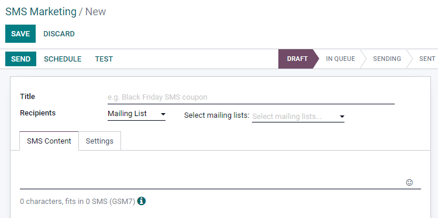
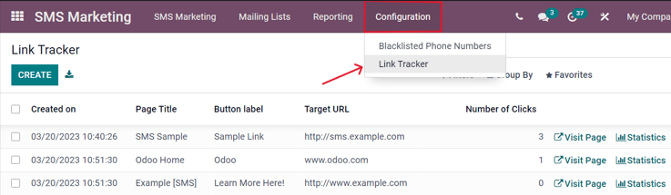

===================
Create SMS messages
===================

To start, click :guilabel:`Create` on the main :guilabel:`SMS Marketing` dashboard, and Odoo reveals
a blank SMS template form, which can be configured in a number of different ways.

First, give the mailing a :guilabel:`Subject`, which describes what the mailing is about.

Next, in the :guilabel:`Recipients` field, choose to whom this :abbr:`SMS (Short Message Service)`
will be sent. By default, Odoo has :guilabel:`Mailing List` selected. If this is the desired
:guilabel:`Recipients` field option, specify which mailing list Odoo should send this :abbr:`SMS
(Short Message Service)` to in the :guilabel:`Select Mailing List` field.

.. note::
   To create (or edit) a mailing list, go to :menuselection:`Mailing Lists --> Mailing List`. There,
   Odoo displays all previously created mailing lists, along with various types of data related to
   that specific list (e.g. number of contacts, mailings, recipients, etc.).

   To learn more about mailing lists and contacts, check out :doc:`mailing_lists_blacklists`.

.. image:: create_sms/sms-mailing-list.png
   :align: center
   :alt: View of the mailing list page in the SMS marketing application.

To reveal all the possible options in the :guilabel:`Recipients` field, click the field to see all
the choices Odoo makes available.

When another field (other than :guilabel:`Mailing List`) is selected, the option to specify that
chosen field even further becomes available — either with a default recipient filter equation that
appears automatically (which can be customized to fit any business need), or, if no default
recipient filter equation is present, an :guilabel:`Add Filter` button will appear.

Clicking the :guilabel:`Add Filter` button, reveals fully customizable domain rule fields, which can
be configured similar to an equation. You can create multiple recipient rules, if necessary.

Then, Odoo will only send the :abbr:`SMS (Short Message Service)` to recipients who fit into
whatever criteria is configured in those fields. Multiple rules can be added.

.. example::
   If :guilabel:`Contact` is chosen, all of the *Contacts* records in the Odoo database (vendors,
   customers, etc.) will receive the :abbr:`SMS (Short Message Service)`, by default — unless more
   specific recipient rules are entered.

   For instance, the message below will only be sent to contacts in the database that are located in
   the United States (e.g. `Country` > `Country Name` equals `United States`), and they haven't
   blacklisted themselves from any mailings (e.g. `Blacklist` > `is` > `not set`).

   .. image:: create_sms/contact-recipient.png
      :align: center
      :alt: Contact recipients on SMS marketing.

Writing SMS messages
--------------------

Enter the content of the :abbr:`SMS (Short Message Service)` in the text field, found in the
:guilabel:`SMS Content` tab. Links and emojis can also be included. Beneath the text field, Odoo
displays how many characters are used in the message, along with how many :abbr:`SMS (Short Message
Service)` mailings it will take to deliver the complete message.

.. tip::
   To check the price of sending an :abbr:`SMS (Short Message Service)` for a country, click on the
   :guilabel:`Information` icon.

.. image:: create_sms/sms-price-check.png
   :align: center
   :alt: SMS price check icon.

.. note::
   Credits must be purchased from Odoo in order to take advantage of the *SMS Marketing* app;
   :abbr:`SMS (Short Message Service)` messages will not be sent without credits.

.. seealso::
   `Odoo SMS - FAQ <https://iap-services.odoo.com/iap/sms/pricing>`_

Track links used in SMS messages
--------------------------------

When links are used in :abbr:`SMS (Short Message Service)` messages, Odoo automatically generates
link trackers to gather analytical data and metrics related to those specific links, which can be
found by going to :menuselection:`Configuration --> Link Tracker`.

Adjust SMS settings
===================

Under the :guilabel:`Settings` tab of the SMS template, there is an option to :guilabel:`Include
opt-out link`. If activated, the recipient is able to unsubscribe from the mailing list, thus
avoiding all future mailings.

An employee can be designated as the :guilabel:`Responsible` in the :guilabel:`Tracking` section of
the :guilabel:`Settings` tab, as well.

.. image:: create_sms/sms-settings-tab.png
   :align: center
   :alt: SMS Settings tab.

Send SMS messages
=================

Once a mailing is created, choose when Odoo should deliver the message from the following options:

- :guilabel:`Send`: sends the message immediately. Consider using this option if the recipient list
  is highly refined, or in cases that involve fast approaching deadlines, such as a "flash sale."
- :guilabel:`Schedule`: choose a day (and time) for Odoo to send the mailing. This is typically the
  best option for mailings related to a specific event. Such a method can also be used to promote a
  limited-time offer, or to help plan a company's content strategy in advance.
- :guilabel:`Test`: allows for an :abbr:`SMS (Short Message Service)` to be sent to one or multiple
  numbers for test purposes. Remember to use a comma between phone numbers if multiple numbers are
  used as recipients.
