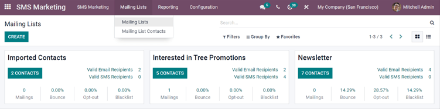
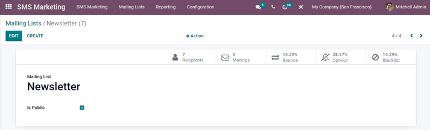
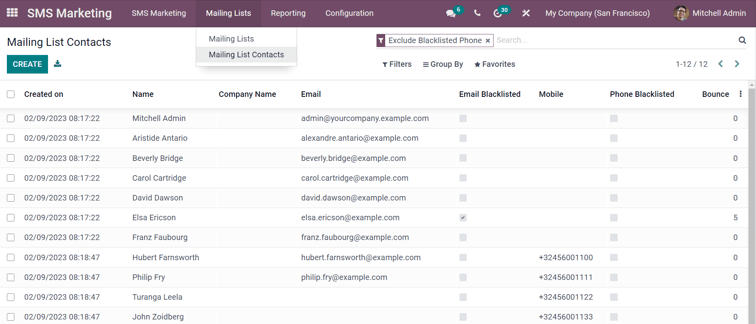
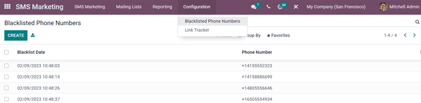
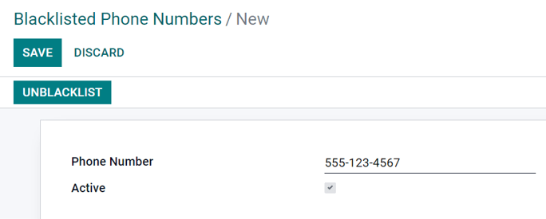
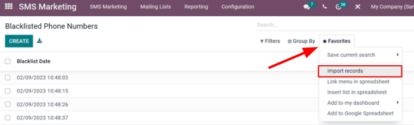

============================
Mailing lists and blacklists
============================

Creating (or importing) mailing lists in the Odoo database is extremely useful, especially if groups
of specific people are already aligned with a company (like subscribers to an already-established
newsletter, for example). Mailing lists are also a great way to get started if a company is
migrating from another system, and already have a built-in audience.

Moreover, providing an audience with the option to 'unsubscribe' from mailings (by putting their
phone numbers on a blacklist), helps businesses maintain good customer relations, by giving
recipients the power to control what they are sent.

Mailing lists
=============

In the :guilabel:`SMS Marketing` app, there's an option on the header menu named :guilabel:`Mailing
Lists`. When clicked, a sub-menu is revealed with options for :guilabel:`Mailing Lists` and
:guilabel:`Mailing List Contacts`.

Click :menuselection:`Mailing Lists --> Mailing Lists` to see an overview of all mailing lists in
the database.

To edit any existing list, select the desired list from the :guilabel:`Mailing Lists` page, and
proceed to modify it in a number of ways.

To create a new mailing list, click :guilabel:`Create` in the upper left corner of the
:guilabel:`Mailing Lists` page. Doing so, will reveal a blank mailing list template pop-up.

.. image:: mailing-lists-blacklists/sms-mailing-list-popup.png
   :align: center
   :alt: View of the mailing list pop-up window in Odoo SMS Marketing.

First, choose a name for the :guilabel:`Mailing List`, and activate the option :guilabel:`Is
Public`, to make the mailing list accessible to recipients on the :guilabel:`Subscription Management
page`. Doing so allows users to update their subscription preferences at any time.

.. note::
   Checking the :guilabel:`Is Public` box is not required, but is recommended to maintain good
   customer relations.

When those fields are filled in, click :guilabel:`Create`, and Odoo removes the pop-up, and returns
to the main :guilabel:`Mailing Lists` page, where there is now a new, accessible list for the
mailing list that was just created.

As mentioned before, to edit (and customize) the mailing list further, select the mailing list from
the main :guilabel:`Mailing Lists` page, and Odoo reveals the mailing list detail form.

Along the top, there are various analytical smart buttons displaying statistics for different
metrics related to the mailing list (e.g. :guilabel:`Recipients`, :guilabel:`Mailings`, etc.).

To take a closer look at (or make changes to) any of those elements, click the desired smart button,
and Odoo reveals a separate page with in-depth data associated with the mailing list.

To make changes to the mailing list itself, click the :guilabel:`Edit` button in the upper-left
corner of the mailing list form.

.. note::
   Don't forget to hit the :guilabel:`Save` button once the necessary changes have been made.

Mailing lists contacts
======================

If :guilabel:`Mailing List Contacts` is selected (from the :guilabel:`Mailing Lists` header menu
drop-down menu), Odoo reveals a separate page with all the contacts associated with one (or more)
of the configured mailing lists in the database.

.. note::
   By default, Odoo reveals the :guilabel:`Mailing List Contacts` page with the :guilabel:`Exclude
   Blacklisted Phone` filter in the search bar. Therefore only showing contact information for
   recipients who still want to receive communications and mailings.

Communication history in the Chatter
------------------------------------

An accessible record of the sent mailings is kept on each recipient's :guilabel:`Chatter`, located
beneath a recipient's contact form (in the :guilabel:`Contacts` application).

Database users can reference the :guilabel:`Chatter` to easily keep track of communications, and see
a history of interactions with contacts and prospects.

For example, sales representative can use the :guilabel:`Chatter` to quickly find out which SMS
mailing promotions a certain customer has received (or not received).

.. image:: mailing-lists-blacklists/sms-marketin-chatter.png
   :align: center
   :alt: View of what the chatter looks like in the Odoo Contacts app.

Blacklist
=========

:guilabel:`Odoo SMS Marketing` has a :guilabel:`Blacklist` feature that provides recipients with the
power to add their phone number to a list of people who no longer want to receieve communications or
mailings.

This is also known as the "Unsubscribe Process". Customers will automatically be added onto the
:guilabel:`Blacklist`, if they click :guilabel:`Unsubscribe`, via their :guilabel:`Subscription
Management Page`. Customers can also be added manually to the blacklist, if necessary.

To see a complete collection of blacklisted numbers, navigate to the :guilabel:`SMS Marketing` app,
and go to :menuselection:`Configuration --> Blacklisted Phone Numbers`. Doing so, reveals a separate
page containing every blacklisted phone number in the database.

To manually add a number, click the :guilabel:`Create` button in the upper-left. When clicked, Odoo
reveals a separate page, in which the phone number to be blacklisted is entered. There's also a
checkbox to indicate whether that particular phone numnber is :guilabel:`Active` (or not).

Once the form is completed, click :guilabel:`Save` to add it to the :guilabel:`Blacklist`. To remove
any number from the :guilabel:`Blacklist`, select the desired number, and click
:guilabel:`Unblacklist`.

Importing blacklists
--------------------

During a software/platform migration, it is possible to import an already existing blacklist of
contacts. This would include customers, who have already asked to be :guilabel:`Blacklisted` on SMS
mailings.

To do that, navigate to the :guilabel:`SMS Marketing` app, and go to :menuselection:`Configuration
--> Blacklisted Phone Numbers`. Then, select the :guilabel:`Favorites` drop-down (beneath the search
bar), and click :guilabel:`Import records`.

