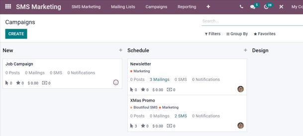
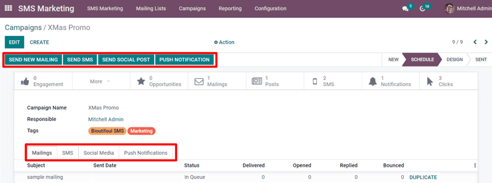
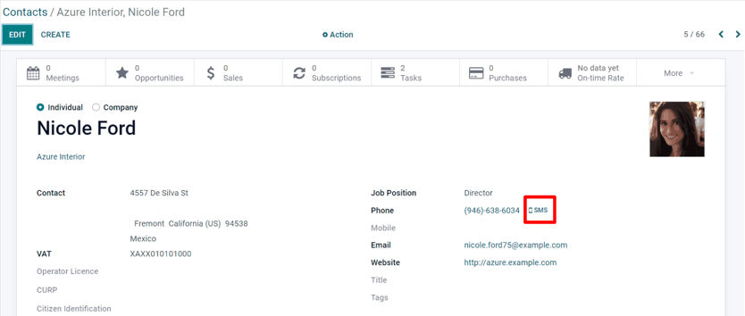
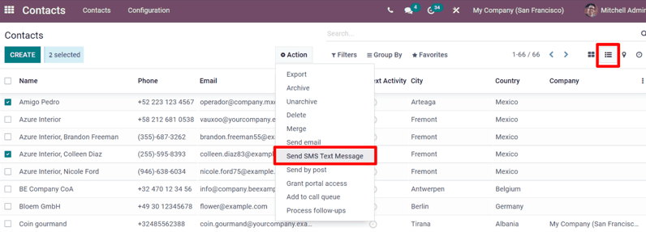
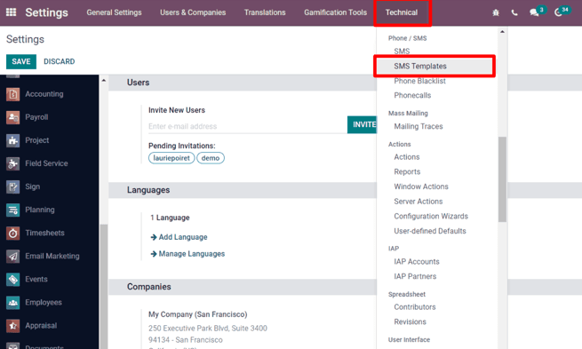
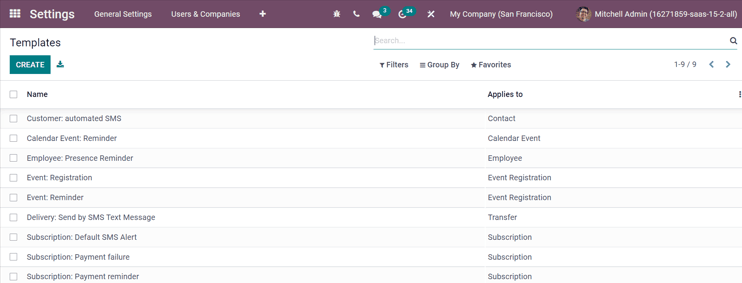

=============
SMS campaigns
=============

Utilizing SMS campaigns with Odoo :guilabel:`SMS Marketing` isn't just an effective advertisement
strategy, it's also a great way to remind people about upcoming events, issued invoices, and so much
more.

But, before SMS campaigns can be created (and sent), a few specific settings and features must be
enabled.

SMS campaign setting
====================

First and foremost, make sure the :guilabel:`Mailing Campaigns` feature is activated.

To do that, go to the :guilabel:`Email Marketing` application :menuselection:`Configuration -->
Settings` enable :guilabel:`Mailing Campaigns` and click :guilabel:`Save`.

.. image:: sms-campaigns/sms-marketing-campaigns.png
   :align: center
   :alt: View of the mailing campaigns setting in Odoo.

.. note::
   Activating the :guilabel:`Mailing Campaigns` feature also enables the :guilabel:`A/B Test`
   feature.

Once this is completed, navigate back to the :guilabel:`SMS Marketing` app, and the
:guilabel:`Campaigns` header menu is now available. The :guilabel:`A/B Test` tab is also now
available on every SMS template form.

A/B tests
=========

:guilabel:`A/B Tests` allow any SMS to be tested against other versions of the same message to test
which version is the most "successful."

On an SMS template form, under the :guilabel:`A/B Tests` tab, initially, there's only a single
checkbox labeled: :guilabel:`Allow A/B Testing.`

When clicked, a series of other options appear.

.. image:: sms-campaigns/ab-tests-sms.png
   :align: center
   :alt: AB Test tab on SMS marketing.

In the first field, enter a desired percentage of recipients to conduct the A/B Test on.

Beneath the percentage field is the :guilabel:`Winner Selection` field. This is what Odoo will use
to determine the “success” of an A/B Test. In other words, this tells Odoo how to pick a “winning”
A/B test.

The following sections are available: :guilabel:`Manual`, :guilabel:`Highest Click Rate`,
:guilabel:`Leads`, :guilabel:`Quotations`, or :guilabel:`Revenues`.

Finally, the :guilabel:`Send Final On` field is listed. This represents the date-time that Odoo uses
as a deadline to determine the “winning” mailing variation. Then, Odoo sends it to the remaining
recipients, who weren't involved in the test at that date-time.

.. tip::
   Quickly create different versions of the mailing to add to the A/B Test by clicking the
   :guilabel:`Create an Alternate Version` button.

.. note::
   Remember, the “winning” mailing variation is based on the criteria selected in the
   :guilabel:`Winner Selection` field.

Campaigns page
==============

To create, edit, or analyze any campaign, click :guilabel:`Campaigns` in the header menu of the
:guilabel:`SMS Marketing` app. On the :guilabel:`Campaigns` page, each campaign displays various
information related to the mailings associated with that campaign (e.g. number of emails, social
posts, SMSs, and push notifications).

Campaign templates
==================

Click :guilabel:`Create` to create a new campaign, and Odoo reveals a blank campaign template to
build upon. Or, select any previously-made campaign to review (and edit) its campaign template form.

Below, is a sample of what a completed campaign template looks like.

With each campaign, the options to :guilabel:`Send New Mailing`, :guilabel:`Send SMS`,
:guilabel:`Send Social Post`, and :guilabel:`Push Notifications` are available above the template
form.

Whenever one of those communication options is added to the campaign, Odoo will create a new
corresponding tab on the template form, where those types of messages can be found (and edited, if
possible), along with various data related to each specific mailing.

At the top of the template, there are various analytical smart buttons. When clicked, Odoo reveals
in-depth metrics related to that specific topic (e.g. :guilabel:`Engagement`,
:guilabel:`Opportunities`, etc.) on a separate page.

Beneath the smart buttons, are fields for :guilabel:`Campaign Name` and :guilabel:`Responsible`.
Odoo also allows for various :guilabel:`Tags` to be added, as well (if necessary).

Sending SMSs through the Contacts app
=====================================

Sending SMS mailings directly through a contact's form is available by default.

In order to send an SMS in this fashion, navigate to the :guilabel:`Contacts` app, select the
desired :guilabel:`contact` in the database, and click on the :guilabel:`SMS` icon on the
:guilabel:`contact form` (next to their :guilabel:`phone number`).

To send a message to multiple contacts at once, navigate to the main :guilabel:`Contacts`
dashboard, choose the :guilabel:`List View`, and select all the desired  to whom the message should
be sent. Then, under :guilabel:`Action`, select :guilabel:`Send SMS`.

Set up SMS templates for future use
===================================

In order to set up :guilabel:`SMS Templates` for future use, activate :guilabel:`Developer Mode`.
To do that, navigate to the main Odoo dashboard (full of apps), and select :guilabel:`Settings`.
Then, scroll down to the :guilabel:`Developer Tools` section, and click :guilabel:`Activate the
Developer Mode`.

When clicked, the main Odoo dashboard appears once more, with a bug icon at the top of the
dashboard, indicating that :guilabel:`Developer Mode` is currently on.

Once activated, return to :guilabel:`Settings App` then from the header menu select
:menuselection:`Technical --> SMS Templates` (in the :guilabel:`Phone / SMS` sub-section).

Upon clicking :guilabel:`SMS Templates`, Odoo reveals an entire page of SMS templates. The default
:guilabel:`List` view, showcases each tempates name and to which recipients it applies.

On this page, SMS templates can be edited or created from scratch.

