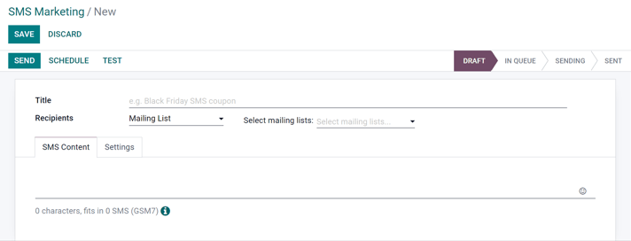
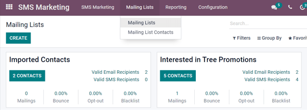
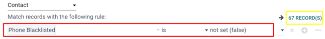
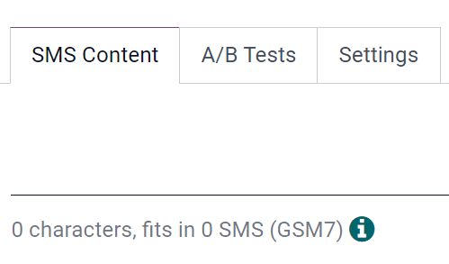
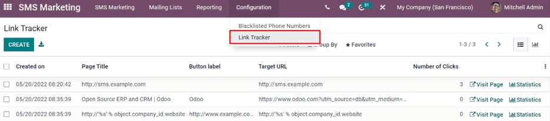
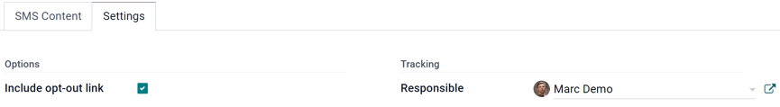
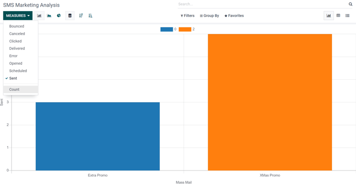

==============
SMS essentials
==============

Utilizing SMS (Short Message Service) mailings in communication strategies can help companies
expand their market reach, especially in some countries, where emails aren't very common (or used
at all).

:guilabel:`SMS Marketing` can also boosts conversion rates - mostly because SMS mailings have an
extremely high open-rate percentage.

SMS Marketing dashboard
=======================

When the application is opened, Odoo displays the main :guilabel:`SMS Marketing` dashboard, which
showcases the various SMS mailings that have been created, along with pertinent information and
data related to that specific message.

The :guilabel:`Kanban` view is the default Odoo uses when the application is opened, which provides
an organized display of the SMS mailings that have been created, and what their current status is
at the moment.

.. note::
   An SMS can have one of the following statuses: :guilabel:`Draft`, :guilabel:`In Queue`,
   :guilabel:`Sending`, or :guilabel:`Sent`.

In the upper right corner of the main :guilabel:`SMS Marketing` dashboard, there are a few different
view options to choose from. Each one provides a unique take on the same SMS information.

The :guilabel:`List` view provides the same useful data related to SMS mailings, but in a more
traditional list layout.

The :guilabel:`Calendar` view provides a simple calendar, making it easy to see when SMS mailings
are going to be sent (or have been sent). If a future date is clicked, Odoo reveals a blank SMS
template that, when completed, will be scheduled to be sent on that specific future date.

Lastly, the :guilabel:`Graph` view visualizes that same SMS-related data in series of graphs and
charts. Odoo also provides various ways to sort and group the data for more detailed analysis.

How to create SMS messages
==========================

To start, click :guilabel:`Create` on the main :guilabel:`SMS Marketing` dashboard, and Odoo reveals
a blank SMS template, which can be customized (and configured) in a number of different ways.

First, give the mailing a :guilabel:`Subject`, which describes what the mailing is about.

Next, in the :guilabel:`Recipients` field, choose to whom this SMS will be sent. By default, Odoo
has :guilabel:`Mailing List` selected. If this is the desired :guilabel:`Recipients` field option,
specify which mailing list Odoo should send this SMS to, in the :guilabel:`Select Mailing List`
field to the right.

.. note::
   To create (or edit) a mailing list, go to :menuselection:`Mailing Lists --> Mailing List`. There,
   Odoo displays all previously created mailing lists, along with various types of data related to
   that specific list (e.g. number of contacts, mailings, recipients, etc.).

To learn more about mailing lists (and contacts) check out :doc:`mailing_lists_blacklists`.

To reveal all the possible options in the :guilabel:`Recipients` field, click the field to see all
the choices Odoo makes avaialble. When another field (other than :guilabel:`Mailing List`) is
selected, the option to specify that chosen field even further becomes available, via an
:guilabel:`Add Filter` button.

Clicking the :guilabel:`Add Filter` button, reveals fully customizable domain rule fields, which can
be configured similar to an equation. You can create multiple recipient rules, if necessary. Then,
Odoo will be sure to only send the SMS to recipients who fit into whatever criteria is configured in
those fields.

For instance, if :guilabel:`Contact` is chosen, all of the Odoo contacts in the database (vendors,
customers, etc.) will receive the SMS, unless a specific recipient rule(s) are entered.

In the example below, the message will only be sent to contacts who haven't chosen to
:guilabel:`Blacklist` their contact information through the :guilabel:`Unsubscribing` process.

How to create SMS messages
==========================

Enter the content of the SMS in the text field, found in the :guilabel:`SMS Content` tab. Links and
emojis can also be included. Beneath the text field, Odoo displays how many characters are used in
the message, along with how many SMS mailings it will take to deliver the complete message.

.. tip::
   To check the price of sending an SMS for a country, click on the :guilabel:`Information` icon.

.. note::
   Credits must be purchased from Odoo in order to take advantage of the app (and its features). SMS
   messages will not be sent without credits.

.. seealso::
   - :doc:`../pricing/pricing_and_faq`

How to track links used in SMS messages
---------------------------------------

When links are used, Odoo automatically generates link trackers to gather analytical data and
metrics related to those specific links, which can be found by going to
:menuselection:`Configuration --> Link Tracker`.

How to adjust SMS Settings
==========================

Under the :guilabel:`Settings` tab of the SMS template, there is an option to :guilabel:`Include
opt-out link`. If activated, the recipient is able to unsubscribe from the mailing list, thus
avoiding all future mailings.

An employee can be designated as the :guilabel:`Responsible` in the :guilabel:`Tracking` section of
the :guilabel:`Settings` tab, as well.

How to send SMS messages
========================

Once a mailing is created, choose when Odoo should deliver the message from the following options:

:guilabel:`Send`: sends the message immediately. Consider using this option if the recipient list
isn't excessive.

:guilabel:`Schedule`: choose a day (and time) for Odoo to send the mailing. This is typically the
best option for mailings related to a specific event. Such a method can also be used to promote a
limited-time offer, or to help plan a company's content strategy in advance.

:guilabel:`Test`: allows for an SMS to be sent to one or multiple numbers for test purposes.
Remember to use a comma between phone numbers, if multiple numbers are used as recipients.

Visualize reports
=================

On the :guilabel:`Reporting` page (accessible via the :guilabel:`Reporting` option in the header
menu), there are options to apply filters, measures, and view metrics in a number of different
layouts (:guilabel:`Graph`, :guilabel:`List`, and :guilabel:`Cohort`).

Each :guilabel:`Reporting` metric view option allows for more extensive performance analysis of SMS
mailings.

For example, while in the default :guilabel:`Graph` view, SMS data is visualized as different graphs
and charts, which can be sorted and grouped in various ways (e.g. :guilabel:`Measures` drop down
menu).

