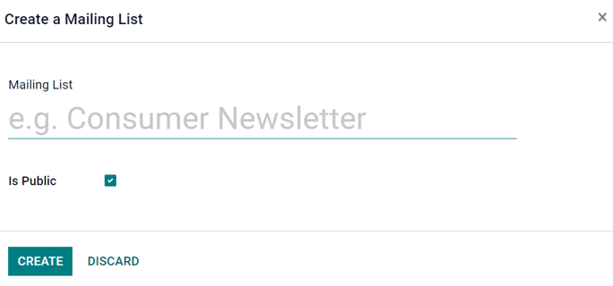

============================
Mailing lists and blacklists
============================

Creating or importing mailing lists in Odoo is very useful when curating content to specific groups
of people that already share similar demographics or interests. Mailing lists are also a great way
to get started if a company is migrating from another system, and already has a established
audience.

Moreover, providing an audience with the option to 'unsubscribe' from mailings, helps businesses
maintain good customer relations, by giving recipients the power to control what they are (and
aren't) sent.

Mailing lists
=============

In the :guilabel:`SMS Marketing` app, there's an option on the header menu called :guilabel:`Mailing
Lists`. When clicked, a sub-menu is revealed with options for :guilabel:`Mailing Lists` and
:guilabel:`Mailing List Contacts`.

Click :menuselection:`Mailing Lists --> Mailing Lists` to see an overview of all mailing lists in
the database.

.. image:: mailing_lists_blacklists/mailing-list-main-page.png
   :align: center
   :alt: View of the main SMS mailing list page on the Odoo SMS Marketing application.

To edit any existing list, select the desired list from the :guilabel:`Mailing Lists` page, and
proceed to modify it in a number of ways.

To create a new mailing list, click :guilabel:`Create` in the upper left corner of the
:guilabel:`Mailing Lists` page. Doing so, will reveal a blank mailing list template form.

First, choose a name for the :guilabel:`Mailing List`, and activate the option :guilabel:`Is
Public`, to make the mailing list accessible to recipients on the :guilabel:`Subscription Management
page`. Doing so allows users to update their subscription preferences at any time.

.. note::
   Checking the :guilabel:`Is Public` box is not required, but is recommended to maintain good
   customer relations.

When those fields are filled in, click :guilabel:`Create` to finalize the form. Then on the main
:guilabel:`Mailing Lists` dashboard, the new mailing list that was just created will be accessible.

To edit or customize the mailing list further, select the mailing list from the main
:guilabel:`Mailing Lists` page to reveal the mailing list detail form.

Along the top of the mailing list detail form, there are various analytical smart buttons displaying
statistics for different metrics related to the mailing list (e.g. :guilabel:`Recipients`,
:guilabel:`Mailings`, etc.).

To review or edit any of those elements, click the desired smart button to reveal a separate page
with in-depth data associated with the mailing list.

To make changes to the mailing list itself, click the :guilabel:`Edit` button in the upper-left
corner of the mailing list detail form.

.. image:: mailing_lists_blacklists/sms-mailing-list.png
   :align: center
   :alt: View of the mailing list template form in Odoo SMS Marketing.

.. note::
   Don't forget to hit the :guilabel:`Save` button once changes have been made.

Mailing lists contacts
======================

Access contacts information from one or more mailing lists navigate to :menuselection:`Mailing Lists
--> Mailing List Contacts` to reveal a dashboard with with all the contacts associated with one or
more of the configured mailing lists in the database.

.. image:: mailing_lists_blacklists/mailing-list-contacts-page.png
   :align: center
   :alt: View of the mailing lists contact page in the Odoo SMS Marketing application.

.. note::
   By default, Odoo reveals the :guilabel:`Mailing List Contacts` page with the :guilabel:`Exclude
   Blacklisted Phone` filter in the search bar. Therefore only showing contact information for
   recipients who still want to receive communications and mailings.

Communication history in the Chatter
------------------------------------

An accessible record of every sent mailing(s) is kept on each recipient's *chatter* section, located
beneath a recipient's contact form (in the *Contacts* application).

Database users can reference the chatter to easily keep track of communications, and see a history
of interactions with contacts and prospects.

For example, sales representatives can use the chatter to quickly find out which :abbr:`SMS (Short
Message Service)` mailing promotions a certain customer has received (or not received).

.. image:: mailing_lists_blacklists/sms-marketing-chatter.png
   :align: center
   :alt: View of what the chatter looks like in the Odoo Contacts app.

Blacklist
=========

Odoo *SMS Marketing* has a :guilabel:`Blacklist` feature that provides recipients with the power to
add their phone number to a list of people who no longer want to receieve communications or
mailings.

This is also known as the unsubscribe process: customers will automatically be added onto a
*blacklist*, if they click :guilabel:`Unsubscribe`, via their :guilabel:`Subscription Management`
page. Customers can also be added manually to the blacklist, if necessary.

To see a complete collection of blacklisted numbers, navigate to the :menuselection:`SMS Marketing
app --> Configuration --> Blacklisted Phone Numbers` to reveal a dashboard containing every
blacklisted phone number in the database.

.. image:: mailing_lists_blacklists/sms-blacklist-menu.png
   :align: center
   :alt: SMS Blacklist menu in the application.

To manually add a number to a blacklist, click the :guilabel:`Create` button in the upper-left
corner of the dashboard and enter the phone number on the next page's form. There's also a
checkbox to indicate whether that particular phone numnber is :guilabel:`Active` (or not).

.. image:: mailing_lists_blacklists/sms-blacklist-create.png
   :align: center
   :alt: SMS Blacklist menu in the application.

Once the form is completed, click :guilabel:`Save` to add it to the :guilabel:`Blacklisted Phone
Numbers` list. To remove any number from the blacklist, select the desired number on the dashboard,
and then, on the phone number's form, click :guilabel:`Unblacklist`.

Importing blacklists
--------------------

During a software/platform migration, it is possible to import an already existing blacklist of
contacts. This would include customers, who have already asked to be blacklisted` on :abbr:`SMS
(Short Message Service)` mailings.

To do that, navigate to :menuselection:`SMS Marketing app --> Configuration --> Blacklisted Phone
Numbers`, and then select the :guilabel:`Favorites` drop-down menu (beneath the search bar), and
click :guilabel:`Import records`.

