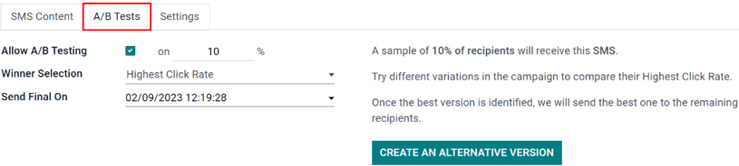
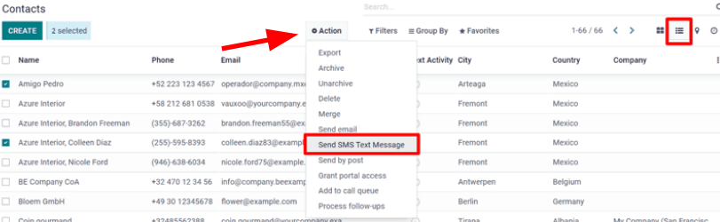

=====================
SMS campaign settings
=====================

Utilizing :abbr:`SMS (Short Message Service)` campaigns with Odoo *SMS Marketing* isn't just an
effective advertisement strategy, it's also a great way to remind people about upcoming events,
issued invoices, and so much more.

But, before :abbr:`SMS (Short Message Service)` campaigns can be created (and sent), a few specific
settings and features must be enabled first.

SMS campaign setting
====================

To enable :abbr:`SMS (Short Message Service)` campaigns in Odoo, make sure the *Mailing Campaigns*
feature is activated by going to :menuselection:`Email Marketing --> Configuration --> Settings`,
and then enable :guilabel:`Mailing Campaigns` and :guilabel:`Save` the changes.

.. image:: marketing_campaigns/sms-mailing-campaigns.png
   :align: center
   :alt: View of the mailing campaigns setting in Odoo.

.. note::
   Activating the *Mailing Campaigns* feature in the *General Settings* also enables the *A/B Test*
   feature.

Once the setting is enabled, navigate back to the :menuselection:`SMS Marketing` app, and notice the
:guilabel:`Campaigns` header menu is now available for use. Similarly, the :guilabel:`A/B Test` tab
is now also available on every :abbr:`SMS (Short Message Service)` template form.

A/B tests
=========

:guilabel:`A/B Tests` allows any :abbr:`SMS (Short Message Service)` mailings to be tested against
other versions within the same campaign, in order to compare which version is the most successful in
producing engagement and/or conversion outcomes.

On an :abbr:`SMS (Short Message Service)` template form, under the :guilabel:`A/B Tests` tab,
initially, there's only a single checkbox labeled: :guilabel:`Allow A/B Testing.`

When clicked, a series of other options appear.

In the first field, enter a desired percentage of recipients to conduct the A/B Test on.

Beneath the percentage field is the :guilabel:`Winner Selection` field. This is what Odoo will use
to determine the successful result of an A/B Test. In other words, this tells Odoo how to pick a
winning A/B test.

The following sections are available: :guilabel:`Manual`, :guilabel:`Highest Click Rate`,
:guilabel:`Leads`, :guilabel:`Quotations`, or :guilabel:`Revenues`.

Finally, the :guilabel:`Send Final On` field is listed. This represents the date-time that Odoo uses
as a deadline to determine the winning mailing variation. Then, Odoo sends that winning mailing
variation to the remaining recipients, who weren't involved in the test, at that prior date and
time.

.. tip::
   Quickly create different versions of the mailing to add to the A/B Test by clicking the
   :guilabel:`Create an Alternate Version` button.

.. note::
   Remember, the winning mailing variation is based on the criteria selected in the
   :guilabel:`Winner Selection` field.

Campaigns page
==============

To create, edit, or analyze any campaign, click :menuselection:`Campaigns` in the header menu of the
:guilabel:`SMS Marketing` app. On the :guilabel:`Campaigns` page, each campaign displays various
information related to the mailings associated with that campaign (e.g. number of emails, social
posts, SMSs, and push notifications).

.. image:: marketing_campaigns/campaigns-page.png
   :align: center
   :alt: Dasbhoard view of different Campaigns in the Odoo SMS Marketing app, separated by stage.

Campaign templates
==================

Click :guilabel:`Create` to create a new campaign, and Odoo reveals a blank campaign template form
to fill out. Alternatively, select any previously-made campaign in order to duplicate, review, or
edit its campaign template form.

.. image:: marketing_campaigns/sms-campaign-template.png
   :align: center
   :alt: View of an SMS campaign template in Odoo SMS marketing.

With each campaign, the options to :guilabel:`Send New Mailing`, :guilabel:`Send SMS`,
:guilabel:`Send Social Post`, and :guilabel:`Push Notifications` are available above the template
form.

Whenever one of those communication options is added to the campaign, Odoo will create a new
corresponding tab on the template form, where those types of messages can be reviewed or edited,
along with various data sets related to each specific mailing.

At the top of the template, there are various analytical smart buttons. When clicked, Odoo reveals
in-depth metrics related to that specific topic (e.g. :guilabel:`Engagement`,
:guilabel:`Opportunities`, etc.) on a separate page.

Beneath the smart buttons, are fields for :guilabel:`Campaign Name` and :guilabel:`Responsible`.
Odoo also allows for various :guilabel:`Tags` to be added, as well (if necessary).

Sending SMSs through the Contacts app
=====================================

Sending :abbr:`SMS (Short Message Service)` mailings directly through a contact's form is available
by default.

In order to send an :abbr:`SMS (Short Message Service)` in this fashion, navigate to the
:menuselection:`Contacts` app, select the desired contact in the database, and click on the
:guilabel:`SMS` icon on the contact form (next to the :guilabel:`Phone Number` field).

.. image:: marketing_campaigns/sms-contact-form.png
   :align: center
   :alt: The SMS icon is located on an individual's contact form in Odoo Contacts.

To send a message to multiple contacts at once, navigate to the main :menuselection:`Contacts` app
main dashboard, choose the :guilabel:`List View`, and select all the desired contacts to whom the
message should be sent. Then, under :guilabel:`Action`, select :guilabel:`Send SMS`.

Set up SMS templates for future use
===================================

In order to set up :guilabel:`SMS Templates` for future use, activate :ref:`developer mode
<developer-mode>`, by navigating to the main Odoo dashboard that is full of apps, and select the
:menuselection:`Settings app`. Then, scroll down to the :guilabel:`Developer Tools` section, and
click :guilabel:`Activate the Developer Mode`.

Once *developer mode* is activated, the main Odoo dashboard appears once more, with a now-visible
bug icon, which is located at the top-right corner of the dashboard; this bug icon indicates that
developer mode is currently active.

Next return to the :menuselection:`Settings app` and, in the now-visible header menus at the top,
choose :menuselection:`Technical --> SMS Templates` to begin setting up :abbr:`SMS (Short Message
Service)` templates for future marketing campaigns.

Inside of the :guilabel:`SMS Templates` dashboard, Odoo reveals an entire page of :abbr:`SMS (Short
Message Service)` templates. The default :guilabel:`List` view showcases each template's name, and
to which recipients it applies.

On this page, :abbr:`SMS (Short Message Service)` templates can be edited or created from scratch.

.. image:: marketing_campaigns/sms-template.png
   :align: center
   :alt: The SMS Templates page in Odoo is available after enabling developer mode in the General
         Settings
