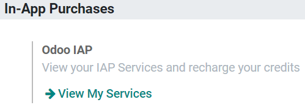

.. _pricing/pricing_and_faq:

===================
SMS Pricing and FAQ
===================

What do I need to send SMSs?
============================
SMS Text Messaging is an In-App Purchase (IAP) service that *requires prepaid credits* to work.

How many types of SMSs are there?
=================================
There are 2 types: GSM7 and UNICODE.

**GSM7** is the standard format, with a limit of 160 characters per message, that includes the
following characters:

.. image:: pricing_and_faq/faq1.png
   :align: center
   :alt: GSM7 in Odoo SMS Marketing

**UNICODE** is the format applied if a special character, that *is not* in the GSM7 list, is used.
Limit per SMS: 70 characters.

.. note::
   For GSM7 SMS the size limit is 160 characters, and for Unicode is 70. *Above these limits, the
   content is divided into a multi-part message* and the limit of characters is lowered to 153 for
   GSM7 and to 67 for Unicode. The system will inform you in real-time about the number of SMS your
   message represents.

How much does it cost to send an SMS?
=====================================
| The price of an SMS depends on the destination and the length (number of characters) of the message.
| To see the **price per country,
  please consult**: `Odoo SMS - FAQ <https://iap-services.odoo.com/iap/sms/pricing#sms_faq_01>`_.

The number of SMSs a message represents will be always available to you in your database.

.. image:: pricing_and_faq/faq2.png
   :align: center
   :height: 300
   :alt: SMS pricing and FAQ Odoo SMS Marketing

How do I buy credits?
=====================
Go to :menuselection:`Settings --> Buy Credits`.

.. image:: pricing_and_faq/faq3.png
   :alt: SMS pricing and FAQ Odoo SMS Marketing

Or go to :menuselection:`Settings --> View my Services`.

.. tip::
   If you are on Odoo Online (SAAS) and have the Enterprise version, you benefit from free trial
   credits to test the feature.

More common questions
=====================

#. **Is there an expiration time for my credits?**

   No, credits do not expire.

#. **Can I send an SMS to a phone number (which is not a mobile phone) because I see the icon in
   front of the field “phone”?**

   Only if that phone number supports SMS (e.g. SIP phones).

#. **Do I receive an invoice to buy my credits?**

   Yes.

#. **Can the recipient answer to me?**

   No, it is not possible to reply to the SMS.

#. **What happens if I send multiple SMS but I do not have enough credits to send them all?**

   The whole transaction is counted as a single one, so no SMS will be sent until you have enough
   credits to send them all.

#. **Do I have a history of the sent SMSs?**

   Yes, the SMS is logged as a note under the chatter of the corresponding record, and a complete
   history of the SMSs sent is available on :ref:`developer mode <developer-mode>` under
   :menuselection:`Technical --> SMS`.

#. **Can I send as many SMSs I want at once?**

   Yes, if you have enough credits.

#. **If I have a number that does not exist in the list of recipients, will I lose credits?**

   Not if the phone number is in the wrong format (e.g. too many digits). Otherwise, if the SMS is
   sent to the wrong person or to a fake number, the credit will be lost.

#. **What happens if I send my SMS to a paying number (e.g.: a contest to win a ticket for a festival)?**

   The SMS will not be delivered to that kind of number, so you won’t be charged.

#. **Can I identify the numbers that do not exist when I send several SMSs?**

   Only the ones that have an invalid format.

#. **How does the GDPR regulation affect this service?**

   Please find our `Privacy Policy here <https://iap.odoo.com/privacy#sms>`__.

#. **Can I use my own SMS provider?**

   Yes, but it is not possible out of the box. Our experts can help you customize your database
   to make it happen. Please, check our success packs `here <https://www.odoo.com/pricing-packs>`_.