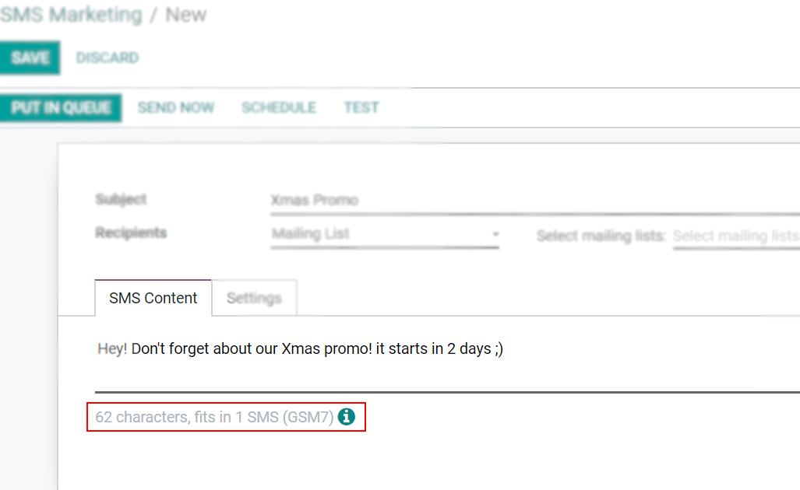

.. _pricing/pricing_and_faq:

===================
SMS Pricing and FAQ
===================

What do I need to send SMSs?
============================

SMS Text Messaging is an In-App Purchase (IAP) service that *requires prepaid credits* to work.

How many types of SMSs are there?
=================================

There are 2 types: GSM7 and UNICODE.

**GSM7** is the standard format, with a limit of 160 characters per message, that includes the
following characters:

.. image:: pricing_and_faq/faq1.png
   :align: center
   :alt: GSM7 characters available in Odoo SMS Marketing.

**UNICODE** is the format applied if a special character, that *is not* in the GSM7 list, is used.
Limit per SMS: 70 characters.

.. note::
   For GSM7 SMS the size limit is 160 characters, and for Unicode is 70. *Above these limits, the
   content is divided into a multi-part message* and the limit of characters is lowered to 153 for
   GSM7 and to 67 for Unicode. Then, in real-time, the system displays the number of SMS mailings
   the message represents.

How much does it cost to send an SMS?
=====================================

The price of an SMS depends on the destination and the length (number of characters) of the
message. To see the **price per country, please consult**: `Odoo SMS - FAQ
<https://iap-services.odoo.com/iap/sms/pricing#sms_faq_01>`_.

The number of SMSs a message represents will always be available in the database.

How to buy credits
==================

Go to :menuselection:`Settings --> Buy Credits`.

.. image:: pricing_and_faq/faq3.png
   :align: center
   :alt: Buying credits for SMS Marketing in Odoo settings.

Or go to :menuselection:`Settings --> View my Services`.

.. image:: pricing_and_faq/faq4.png
   :align: center
   :alt: Using Odoo IAP to recharge credits for SMS Marketing in Odoo settings.

.. tip::
   If Odoo Online (Saas) is being used, along with the Enterprise version, free trial credits are
   available to test the feature.

More common questions
=====================

#. | **Is there an expiration time for my credits?**
   | No, credits do not expire.

#. | **Can I send an SMS to a phone number (which is not a mobile phone) because I see the icon in
     front of the field “phone”?**
   | Only if that phone number supports SMS (e.g. SIP phones).

#. | **Do I receive an invoice to buy my credits?**
   | Yes.

#. | **Can the recipient answer me?**
   | No, it is not possible to reply to the SMS.

#. | **What happens if I send multiple SMSs at once, but I don't have enough credits to send them
     all?**
   | Multiple SMS communications at once at are counted as a single transaction, so no SMSs will be
     sent until there are enough credits to send them all.

#. | **Do I have a history of the sent SMSs?**
   | A history of sent SMSs, along with all pertinent information related to its sent contacts (and
     the message itself), can be found in the :guilabel:`Sent` column of the main :guilabel:`SMS
     Marketing` dashboard (while in :guilabel:`Kanban` view).

     For more detailed information, select a desired SMS from the main dashboard (in
     :guilabel:`Kanban` view), and click on either link in the blue banner above the SMS detail form
     to learn more.

#. | **Can I send as many SMSs I want at once?**
   | Yes, if you have enough credits.

#. | **If an SMS is sent to a number that doesn't exist in the list of recipients, will credits be
     lost?**
   | No, not if the phone number is incorrectly formatted (e.g. too many digits). However, if the
     SMS is sent to the wrong person (or to a fake number), the credit for that SMS will be lost.

#. | **What happens if I send my SMS to a paying number (e.g.: a contest to win a ticket for a
     festival)?**
   | The SMS will not be delivered to that kind of number, so no charges will be made.

#. | **Can I identify the numbers that do not exist when I send several SMSs?**
   | Only the ones that have an invalid format.

#. | **How does the GDPR regulation affect this service?**
   | Please find our `Privacy Policy here <https://iap.odoo.com/privacy#sms>`__.

#. | **Can I use my own SMS provider?**
   | Yes, but it is not possible out-of-the-box. Odoo experts can help customize a database to allow
     for the use of a personal SMS provider. Please check our success packs `here
     <https://www.odoo.com/pricing-packs>`_.
