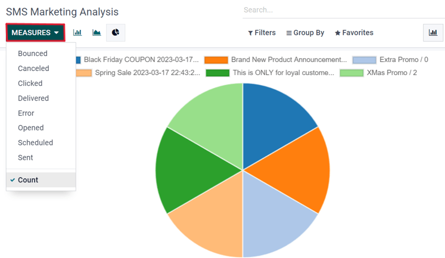

============
SMS analysis
============

On the :guilabel:`Reporting` page (accessible via the :menuselection:`Reporting` option in the
header menu), there are options to apply different combinations of :guilabel:`Filters` and
:guilabel:`Measures` to view metrics in a number of different layouts (e.g. :guilabel:`Graph`,
:guilabel:`List`, and :guilabel:`Cohort` views.)

Each :guilabel:`Reporting` metric view option allows for more extensive performance analysis of
:abbr:`SMS (Short Message Service)` mailings.

For example, while in the default :guilabel:`Graph` view, :abbr:`SMS (Short Message Service)` data
is visualized as different graphs and charts, which can be sorted and grouped in various ways (e.g.
:guilabel:`Measures` drop down menu).

.. tip::
   SMS messages can be sent using automation rules in Odoo. Odoo *Studio* is required to use
   automation rules.

   To install Odoo *Studio*, go to the :menuselection:`Apps application`. Then, using the
   :guilabel:`Search...` bar, search for `studio`.

   If it is not already installed, click :guilabel:`Install`.

   Adding the *Studio* application upgrades the subscription status to *Custom*, which increases the
   cost. Consult `support <https://www.odoo.com/contactus>`_, or reach out to the database's
   customer success manager, with any questions on making the change.

   To use automation rules, navigate in :ref:`developer mode <developer-mode>`, to
   :menuselection:`Settings app --> Technical menu --> Automation section --> Automation Rules`.
   Then, click :guilabel:`New` to create a new rule.

   Enter a name for the automation rule, and select a :guilabel:`Model` to implement this rule on.

   Based on the selection for the :guilabel:`Trigger`, additional fields will populate below. Set
   the :guilabel:`Trigger` to one of the following options:

   :guilabel:`Values Updated`

   - :guilabel:`User is set`
   - :guilabel:`State is set to`
   - :guilabel:`On archived`
   - :guilabel:`On unarchived`

   :guilabel:`Timing Conditions`

   - :guilabel:`Based on date field`
   - :guilabel:`After creation`
   - :guilabel:`After last update`

   :guilabel:`Custom`

   - :guilabel:`On save`
   - :guilabel:`On deletion`
   - :guilabel:`On UI change`

   :guilabel:`External`

   - :guilabel:`On webhook`

   Other options may appear based on the :guilabel:`Model` selected. For example if the
   :guilabel:`Calendar Event` model is selected, then the following options appear in addition to
   those above:

   :guilabel:`Email Events`

   - :guilabel:`On incoming message`
   - :guilabel:`On outgoing message`

   Under the :guilabel:`Before Update Domain` field, set a condition to be met before updating the
   record. Click :guilabel:`Edit Domain` to set record parameters.

   Under the :guilabel:`Actions To Do` tab, select :guilabel:`Add an action`. Next, in the resulting
   :guilabel:`Create Actions` pop-up window, select :guilabel:`Send SMS`, and set the
   :guilabel:`Allowed Groups`. :guilabel:`Allowed Groups` are the access rights groups that are
   allowed to execute this rule. Leave the field empty to allow all groups. See this documentation:
   :ref:`access-rights/groups`.

   Next, set the :guilabel:`SMS Template` and choose whether the SMS message should be logged as a
   note, by making a selection in the drop-down menu: :guilabel:`Send SMS as`. Click
   :guilabel:`Save and Close` to save the changes to this new action.

   .. image:: sms_analysis/automation-rule-sms.png
      :align: center
      :alt: Automation rule template with rule to do, SMS template and log as note highlighted.

   Add any necessary notes under the :guilabel:`Notes` tab. Finally, navigate away from the
   completed automation rule, or manually save (by clicking the :guilabel:`☁️ (cloud)` icon), to
   implement the change.
