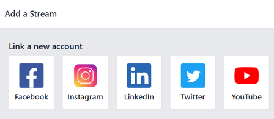
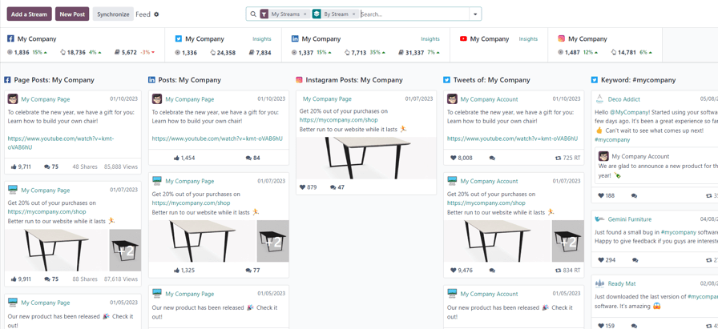
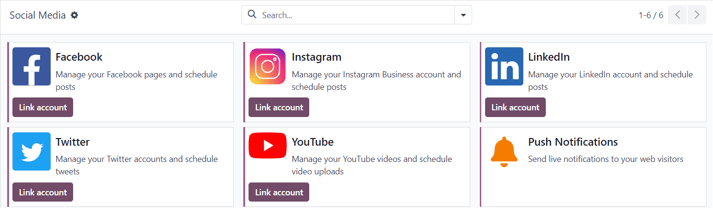
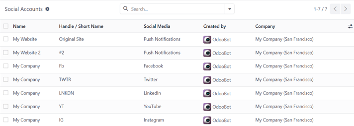
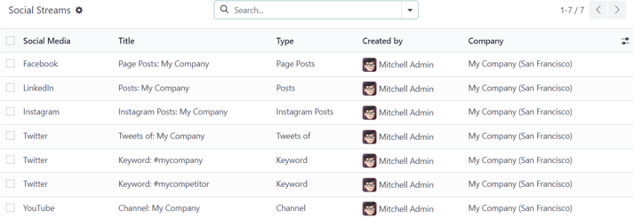
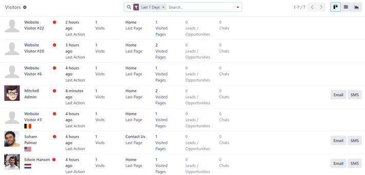

:show-content:

================
Social Marketing
================

Odoo's *Social Marketing* application helps content marketers create and schedule posts, manage
various social media accounts, analyze content effectiveness, and engage directly with social media
followers in one, centralized location.

.. seealso::
   - `Odoo Tutorials: Marketing <https://www.odoo.com/slides/marketing-27>`_

.. cards::

   .. card:: Social posts
      :target: social_marketing/social_posts

      Discover everything there is to know about how to create and customize social media posts
      using Odoo.

   .. card:: Social campaigns
      :target: social_marketing/social_campaigns

      Learn about all the different campaign and marketing tools this application has to offer.

Social media accounts
=====================

In order to create social posts and analyze content with Odoo *Social Marketing*, social media
accounts **must** be added as a *stream* on the application's main dashboard.

.. note::
   Be aware that personal profiles **cannot** be added as a stream. The main use of Odoo *Social
   Marketing* is to manage and analyze business accounts on social media platforms.

.. warning::
   Odoo *Social Marketing* has some limitations in regards to social media accounts. For example,
   Odoo **cannot** handle a large quantity of various pages (e.g. ~40 pages) under the same company.
   The same limitations are present in a multi-company environment because of how the API is
   constructed.

.. warning::
   In multi-company environments, if every company doesn't activate a page at once, it will result
   in a permission error.

   For example, if Company 1 is the only company selected from the main Odoo dashboard, and
   activates *Facebook Page 1* and *Facebook Page 2*, then those pages will be accesible on the
   *Social Marketing* dashboard.

   However, if on that same database, the user adds Company 2 from the company drop-down menu in the
   header, and attempts to add those same streams, it results in a permission error.

   .. image:: social_marketing/permission-error.png
      :align: center
      :alt: View of the permission error that appears when incorrectly attempting to add stream.

Social media streams
====================

To add a social media business account as a stream, navigate to :menuselection:`Social Marketing
app` and select the :guilabel:`Add A Stream` button located in the upper-left corner. Doing so
reveals an :guilabel:`Add a Stream` pop-up window.

In the :guilabel:`Add a Stream` pop-up window, choose to :guilabel:`Link a new account` for a
business from any of the following popular social media platforms: :guilabel:`Facebook`,
:guilabel:`Instagram`, :guilabel:`LinkedIn`, :guilabel:`Twitter`, and :guilabel:`YouTube`.

After clicking the desired social media outlet from the :guilabel:`Add a Stream` pop-up window, Odoo
navigates directly to that specific social media outlet's authorization page, where permission must
be granted, in order for Odoo to add that particular social media account as a stream to the *Social
Marketing* application.

Once permission is granted, Odoo navigates back to the :guilabel:`Feed` on the main
:guilabel:`Social Marketing` dashboard, and a new column, with that account's posts, is added.
Accounts/streams can be added at any time.

.. important::
   A :guilabel:`Facebook` page can be added as long as the :guilabel:`Facebook` account that grants
   permission is the administrator for the page. It should also be noted that different pages can be
   added for different streams.

.. note::
   :guilabel:`Instagram` accounts are added through a :guilabel:`Facebook` login because it uses the
   same API. This means, an :guilabel:`Instagram` account needs to be linked to a
   :guilabel:`Facebook` account in order for it to show up as a stream in Odoo.

Social media page
=================

Another way to quickly link social media accounts to Odoo *Social Marketing* can be done on the
:guilabel:`Social Media` page. To access the :guilabel:`Social Media` page, navigate to
:menuselection:`Social Marketing app --> Configuration --> Social Media`.

On the :guilabel:`Social Media` page there is a collection of all social media options, each
complete with a :guilabel:`Link account` button: :guilabel:`Facebook`, :guilabel:`Instagram`,
:guilabel:`LinkedIn`, :guilabel:`Twitter`, :guilabel:`YouTube`, and :guilabel:`Push Notifications`.

Social accounts page
====================

To see a list of all social accounts and websites linked to the database, go to
:menuselection:`Social Marketing app --> Configuration --> Social Accounts`. This :guilabel:`Social
Accounts` display the :guilabel:`Name`, the :guilabel:`Handle/Short Name`, the :guilabel:`Social
Media` platform, who it was :guilabel:`Created by`, and the :guilabel:`Company` to which it is
associated.

To edit/modify any of the social accounts on this page, simply select the desired account from the
list on this page, and proceed to make any adjustments necessary.

Social streams page
===================

To view a separate page with all the social media streams that have been added to the main *Social
Marketing* dashboard, navigate to :menuselection:`Social Marketing app --> Configuration --> Social
Streams`.

Here, the social stream information is organized in a list with the :guilabel:`Social Media`, the
:guilabel:`Title` of the stream, the :guilabel:`Type` of the stream (e.g. :guilabel:`Posts`,
:guilabel:`Keyword`, etc.), who it was :guilabel:`Created by`, and  the :guilabel:`Company` to which
it is associated.

To modify any stream's information, simply click the desired stream from the list, and proceed to
make any necessary adjustments.

Visitors
========

To see a complete overview of all the people who have visited the website(s) connected to the
database, navigate to :menuselection:`Social Marketing app --> Visitors`.

Here, Odoo provides a detailed layout of all the visitors' pertinent information in a default kanban
view. If visitors already have contact information in the database, the option to send them an
:guilabel:`Email` and/or an :guilabel:`SMS` is available.

This same visitor data can also be viewed as a list or a graph. Those view options are located in
the upper-right corner of the :guilabel:`Visitors` page.

.. toctree::

   social_marketing/social_posts
   social_marketing/social_campaigns
