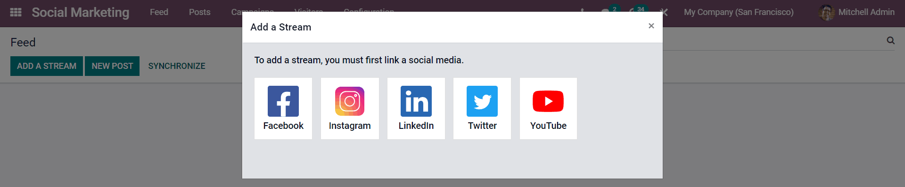
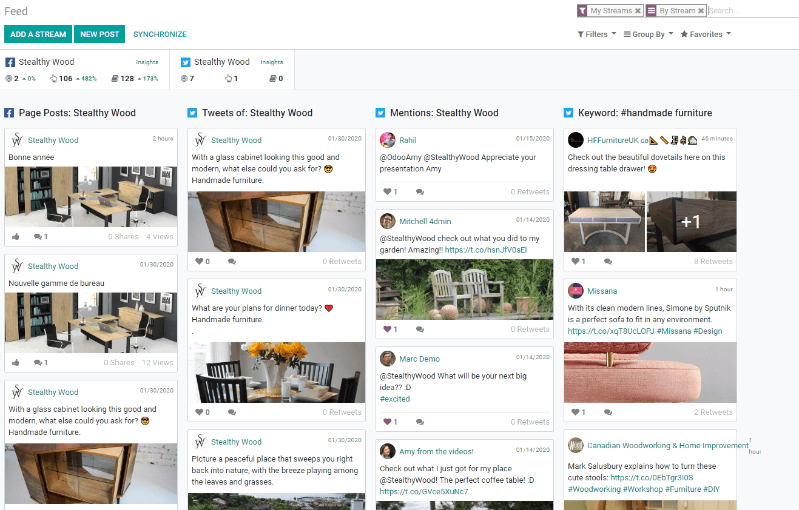
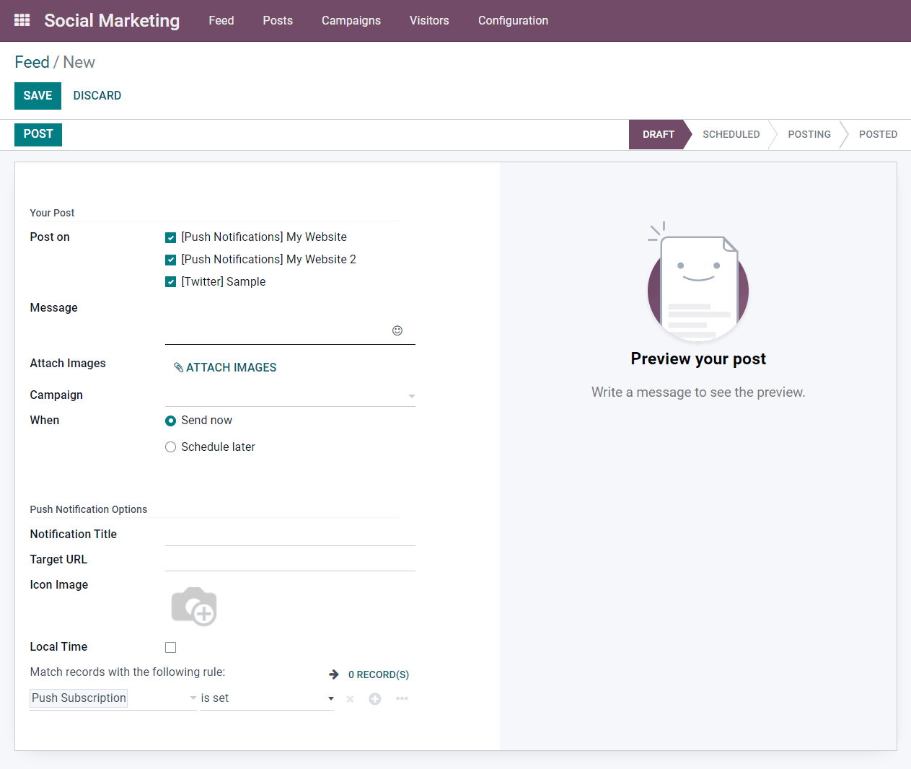

===================
Create & Plan posts
===================

If you're on social media, you know how important it is to update your accounts with consistent
posts and engaging content. However, as easy as that may seem, maintaining and managing various
social media accounts can be exhausting, time-consuming, and tedious.

:guilabel:`Odoo Social Marketing`, allows you to create, schedule, manage, and engage with your
social media followers better and easier than ever before. 

Not only that, but :guilabel:`Odoo Social Marketing` also measures the results of your social media
posts/accounts for you. This saves valuable time, and helps you successfully execute your different
social media strategies - from posts to results.

Add accounts & create a feed
============================

To begin, start on the main :guilabel:`Odoo Social Marketing` dashboard. Then, click
:guilabel:`Add Stream`.

A pop-up will appear where social media accounts can be added to the database's social media
stream. In order to properly add social accounts to the :guilabel:`Odoo Social Marketing`
dashboard, permissions will need to be granted.

.. note::
   A Facebook page can be added as long as the Facebook account that grants permission is the
   Administrator for the page. Also, different pages can be added for different streams.

Odoo will redirect the page to the :guilabel:`Feed`, and a column with the new account's posts or
publications are automatically added. From here new accounts and/or streams (such as Facebook
mentions, etc.) can be added. Customize the Kanban view to fit your company's unique needs.

Adding social media accounts to the feed will also link the Social Media’s KPIs, if the platform
has them. To get redirected to the statistics and metrics related to any social account, simply
click on :guilabel:`Insights`.

.. image:: create_posts/insights.png
   :align: center
   :alt: The insights link that you can access for each social media stream added in Odoo.

Publish content
===============

To publish content for social media accounts directly through Odoo, click on
:guilabel:`Social Marketing` > :guilabel:`Feed` > :guilabel:`New Post` or go to
 :guilabel:`Social Marketing` > :guilabel:`Posts` > :guilabel:`Create`.

With :guilabel:`Odoo Social Marketing`, the post can be uploaded immediately, or it can be
scheduled for later. If necessary, a number of :guilabel:`Push Notification` options can also be
configured. It should be noted that saving the post will apply a :guilabel:`Draft` status to it.

Overview & plan posts with calendar view
========================================

:guilabel:`Odoo Social Marketing` has a very useful :guilabel:`Calendar` view to better manage
social media posts. In addition to having a clear overview of a planned day, week, or month, Odoo
will also display drafted, scheduled, and published posts.

Feel free to drag-and-drop already scheduled posts to automatically change their scheduled date.

Double-click on a :guilabel:`date` to create a post directly through the :guilabel:`Calendar` view.
Click on an existing :guilabel:`post` to edit it at any time.

.. image:: create_posts/calendar-view.png
   :align: center
   :alt: Example of the calendar view in Odoo Social Marketing

.. seealso::
   - :doc:`./push_notifications`
   - :doc:`./campaigns`
   - :doc:`./livechat`
