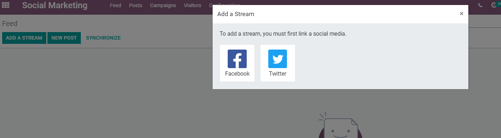
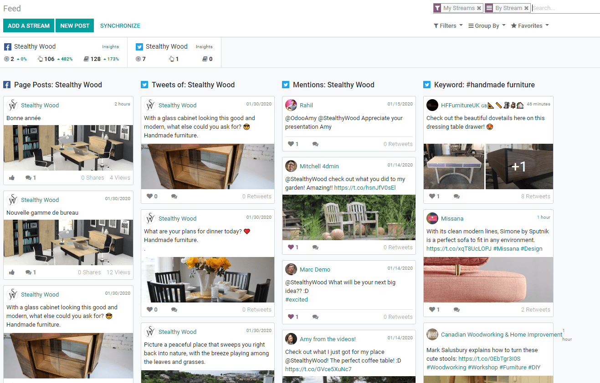
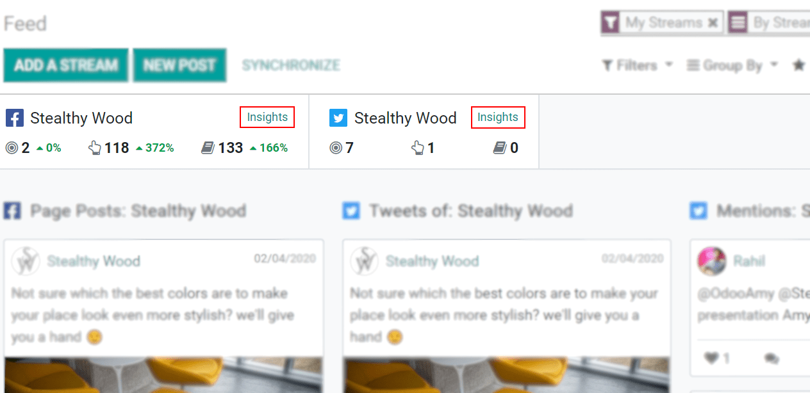
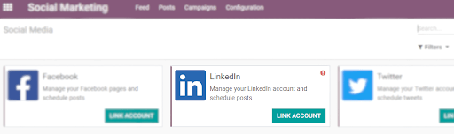
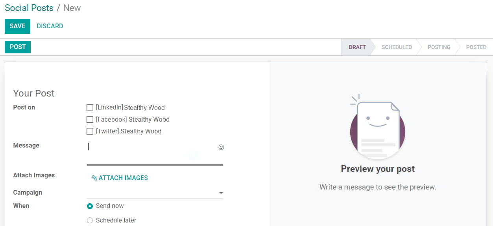
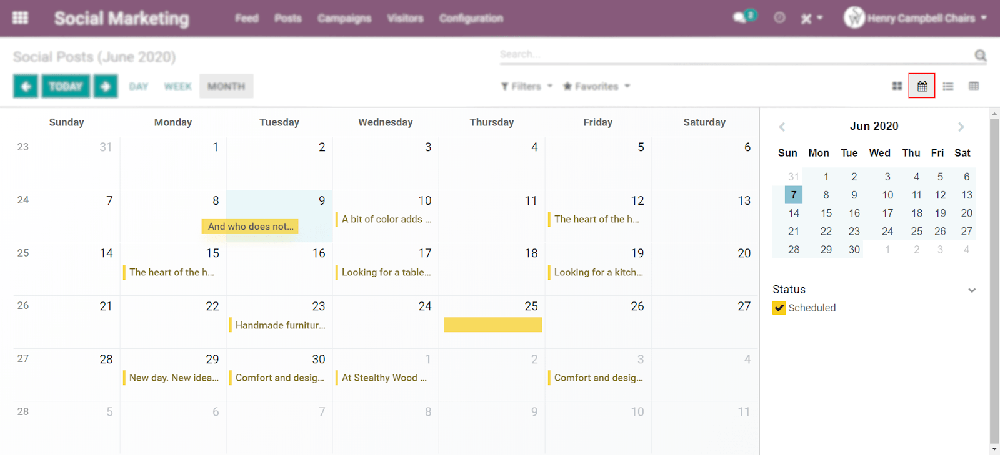

============================================
Manage Social Media Pages and Create Content
============================================

Once you are present on social media platforms, it is important to keep them up-to-date. However,
that might feel like a full-time job. Having a solution that allows you to create, schedule, keep
track, engage with your audience and measure results saves you time and helps you to successfully
execute your online strategy, from posts to results.

Add accounts and create your feed
=================================

Click on *Add Stream* and grant the required permissions to add your accounts.

.. note::
   You can link a Facebook page for which you are the admin.

| You are then redirected to your *Feed* and a column with the publications is automatically added.
| You can then add new accounts and/or streams, such as Facebook mentions, and customize your
  Kanban view.

Adding social media accounts to your feed will also link KPIs. To get redirected to the statistics
page of the social account, click on *Insights*.

Link a LinkedIn account
-----------------------

Go to :menuselection:`Social Marketing --> Configuration --> Social Media`.

.. note::
   LinkedIn is in Beta Version, therefore, the feed is not available. Only the creation of content.

Publish content
===============

Click on :menuselection:`Social Marketing --> Feed --> New Post`, or go to
:menuselection:`Social Marketing --> Posts → Create`.

| Choose to upload your post right away or to schedule it.
| Saving your post will apply a draft status to it.

Overview and plan your posts with a calendar view
=================================================

| Through the calendar view, besides having an overview of your planned day, week or month, also see
  your drafted, scheduled and published posts.
| Drag and drop (scheduled posts) to change their scheduled date.
| Double-click on a date to create a post directly from the *Calendar view*, and click on an
  existing one to edit it.

.. seealso::
   - :doc:`./push_notifications`
   - :doc:`./campaigns`
   - :doc:`./livechat`
