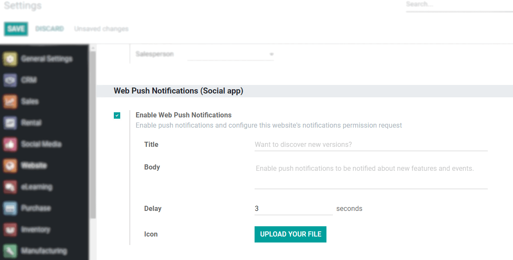
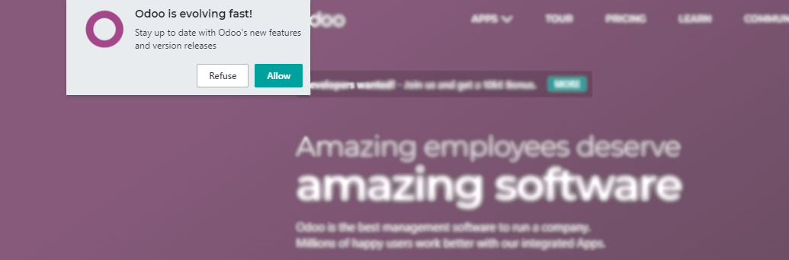
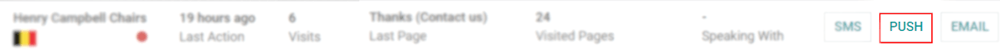
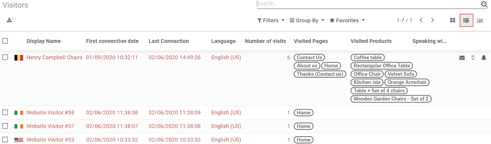
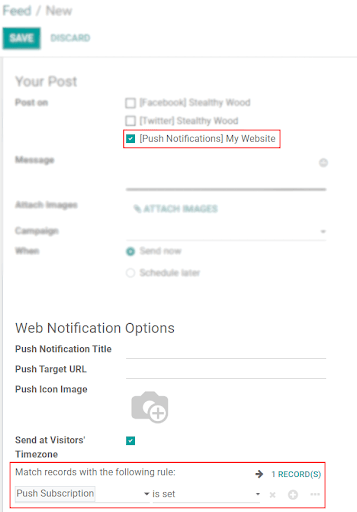

==========================
Use Web Push Notifications
==========================

Web Push Notifications deliver messages to your user’s device without the need to be on your
website, or for them to give personal information. They can be used to inform your users about news,
articles and content posted, practical messages like traffic and weather updates,
flight information, sales alerts, coupons, and product updates.

Ask users for permission
========================

In the *Website* application go to :menuselection:`Website --> Configuration --> Settings`
and enable *Web Push Notifications*.

Choose your message, icon, and delay time (which is the wait time for the permission request to be
shown once the user lands on your page).

Send notifications
==================

Individually
------------

You can send individual messages through the menu *Visitors*.

To a group
----------

Target a bigger segment by selecting multiple visitors in the *View List* (e.g.: all visitors that
visited your Homepage).

.. note::
   Visitors records are kept under *Visitors* for a week, before getting archived.

By rules
--------

Or go to :menuselection:`Social Marketing --> Posts --> Create`. Under *Web Notification options*,
apply filters to send your message to the records that match the rules you set.

.. note::
   The feature only works with Odoo Website application.

.. seealso::
   - :doc:`./manage_social`
   - :doc:`./campaigns`
