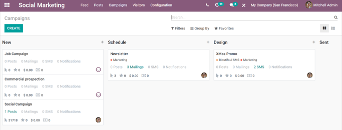
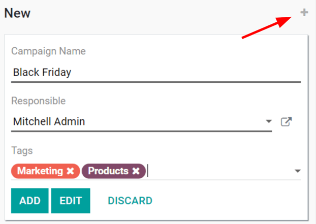
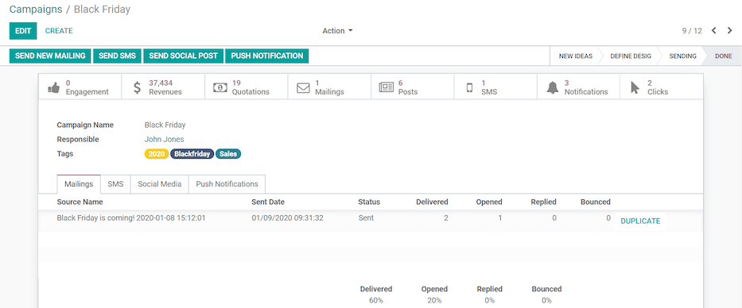

==========================
Social marketing campaigns
==========================

Social marketing campaigns help companies connect directly with the marketplace. These campaigns
are helpful when introducing a new product to customers, explaining the value of a product or
service, or when advertising an upcoming event or product release.

The most effective social marketing campaigns typically involve multiple channels to maximize
content distribution, and Odoo's *Social Marketing* application acts as a singular control center to
monitor, plan, post, track, and analyze all of the various content and content channels within a
single dashboard.

Campaigns page
==============

To access a complete overview of all social marketing campaigns, open the :menuselection:`Social
Marketing` application, and click :menuselection:`Campaigns` from the header menu. Doing so reveals
a separate page with every campaign in a default kanban view.

Each *stage* in the kanban view can be edited, by clicking the :guilabel:`gear icon` to the left of
the :guilabel:`+ (plus sign)` - located to the right of the stage title.

.. note::
   The **gear icon** *only* appears when the cursor hovers to the left of the **+ (plus sign)**.
   When the gear icon is clicked, a drop-down menu reveals the options: :guilabel:`Fold`,
   :guilabel:`Edit Stage`, and :guilabel:`Delete`.

.. image:: social_campaigns/campaign-stage-dropdown.png
   :align: center
   :alt: View of the campaigns page in the Odoo Social Marketing application.

Clicking :guilabel:`Fold` minimizes that specific stage's column. The stage column can be restored
by clicking the folded version of it on the main :guilabel:`Campaigns` dashboard in the default
kanban view.

Selecting :guilabel:`Edit Stage` reveals a pop-up window, in which the name and the sequence of the
stage can be modified. If changes are made, be sure to click :guilabel:`Save`.

Clicking :guilabel:`Delete` removes the stage entirely.

.. note::
   To add a new stage to the pipeline, side-scroll to the right on the :guilabel:`Campaigns`
   dashboard, click :guilabel:`Add a Column`, enter in the desired information, and click
   :guilabel:`Add`.

.. tip::
   The same social marketing campaign information on the :guilabel:`Campaigns` dashboard can also be
   viewed as a list, by selecting the :guilabel:`List` option, located under the search bar, in the
   upper-right corner.

Create social marketing campaigns
=================================

First, open the :menuselection:`Social Marketing` application, and select :guilabel:`Campaigns` from
the header menu.

On the :guilabel:`Campaigns` dashboard, a new campaign can be created by clicking the quick add
:guilabel:`+ (plus sign)` located in the top-right corner of each stage in the pipeline, visible in
the kanban view. Campaigns can also be created by clicking :guilabel:`Create` in the upper-left
corner of the :guilabel:`Campaigns` dashboard.

Both options reveal a new campaign detail window directly on the :guilabel:`Campaigns` dashboard
when clicked.

Here, the :guilabel:`Campaign Name`, :guilabel:`Responsible`, and :guilabel:`Tags` can be entered.
When all modifications are complete, click :guilabel:`Add` to add the campaign to the database.

Edit social marketing campaigns
===============================

In order to edit a campaign in greater detail, and create/send various forms of communications
related to it, the template page for that campaign must be accessed and modified, accordingly.
There are multiple ways to access a template page for a campaign.

- After entering the pertinent information in the :guilabel:`Quick Add` campaign drop-down, click
  :guilabel:`Edit`.
- Simply select the desired campaign from the :guilabel:`Campaigns` dashboard in list or kanban
  view.
- On the :guilabel:`Campaigns` dashboard in the kanban view, select the :guilabel:`⋮ (three dots)`
  drop-down menu on the desired campaign, and select :guilabel:`Edit`.

Any of the above routes will reveal the *Campaign Template* page for that specific campaign.

Social marketing campaign templates
===================================

On a *Campaign Template* page, numerous elements can be customized/modified, and various forms of
communications can be created, modified, and sent or scheduled. Below is a sample of a completed
campaign template.

.. important::
   In order for the :guilabel:`Send New Mailing` option to appear on campaign templates, make sure
   the *Mailing Campaigns* feature is enabled in the *Email Marketing* app. To do that, navigate to
   :menuselection:`Email Marketing --> Configuration --> Settings`, activate :guilabel:`Mailing
   Campaigns`, and click :guilabel:`Save`.

.. note::
   In order for the :guilabel:`Send SMS` option to appear, the Odoo *SMS Marketing* application must
   be installed on the database.

Add content and communications to campaigns
===========================================

If the proper settings and applications are installed (as instructed above), there are four forms
of communication/content options that can be added to campaigns. Each of these options are displayed
as buttons in the upper-left corner of the campaign template page.

- :guilabel:`Send New Mailing`: reveals a blank email template on a separate page, in which the
  message can be fully customized in a variety of ways.
- :guilabel:`Send SMS`: reveals a blank SMS template on a separate page, in which a SMS
  communication can be created and configured.
- :guilabel:`Send Social Post`: reveals a blank social post template on a separate page, in which
  a post can be created, and applied to social media accounts that are already connected to the
  database.
- :guilabel:`Push Notification`: reveals a similar blank social post template on a separate page,
  however, the :guilabel:`Push Notification` options are already pre-selected in the :guilabel:`Post
  on` field.

Whichever form of communication is created, once it's completed, Odoo returns to the
:guilabel:`Campaign Template` page, showcasing that new content in its corresponding tab (e.g.
:guilabel:`Mailings`, :guilabel:`SMS`, :guilabel:`Social Media`, and/or :guilabel:`Push
Notifications`).

As content and communications are added to a campaign, tabs for those specific mediums appear,
along with a variety of analytical smart buttons (e.g. :guilabel:`Revenues`, :guilabel:`Quotations`,
:guilabel:`Leads`, etc.).

These smart buttons, located at the top of the template, display different metrics related to the
campaign, and its various communications and content. Clicking any smart button reveals a separate
page dedicated to that particular element of the campaign, allowing for quicker, more organized
analysis.

.. note::
   The Odoo *Social Marketing* app is integrated with other Odoo applications, such as *Sales*,
   *Invoicing*, *CRM*, and *Website*.
