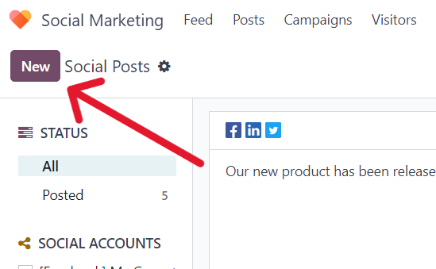
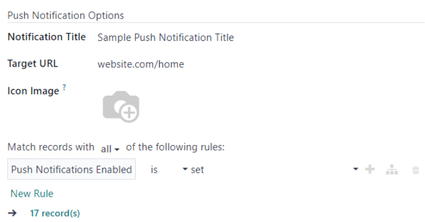

============
Social posts
============

The Odoo *Social Marketing* application provides various ways to create posts for any type of social
media outlet.

Posts page
==========

To see a complete overview of posts, go to Odoo :menuselection:`Social Marketing app --> Posts`.
Here, on the :guilabel:`Social Posts` page, every post that has been created and posted with Odoo
can be seen and accessed.

There are four different view options for the :guilabel:`Social Posts` page data: *kanban*,
*calendar*, *list*, and *pivot*.

The view options are located in the upper right corner of the :guilabel:`Posts` page, beneath the
search bar.

.. tabs::

   .. tab:: Kanban view

      By default, Odoo displays the posts in a kanban view. The information on this page can be
      sorted even further, via the left sidebar, where all connected social accounts and posts can
      be quickly seen, accessed, and analyzed.

      The kanban view is represented by an :guilabel:`inverted bar graph icon` in the upper-right
      corner.

      .. image:: social_posts/posts-page-kanban.png
         :align: center
         :alt: Kanban view of the posts page in the Odoo Social Marketing application.

   .. tab:: Calendar view

      The calendar view option displays a visual representation of posts in a calendar format of
      when posts were published, or are scheduled to be published. This option provides a clear
      overview of any planned day, week, or month, and Odoo displays all drafted, scheduled, and
      published posts.

      Clicking on a date reveals a blank social media post detail form, in which a social media
      post can be created, and Odoo will post it on that specific date/time.

      The calendar view is represented by a :guilabel:`calendar icon` in the upper-right corner.

      .. image:: social_posts/calendar-view.png
         :align: center
         :alt: Example of the calendar view in Odoo Social Marketing.

   .. tab:: List view

      The list view option is similar to the kanban option, but instead of individual blocks, all
      post information is displayed in a clear, list layout. Each line of the list displays the
      :guilabel:`Social Accounts`, :guilabel:`Message`, and :guilabel:`Status` of every post.

      There is also a helpful left sidebar that organizes all posts by :guilabel:`Status` and lists
      all connected :guilabel:`Social Accounts`, as well.

      The list view is represented by four vertical lines in the upper-right corner.

      .. image:: social_posts/list-view.png
         :align: center
         :alt: View of the list option on the posts page in Odoo Social Marketing.

   .. tab:: Pivot view

      The pivot view option provides a fully customizable grid table, where different measures of
      data can be added and analyzed.

      .. image:: social_posts/pivot-view.png
         :align: center
         :alt: View of the pivot option on the posts page in Odoo Social Marketing.

      The pivot view option provides numerous analytical options, allowing for in-depth, detailed
      analysis of various posts and metrics.

      Click on any :guilabel:`➕ (plus sign) icon` next to a line in the pivot table to reveal more
      metric options to add to the grid.

      While in the pivot view, the option to :guilabel:`Insert in Spreadsheet` is available, located
      to the right of the :guilabel:`Measures` drop-down menu, in the upper-left corner of the
      :guilabel:`Social Posts` page.

      Next to the :guilabel:`Insert in Spreadsheet` are three options, specific to the pivot view.

      From left to right, those options are:

      - :guilabel:`Flip Axis`, which switches the *X* and *Y* axis in the grid table.
      - :guilabel:`Expand All`, which expands each line in the grid, revealing more detailed
        information related to it.
      - :guilabel:`Download`, which, when clicked, instantly downloads the pivot table as a
        spreadsheet.

Posts
-----

Clicking on a post from a social media stream reveals a pop-up window, showcasing the content of
that specific post, along with all the engagement data related to it (e.g. likes, comments, etc.).

.. image:: social_posts/social-post-popup.png
   :align: center
   :alt: Sample of a social media post's pop-up window in Odoo Social Marketing application.

If desired, the user can leave a new comment of the post from the post's pop-up window, by typing
one in the :guilabel:`Write a comment...` field, and clicking :guilabel:`Enter` to post that
comment.

Create leads from comments
--------------------------

Odoo *Social Marketing* also provides the ability to create leads directly from social media
comments.

To create a lead from a comment left on a social media post, click on the desired post from the
dashboard to reveal that post's specific pop-up window. Then, scroll to the desired comment, and
click the :guilabel:`three vertical dots` icon to the right of that comment.

Doing so reveals a drop-down menu with the option: :guilabel:`Create Lead`.

.. image:: social_posts/create-lead-drop-down.png
   :align: center
   :alt: The drop-down menu beside a comment revealing the option to create a lead.

Upon clicking :guilabel:`Create Lead` from the comment's drop-down menu, a :guilabel:`Conver Post to
Lead` pop-up window appears.

.. image:: social_posts/convert-post-to-lead-popup.png
   :align: center
   :alt: The convert post to lead pop-up window that appears in Odoo Social Marketing.

In this pop-up window, select to either: :guilabel:`Create a new customer`, :guilabel:`Link to an
existing customer`, or :guilabel:`Do not link to a customer`.

.. note::
   If :guilabel:`Link to an existing customer` is selected, a new :guilabel:`Customer` field appears
   beneath those options, wherein a customer can be chosen to be linked to this lead.

Once the desired selection has been made, click the :guilabel:`Convert` button at the bottom of the
:guilabel:`Convert Post to Lead` pop-up window. Doing so reveals a fresh lead detail form, where the
necessary information can be entered and processed.

.. image:: social_posts/new-lead-detail-form-comments.png
   :align: center
   :alt: New lead detail form generated from a social media comment in Odoo Social Marketing.

Insights
--------

When a social media account stream is added to the *Social Marketing* dashboard, each stream also
displays and links that specific social media platform's KPIs (if the platform has them).

To get redirected to the statistics and metrics related to any social media account's KPIs, click on
the :guilabel:`Insights` link, located at the top of each stream.

.. image:: social_posts/social-marketing-insights-link.png
   :align: center
   :alt: Visual of how the Insights link appears on the dashboard of the Social Marketing app.

.. note::
   In a multi-company environment, if not *all* pages are selected, de-authentication happens.

   For example, if the companies have 3 *Facebook* pages, but only grant access to 1, and try to
   grant access to another at a later date, they will be de-authenticated, and access to the initial
   page's insights/analytics will be lost.

   So, be sure to add *all* pages for *all* companies in a multi-company environment to avoid this
   issue. If a page gets de-autenticated, simply remove the stream, and re-establish it.

Create and post social media content
====================================

Odoo *Social Marketing* offers the ability to create and post content for social media accounts
directly through the application.

To create content for social media accounts, navigated to the :menuselection:`Social Marketing app`,
and click :guilabel:`New Post` located in the upper-right corner of the *Social Marketing*
dashboard.

.. image:: social_posts/new-post-button-social-marketing-dashboard.png
   :align: center
   :alt: New Post button on the main dashboard of the Odoo Social Marketing application.

Or, navigate to :menuselection:`Social Marketing app --> Posts` and click the :guilabel:`New`
button.

Either route reveals a blank social media post detail form that can be customized and configured in
a number of different ways.

.. image:: social_posts/blank-post-detail-page.png
   :align: center
   :alt: Blank social media post detail page in Odoo Social Marketing.

Post detail form
----------------

The social media post detail form in Odoo *Social Marketing* has many different configurable options
available.

Company
~~~~~~~

If working in a multi-company environment, the first field in the :guilabel:`Your Post` section of
the social media post detail form is :guilabel:`Company`. In this field, select the company that
should be connected to this specific social media post.

Post on
~~~~~~~

If working in a single-company environment, the first field in the :guilabel:`Your Post` section of
the social media post detail form is :guilabel:`Post on`. In this field, determine which social
media outlets (streams) this post is intended to be posted on, and/or which website's visitors this
post should be sent to, via push notification, by checking the box beside the desired option(s).

Odoo automatically provides every available social media account that's been linked to the database
as an option in this section. If a social media account hasn't been added as a stream to the *Social
Marketing* application, it will **not** appear as an option on the post template.

Multiple social media outlets (streams) and websites can be selected in the :guilabel:`Post on`
field. At least **one** option in the :guilabel:`Post on` field *must* be selected.

.. important::
   In order for the :guilabel:`Push Notification` option to appear on the social media post detail
   form in Odoo *Social Marketing*, make sure the *Enable Web Push Notifications* feature is enabled
   in the *Website* app.

   To do that, navigate to :menuselection:`Website app --> Configuration --> Settings`, activate
   :guilabel:`Enable Web Push Notifications`, fill out the corresponding fields, and click
   :guilabel:`Save`.

Message
~~~~~~~

Next, there's the :guilabel:`Message` field. This is where the main content of the post is created.

In the :guilabel:`Message` field, type in the desired message for the social post. After typing,
click away from the :guilabel:`Message` field to reveal visual samples of how the post will look on
all the previously selected social media accounts (and/or websites, as push notifications).

.. image:: social_posts/visual-samples-social-media-outlets-preview.png
   :align: center
   :alt: Sample social media post with visual samples of how it will appear on social media outlets.

.. tip::
   Emojis can also be added directly to the text in the :guilabel:`Message` field. Just click the
   :guilabel:`🙂 (smiley face)` icon, located on the line of the :guilabel:`Message` field to the far
   right. Clicking this icon reveals a drop-down menu containing numerous emojis to choose from.

.. note::
   If :guilabel:`Twitter` is chosen in the :guilabel:`Post on` field, a character counter appears
   beneath the :guilabel:`Message` field.

Attach Images
~~~~~~~~~~~~~

If images are to be used in the post, click the :guilabel:`Attach Images` button, in the
:guilabel:`Attach Images` field, located beneath the :guilabel:`Message` field. When clicked, Odoo
reveals a pop-up window. In this pop-up window, select the desired image from the hard drive, and
upload it.

After successfully uploading and attaching the desired image, Odoo reveals a new preview of the
social media post, complete with the newly-added image, on the right side of the detail form.

Campaign
~~~~~~~~

Next, there is the :guilabel:`Campaign` field. This non-required field provides the options to
attach this post to a specific marketing campaign.

To add this post to a pre-existing campaign, click the empty :guilabel:`Campaign` field to reveal a
drop-down menu, containing all the existing campaigns in the database. Select the desired campaign
from this drop-down menu to add this post to that campaign.

To create a new campaign directly from the social media post detail form, start typing the name of
the new campaign in the blank :guilabel:`Campaign` field, and select either :guilabel:`Create` or
:guilabel:`Create and edit...`.

.. image:: social_posts/campaign-drop-down-menu-options.png
   :align: center
   :alt: Drop-down menu options of Create or Create and edit in the Campaign field.

Clicking :guilabel:`Create` creates the campaign, which can be edited/customized later.

Clicking :guilabel:`Create and edit...` creates the campaign, and reveals a :guilabel:`Create
Campaign` pop-up form, wherein the :guilabel:`Campaign Identifier`, :guilabel:`Responsible`, and
:guilabel:`Tags` can be instantly configured.

.. image:: social_posts/create-campaign-popup.png
   :align: center
   :alt: Create campaign pop-up window that appears on a social media post detail form.

When all the desired settings have been entered, click :guilabel:`Save & Close` to save the campaign
and return to the social media post detail form.

When
~~~~

Then, in the :guilabel:`When` field, choose either :guilabel:`Send Now` to have Odoo publish the
post immediately, or :guilabel:`Schedule later` to have Odoo publish the post at a later date and
time.

If :guilabel:`Schedule later` is selected, a new :guilabel:`Scheduled Date` field appears. Clicking
the empty field reveals a pop-up calendar, in which a future date and time can be designated.

.. image:: social_posts/schedule-post-calendar-popup.png
   :align: center
   :alt: Schedule date pop-up window that appears on social media post detail form in Odoo.

After selecting a desired date and time, click :guilabel:`Apply`. Then, Odoo will promptly publish
the post at that specific date and time on the pre-detemined social media account(s).

.. note::
   If scheduling a post, the :guilabel:`Post` button at the top of the social media post detail form
   changes to :guilabel:`Schedule`. Be sure to click :guilabel:`Schedule` after completing the
   social media post detail form.

   Doing so, locks in that specific date/time for Odoo to send the post, and it changes the status
   of the post to :guilabel:`Scheduled`.

Push Notification Options
~~~~~~~~~~~~~~~~~~~~~~~~~

If one (or multiple) :guilabel:`[Push Notification]` options are chosen in the :guilabel:`Post on`
field, a specific :guilabel:`Push Notification Options` section appears at the bottom of the social
media post detail form.

.. image:: social_posts/push-notification-options-section.png
   :align: center
   :alt: Push notification options section on a social media post detail form.

It should be noted that *none* of these fields are required.

The first field in this section is :guilabel:`Notification Title`. In this field, there is the
option to add a custom title to the push notification that will be sent.

To designate a specific page on the website that should trigger this push notification, enter that
page's URL in the :guilabel:`Target URL` field. Then, once a visitor reaches that specific page,
Odoo will display the push notification.

Below that field is the option to add a custom :guilabel:`Icon Image` to the push notification. This
is an icon that appears beside the push notification.

To upload a new image, click the :guilabel:`✏️ (pencil) icon` when hovering over the :guilabel:`Icon
Image` camera icon. Doing so reveals a pop-up window, in which the desired icon image can be located
on the hard drive, and subsequently uploaded.

Once that's complete, Odoo automatically updates the visual preview of how the icon appears on the
push notification.

.. note::
   Next, if the post is scheduled to be posted later, there is the option to ensure the post is sent
   in the visitor's timezone, by enabling the :guilabel:`Local Time` option. If enabled, Odoo will
   send it at the appropriate, pre-determined time, taking the visitor's location into
   consideration.

   .. image:: social_posts/push-notification-local-time.png
      :align: center
      :alt: The Local Time option in the Push Notification Options section of features.

Then, there is the :guilabel:`Match all records` field. This field provides the ability to target a
specific group of recipients in the database, based on certain criteria, and can be applied to match
:guilabel:`all` or :guilabel:`any` of the rules.

To utilize this field, click the :guilabel:`+ Add condition` button, which reveals an equation-like
rule field.

In this equation-like rule field, specifiy the specific criteria Odoo should take into account when
sending this post to a particular target audience.

To add an additional rule, click the :guilabel:`➕ (plus sign) icon` to the far-right of the rule.

To add a branch (series of additional rules based on the previous rule, to further specify a target
audience), click the unique :guilabel:`branch icon`, located to the right of the :guilabel:`➕ (plus
sign) icon`.

Lastly, click the :guilabel:`🗑️ (trash can) icon` to delete any rule.

The size of the specified target audience of recipients is represented by the number of
:guilabel:`Records` displayed beneath the rules.

.. seealso::
   :doc:`social_campaigns`
