=======
Surveys
=======

**Odoo Surveys** helps users create surveys, appraisals, quizzes, and questionnaires to gather
valuable information from their customers or employees.

.. seealso::
   - `Odoo Surveys: product page <https://www.odoo.com/app/surveys>`_
   - `Odoo Tutorials: Surveys <https://www.odoo.com/slides/surveys-62>`_

Question configuration
======================

Add a question
--------------

When you click *Add a question* in the *Questions* tab on the survey template page, a pop-up
appears, in which you create your question.

After writing your question in the *Question* field, select a *Question Type.* A preview of the
question type is displayed on the right side of the pop-up window.

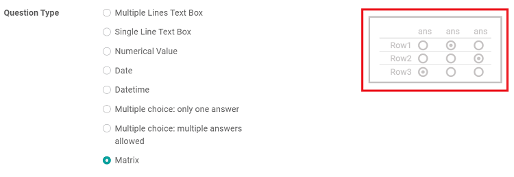

.. _survey/question-types:

Question types
--------------

The following is a list of the available *Question Types*:

* **Multiple Lines Text Box** - open-text field suitable for long answers where any type of text
  is allowed

* **Single Line Text Box** - open-text field suitable for short answers where any type of text is
  allowed

* **Numerical Value** - open-text field that only accepts a number as an answer

* **Date** - date selection on a calendar

* **Datetime** - date and time selection on a calendar

* **Multiple choice: only one answer** - closed question where only one answer can be selected

* **Multiple choice: multiple answers allowed** - closed question where multiple answers can be
  selected

* **Matrix** - table of multiple choice questions that share the same possible answers

Answers and Options tab
-----------------------

Features change in the *Answers* and *Options* tab. It all depends on the *Question Type*. Below are
presented options that are common to several *Question Types*, such as *Validate entry*, *Mandatory
Answer*, *Question Time Limit* (for *Live Sessions*), and *Conditional Display*.

.. _survey/validate-entry:

Validate entry
~~~~~~~~~~~~~~

Entry validation lets you define requirements for single line text length, dates, and numerical
values. To do so, go to the *Answers* tab, tick *Validate entry*, and set a *Minimum* and a
*Maximum* value.

You can also customize the *Validation Error message* that appears beneath the field on the survey
if an invalid answer is entered.

.. note::
   Available for: *Single Line Text Box*, *Numerical Value*, *Date*, and *Datetime*

.. _survey/conditional-display:

Conditional Display
~~~~~~~~~~~~~~~~~~~

*Conditional Display* means a question is only displayed if the specified conditional answer has
been selected in a previous question.

To use that feature, go to a question's *Options* tab, activate *Conditional Display*, choose a
*Triggering Question* and select the *Triggering Answer* linked to that question. Remember,
*Triggering Questions* can only be multiple choice.

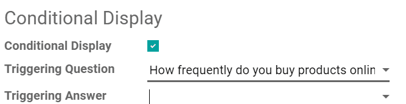

.. tip::
   Save the entire survey first before selecting a triggering question to update the selection of
   triggering questions.

.. note::
   Available for **all** *Question Types*

.. _survey/question-time-limit:

Question Time Limit (for *Live Sessions*)
~~~~~~~~~~~~~~~~~~~~~~~~~~~~~~~~~~~~~~~~~

Timed questions are only available during :ref:`survey/live-session` surveys.

To put a time limit on a question, open a question's *Options* tab, tick *Question Time Limit*, and
specify a limit in seconds.

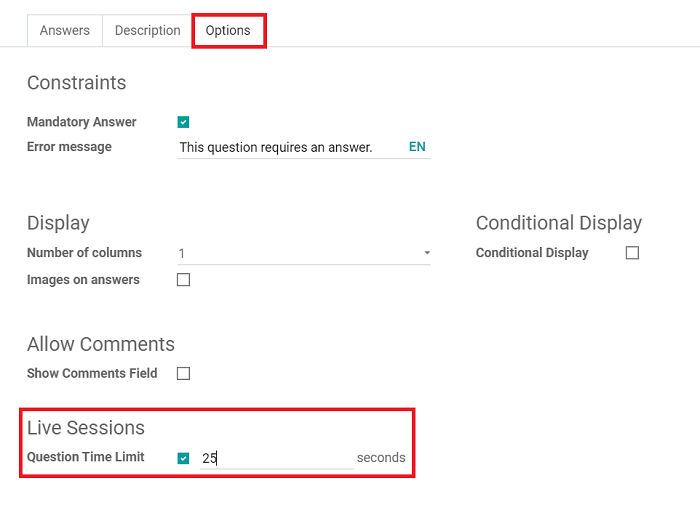

.. note::
   Available for **all** *Question Types*

Survey options
==============

Questions
---------

This section primarily focuses on the overall presentation and layout of your survey. There are
also options featuring timed and randomized surveys.

First, you select the layout. You can choose from:

* *One page with all the questions*
* *One page per section*
* *One page per question*

You can also choose how you want to display the participant's progress during the survey. It can
either be shown as a *Percentage* or a *Number* (i.e. 1 of 20 answered).

Below that, you can decide if you'd like to present your participants with a *Back Button* during
the survey. You can also decide to modify the question selection to include all answers or have
them randomized by section. You can even add a time limit, as well.

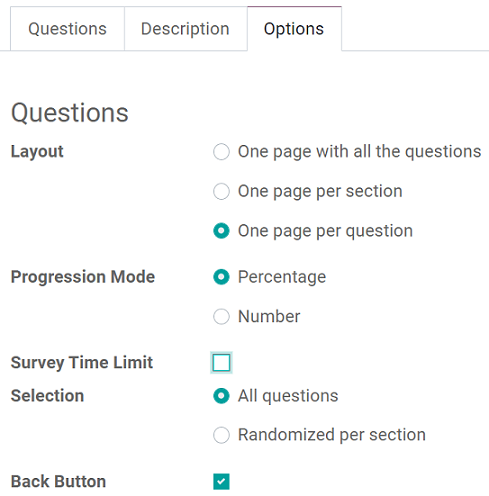

.. _survey/timed-surveys:

Timed surveys
~~~~~~~~~~~~~

With timed surveys, participants must complete the survey within a predetermined amount of time.
You can apply the same time limit feature to individual questions, as well.

Timed surveys and questions ensure that all participants get the same amount of time to answer and
complete the survey. They also discourage participants from looking up answers with external
sources.

To set a time limit on a survey, select *Survey Time Limit* under the *Options* tab of your
survey, and enter the desired time limit (in minutes).

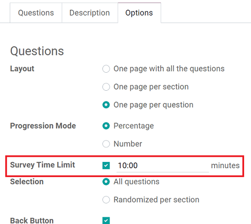

Before participants begin, they see how much allotted time they have to complete the survey. During
the survey, a timer is shown on the pages so the user can keep track of the remaining time.

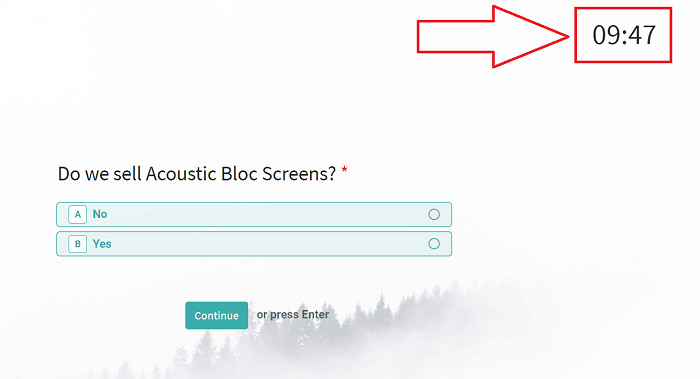

.. important::
   Surveys that are not submitted in time **do not** have their answers saved.

.. _survey/randomized-surveys:

Randomized surveys
~~~~~~~~~~~~~~~~~~

When a survey is randomized, the questions are shuffled in a random order every time a participant
opens the survey. Random surveys are a great way to eliminate the possibility of participants
copying off one another.

Once you've enabled that feature, go to the *Questions* tab of the survey, where a *Random questions
count* column is now present.

Here you can decide how many of the questions should be taken into account during the shuffling, by
simply selecting the number and changing it. That number corresponds to how many questions in that
section should be randomly selected.

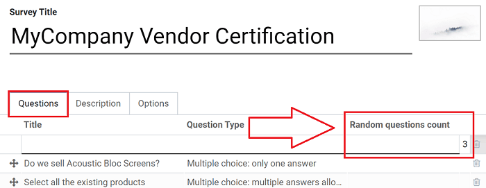

.. _survey/scoring:

Scoring
-------

Surveys are a great way to measure a person's performance, knowledge of a subject, or overall
satisfaction.

Odoo allows you to attach points to certain answers of survey questions. These points are then
summed up to give your participant a final score.

You can choose between: *Scoring with answers at the end* **or** *Scoring without answers at the
end*.

You can set the *Success %* here, as well. The *Success %* is the percentage the user needs to earn
in order to have successfully taken the survey. If *Is a Certification* is selected, you can choose
its template. The certification is automatically emailed to users who have completed the survey.

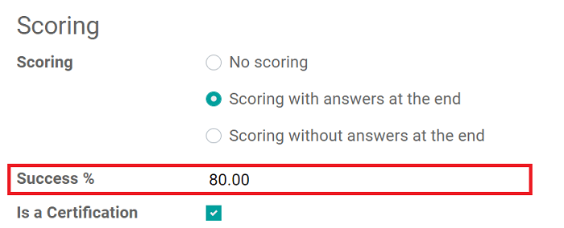

By activating *Give Badge,* you can select a *Certification Badge* to give to your participants.

.. important::
   The *Give Badge* feature is **only** available if you enable *Login required* in your survey's
   options.

Following those configurations, you can choose a survey question that you want to assign a point
value to, and mark which answer is "correct" on the question pop-up. You can also apply negative
point results for "incorrect" answers, as well.

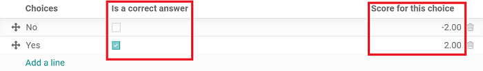

.. _survey/candidates:

Candidates
----------

In this section, you can decide who can access this survey.

The *Access Mode* allows you to choose between *Anyone with the link* and *Invited people only*.
You can also decide if you want to grant access to *Appraisal Managers Only*. This person is the
one who manages the various appraisals/surveys.

You can also require participants to log in to access the survey by ticking *Login Required*.

You can limit the number of login attempts by ticking *Attempts Limit* and entering a number.

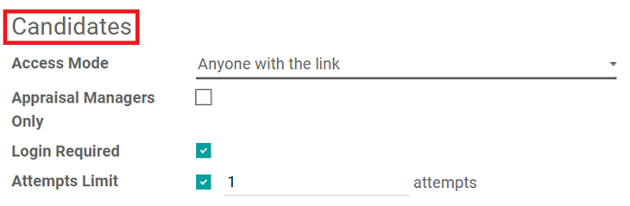

.. _survey/live-session:

Live Session
------------

This section is dedicated to users who are conducting Live Session surveys, wherein they directly
engage with an audience at the same time - much like a live event.

Here, you can choose to reward participants with more points for quick answers. So, if more than
one participant were to choose the correct answer, the quickest (correct) response would be more
valuable, and thus given more points.

You can also customize the specific *Session Code* that participants would need in order to access
the Live Session survey here, as well.

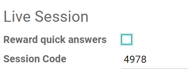
