===============
Survey analysis
===============

After surveys have been created and sent to participants, it is only a matter of time before the
responses start to come in. When they do, it is important to know where and how to analyze them in
the Odoo *Surveys* application.

Fortunately, Odoo provides numerous ways to view survey responses, allowing users to access and
analyze survey responses as they are submitted.

See results
===========

Upon opening the :menuselection:`Surveys` application, the main dashboard reveals a list of all the
surveys in the database, along with pertinent information related to each one.

By default, every survey line showcases its number of :guilabel:`Questions`, :guilabel:`Average
Duration`, and how many participants have :guilabel:`Registered` or :guilabel:`Completed` the
survey.

There are also elements showing the percentage of how many participants :guilabel:`Passed` (if a
*Required Score (%)* was configured), or how many participants became :guilabel:`Certified` (if the
*Is a Certification* option was configured).

.. note::
   To learn more about the different analytical elements found on the :guilabel:`Surveys` dashboard,
   check out the :doc:`Survey Essentials <../surveys/create>` documentation.

On the :guilabel:`Surveys` dashboard, to the far-right of each survey line displayed in the default
list view, there is a :guilabel:`See results` button.

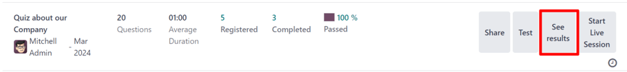

When the :guilabel:`See results` button is clicked, a new browser tab opens, revealing a separate
page filled with all of that particular survey's results and responses, with an informative
:guilabel:`Results Overview` and some filtering drop-down menus at the top.

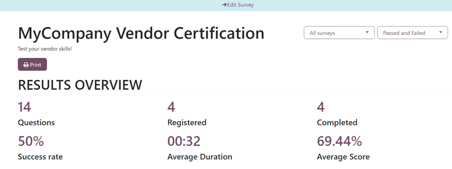

At the top of the page, there is an :guilabel:`Edit Survey` link, in the middle of a blue header
banner. When clicked, Odoo returns the user to the survey form for that particular survey.

Beneath that, is the title of the survey, and its description, if one was configured for it on its
survey form.

To the right of the survey title, there are two drop-down menus with various filtering options,
which can be used to personalize and segment the survey results in a number of different ways.

The first filter drop-down menu is set on the default :guilabel:`All Surveys` option, meaning the
results below are showing results and responses from all the submitted surveys, regardless if they
have been fully completed or not.

When that drop-down menu is clicked open, another option, :guilabel:`Completed surveys`, appears.

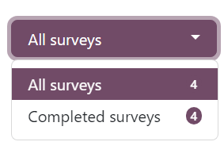

With that drop-down menu open, the number corresponding to each filter option appears to the right
of each option.

To the right of that drop-down menu of filter options, is another drop-down menu of filter options
that can be used to further customize the results showcased on this page.

That drop-down menu is set to the :guilabel:`Passed and Failed` option, by default. This option
shows the results and responses from all participants who have passed or failed this particular
survey.

.. note::
   This second drop-down menu of filter options **only** appears if the survey being analyzed has a
   *Scoring* option configured, or if the *Is a Certification* feature has been enabled.

When that second drop-down menu of filter options is clicked open, two additional options appear:
:guilabel:`Passed only` and :guilabel:`Failed only`.

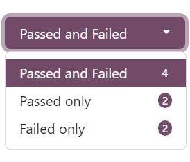

Each option would filter the results below to only show responses from participants who have passed
the survey, or who have failed the survey, respectively.

Directly beneath the survey title, there is a :guilabel:`Print` button. When clicked, the entire
results page can be printed.

The :guilabel:`Results Overview` section is below the survey title, filter option drop-down menus,
and :guilabel:`Print` button.

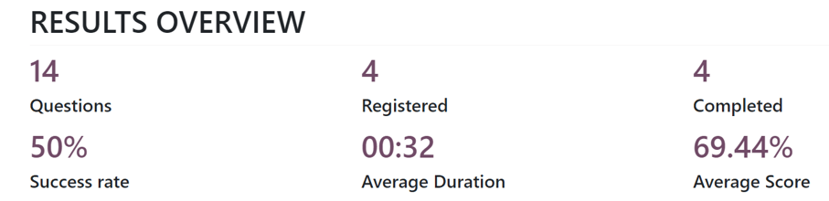

This section of the results page provides a summarized collection of useful survey-related data and
metrics for quick analysis.

Question analysis
-----------------

Directly beneath the :guilabel:`Results Overview` section is where the results and responses of the
survey are found.

.. note::
   The various sections of the survey, if there were any, appear at the top of their corresponding
   questions on the results page, as well, for added organization.

Every question that was a part of the survey is shown, along with an in-depth breakdown, and visual
representation, of how it was answered by participants, beneath the :guilabel:`Results Overview`
section.

Each question is displayed above its corresponding results. To the left of the question is an
:guilabel:`👁️ (eye)` icon. When clicked, Odoo hides the visual and data-related results and
responses. When clicked again, that question's visual and data-related results re-appear.

To the far-right of the question, there are indicators to see how many participants
:guilabel:`Responded` and how many :guilabel:`Skipped` the question.

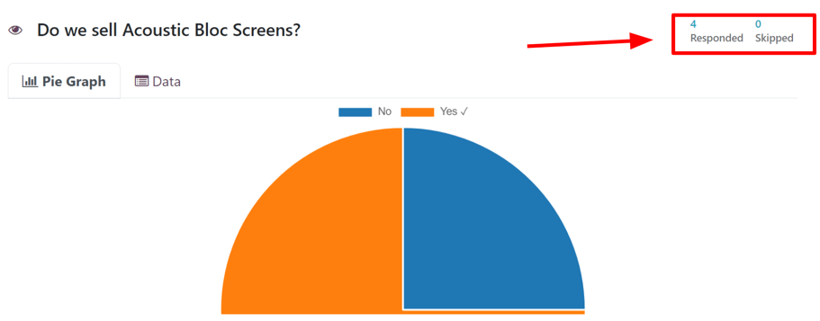

If the question required the participant to enter in their own answer, without any options to choose
from, like entering a specific number or date, for example, there is also an indicator to showcase
how many users answered the question :guilabel:`Correct`.

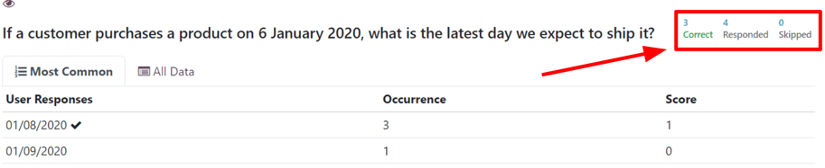

.. note::
   Even if there is no configured *correct* response for question of this nature, the
   :guilabel:`Correct` indicator still appears, although, it displays a `0`.

   This would occur for opinion-based questions, like `When would be a good time to hold another
   sale?`

If there is only one correct response to a multiple choice question, those results and responses are
represented by a :guilabel:`Pie Graph`. The correct answer is indicated by a :guilabel:`✔️
(checkmark)` icon next to the correct answer option, in the legend above the graph.

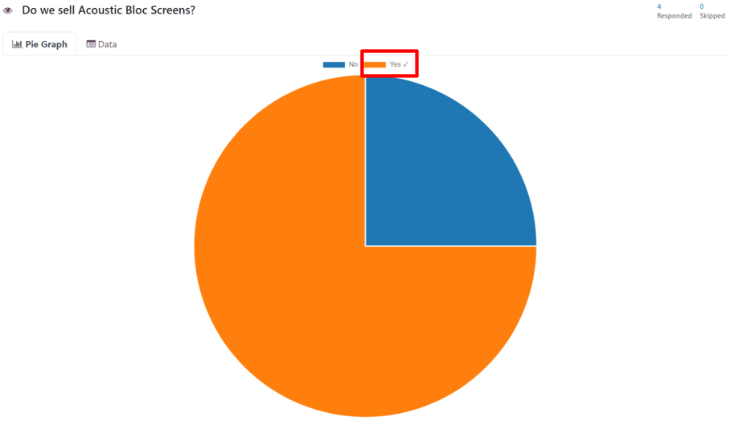

If there are multiple correct answer options (or no correct answers at all) for a multiple choice
question, those results and responses are represented by a :guilabel:`Bar Graph`.

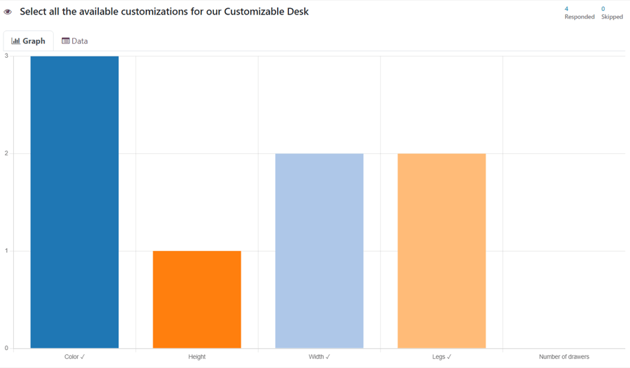

Each multiple choice question has a :guilabel:`Graph` tab and an :guilabel:`Data` tab. The
graph-related tab is shown by default.

The :guilabel:`Data` tab shows all the provided :guilabel:`Answer` options for the question. The
:guilabel:`User Choice` (with percentages and votes) along with the :guilabel:`Score` of each
option.

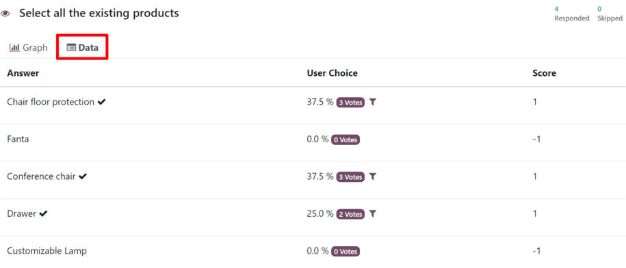

Other question types, wherein there were no answer options for the participant to choose from, there
is a :guilabel:`Most Common` tab and an :guilabel:`All Data` tab.

The :guilabel:`Most Common` tab shows the :guilabel:`User Responses`, the :guilabel:`Occurrence`,
and the :guilabel:`Score` (if applicable).

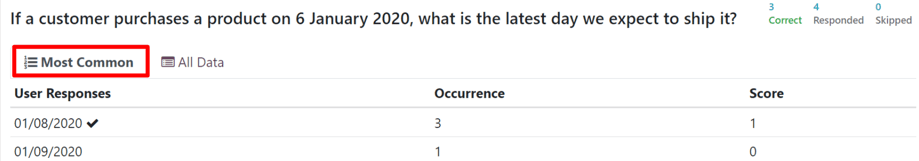

The :guilabel:`All Data` tab shows a list of all the submitted responses to that particular
question.

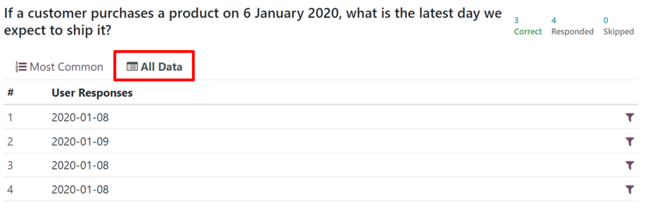

If a question is looking for participants to enter a numerical value as a response,
:guilabel:`Maximum`, :guilabel:`Minimum`, and :guilabel:`Average` indicators appear to the far-right
of the results tabs.

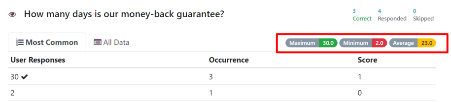

A :guilabel:`filter` icon is also present either to the right of the :guilabel:`User Choice` column
in a :guilabel:`Data` tab, or to the far-right of a :guilabel:`User Response` line in an
:guilabel:`All Data` tab.

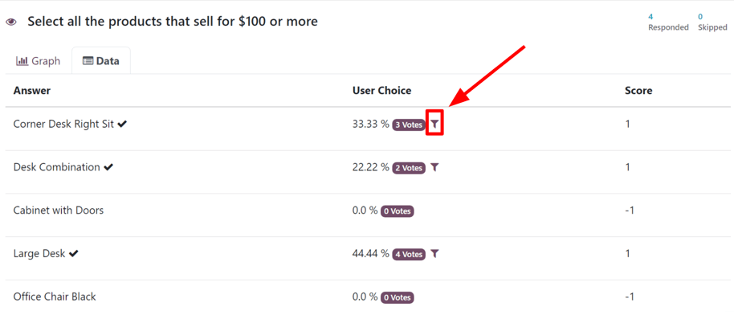

When that :guilabel:`filter` icon is clicked, Odoo returns the user to the top of the results page,
with that chosen filter applied, showing the results of each question for participants who submitted
that particular answer for that specific question.

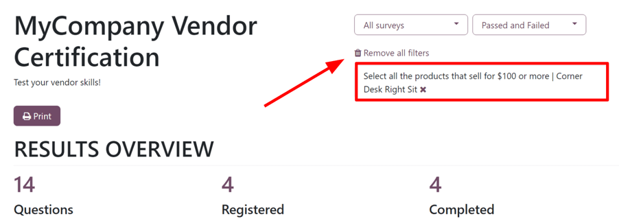

Therefore, showcasing the remaining results for participants who answered that specific question in
the same way. To remove that filter, and reveal all the results once again, click :guilabel:`Remove
all filters` or click the :guilabel:`✖️ (X)` icon in the filter box at the top of the results page.

Participations
==============

To view a consolidated list of participation results for a specific survey, navigate to
:menuselection:`Surveys app`, select the desired survey from the list, and click the
:guilabel:`Participations` smart button at the top of the survey form.

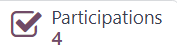

Doing so reveals a separate :guilabel:`Participations` page, showcasing the participants for that
specific survey, along with a collection of pertinent information related to each one.

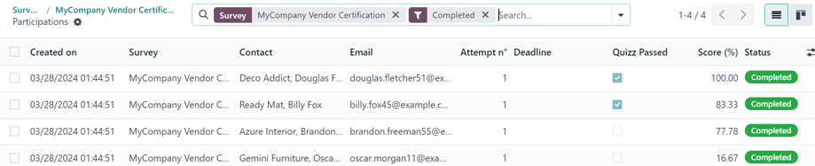

Here, users can view information related to individual participants who took that specific survey.
If they desire to see a more detailed breakdown of their various answers and responses, they can
click on any participant, and Odoo reveals a separate page showing that participant's survey
details, along with their submitted answers.

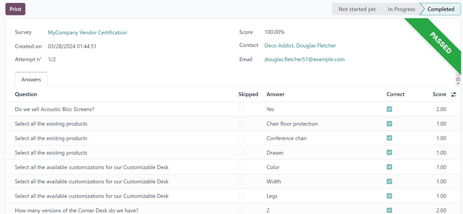

To view a consolidated list of all participants of every survey in the database, navigate to
:menuselection:`Surveys app --> Participations`. Here, every survey in the database is shown in a
default nested list. Beside each survey title has the number of participants in parenthesis.

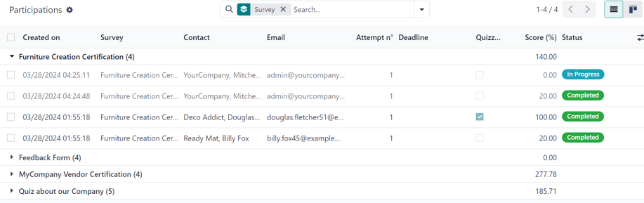

When a survey is un-nested from this list, by clicking the survey title, the corresponding
participants, along with their response-related data for that survey, appear on the page.

The :guilabel:`Participations` page can also be viewed in a Kanban layout, as well.

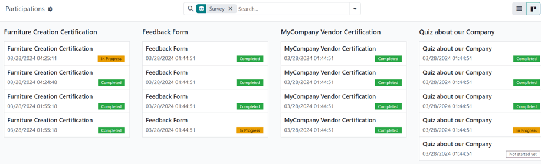

.. seealso::
   - :doc:`create`
   - :doc:`scoring`
