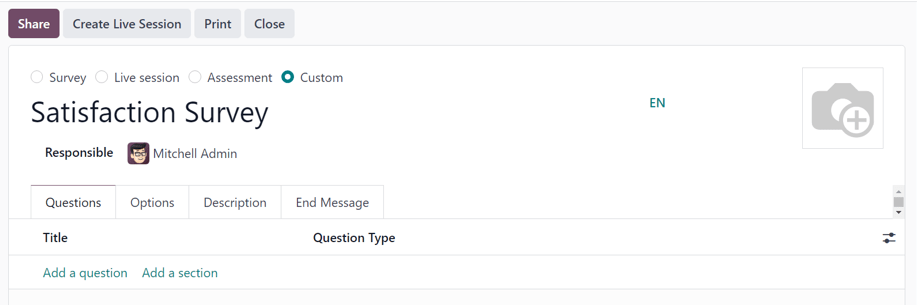
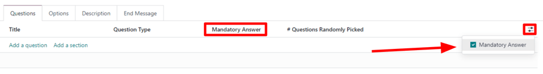
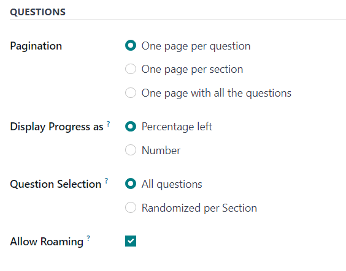
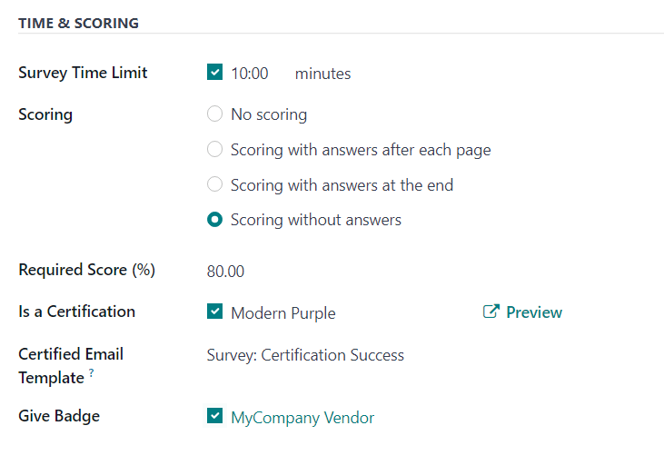
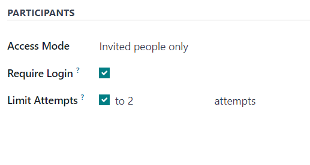
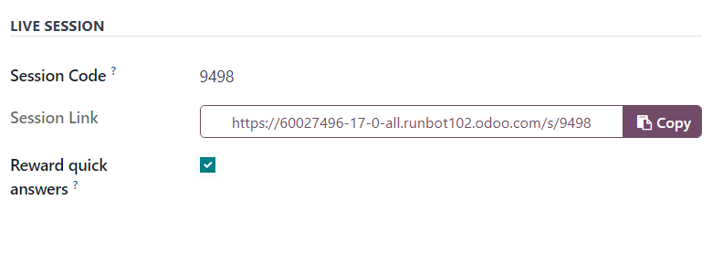
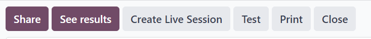

==============
Create surveys
==============

To create a survey in the Odoo *Surveys* application, navigate to :menuselection:`Surveys app -->
New` to reveal a blank survey form.

.. note::
   The :guilabel:`New` button is **not** present on the *Surveys* dashboard if in the *Activities*
   view.

Survey form
===========

At the top of the survey form are four radio buttons, each representing a survey style. The radio
button options are:

- :guilabel:`Survey`
- :guilabel:`Live Session`
- :guilabel:`Assessment`
- :guilabel:`Custom` (selected by default)

These options are here to streamline the survey-making process, by providing users with automated
settings and options that are ideally specific to those types of surveys. Each of those survey type
options comes equipped with its own specific selection of options.

The :guilabel:`Custom` option, selected by default, offers all the options from every potential
survey type (located in the :guilabel:`Options` tab).

Beneath those radio survey type options is a blank field in which a name for the survey **must** be
entered.

Below the survey name field, is the :guilabel:`Responsible` field. Choose a user from the drop-down
menu to be in charge of the survey. By default, the user who initially created the survey is
selected as the default :guilabel:`Responsible`.

To the right of those fields, and above the tabs, is the option to add a background image,
represented by a :guilabel:`📷 (camera)` icon. When clicked, the option to upload an image becomes
available. This image would be used as the background image for the entire survey. This is **not** a
required option.

Below those fields and options are four tabs: :guilabel:`Questions`, :guilabel:`Options`,
:guilabel:`Description`, and :guilabel:`End Message`.

Questions tab
-------------

View, access, add, and/or delete questions and sections to the survey in the :guilabel:`Questions`
tab.

By default, two columns are present in the :guilabel:`Questions` tab: :guilabel:`Title` (i.e. the
question) and :guilabel:`Question Type`.

If the :guilabel:`Randomized per Section` option is enabled in the :guilabel:`Options` tab of the
survey form, a column titled, :guilabel:`# Questions Randomly Picked` appears in the
:guilabel:`Questions` tab.

Indicate whether questions require a mandatory answer by clicking the :guilabel:`(optional columns)`
icon to the far-right of the column titles. Then, select :guilabel:`Mandatory Answer` from the
drop-down menu to reveal the :guilabel:`Mandatory Answer` column in the :guilabel:`Questions` tab.

Add a question
~~~~~~~~~~~~~~

To add a question to a survey, click :guilabel:`Add a question` in the :guilabel:`Questions` tab,
and proceed to fill out the :guilabel:`Create Sections and Questions` pop-up window that appears.

To learn how to create and customize questions, refer to the :doc:`create questions <questions>`
documentation.

.. important::
   There **must** be a survey title entered in order for the :guilabel:`Create Sections and
   Questions` pop-up window to appear. If no title is entered for the survey, an error pop-up
   message appears in the upper-right corner, instructing the user to enter a survey title.

Add a section
~~~~~~~~~~~~~

A *section* divides the survey into organized parts, in order to visually group similar questions
together. To make a section, click :guilabel:`Add a section` at the bottom of the
:guilabel:`Questions` tab, proceed to type in a desired name for the section, then either press
:kbd:`Enter` or click away.

The section line appears in dark gray in the :guilabel:`Questions` tab.

Then, drag-and-drop desired questions beneath a section, or drag-and-drop a section title on top of
(i.e. *before*) the desired question(s) in the survey. Doing so populates the section with questions
that align with its theme.

If the :guilabel:`Randomized per Section` option is enabled in the :guilabel:`Options` tab of the
survey form, the number `1` appears, by default, on the section line, beneath the :guilabel:`#
Questions Randomly Picked` column.

This indicates that `1` question from that section will be picked at random for each participant
taking the survey, bypassing every other, non-chosen question from that section. To change that
number, select that figure, and type in the desired number in its place. Then, either press
:kbd:`Enter`, or click away.

Options tab
-----------

In the :guilabel:`Options` tab of the survey form, there are many options to choose from, separated
in four different sections: :guilabel:`Questions`, :guilabel:`Time & Scoring`,
:guilabel:`Participants`, and :guilabel:`Live Session`.

The options available in this tab vary on the survey type chosen, via the radio buttons at the top
of the survey form: :guilabel:`Survey`, :guilabel:`Live Session`, :guilabel:`Assessment`, or
:guilabel:`Custom`.

The :guilabel:`Custom` survey type showcases all the possible options in the :guilabel:`Options`
tab. So, if any of the following options do **not** appear in the :guilabel:`Options` tab, it is
likely because the selected survey type does not offer it.

Questions section
~~~~~~~~~~~~~~~~~

The first field in the :guilabel:`Questions` section revolves around the :guilabel:`Pagination`,
or overall layout, of the survey.

Choose between :guilabel:`One page per question`, :guilabel:`One page per section`, or
:guilabel:`One page with all the questions` in the :guilabel:`Pagination` field.

.. note::
   If :guilabel:`One page with all the questions` is selected, all the remaining options in the
   :guilabel:`Questions` field, apart from :guilabel:`Question Selection` is removed, as they are no
   longer needed.

Next, select one of the following options in the :guilabel:`Display Progress as` field:

- :guilabel:`Percentage left`: displays the percentage of the survey remaining to participants.
- :guilabel:`Number`: display the number of questions answered along with the total number of
  questions to answer.

In the :guilabel:`Question Selection` field choose to have the survey show :guilabel:`All questions`
or :guilabel:`Randomized per Section`. If :guilabel:`Randomized per Section` a new column appears in
the :guilabel:`Questions` tab, titled: :guilabel:`# Questions Randomly Picked`.

In the :guilabel:`# Questions Randomly Picked` column, designate how many questions, in that
particular section, should be chosen at random to the participant.

Lastly, there is the :guilabel:`Allow Roaming` option. When enabled, participants are able to
navigate back to previous pages in the survey.

Time & Scoring section
~~~~~~~~~~~~~~~~~~~~~~

The first option in the :guilabel:`Time & Scoring` section is the :guilabel:`Survey Time Limit`
option. If enabled, proceed to enter in an amount of time (in :guilabel:`minutes`) to be set as the
time limit for the survey.

Next, in the :guilabel:`Scoring` section, determine whether there should be: :guilabel:`No scoring`,
:guilabel:`Scoring with answers after each page`, :guilabel:`Scoring with answers at the end`, or
:guilabel:`Scoring without answers`.

If the :guilabel:`No scoring` option is selected, no other options are available in this section.
However, if any *other* :guilabel:`Scoring` option is selected, two additional fields appear:
:guilabel:`Required Score (%)` and :guilabel:`Is a Certification`.

In the :guilabel:`Required Score (%)` field, enter the minimum percentage participants **must** earn
in order to pass the survey. Scores below this threshold are considered fails. This figure is also
used to determine if a participant is 'certified' or not, if the :guilabel:`Is a Certification`
option is enabled.

If the :guilabel:`Is a Certification` option is enabled, that makes the survey a *Certification*,
which is represented on the main *Surveys* app dashboard via a half-tropy image behind the survey
title, while in the default Kanban view. Or, via a full-trophy icon, while in list view.

When the :guilabel:`Is a Certification` option is enabled, three additional fields appear -- one
beside the option, and two below.

In the field that appears beside the option, users can select (and :guilabel:`Preview`) a
certification template.

Beneath that, in the :guilabel:`Certified Email Template` field, users can select a preconfigured
email template, or create one on-the-fly, to be sent to certified participants of the survey upon
completion.

Lastly, if the :guilabel:`Give Badge` field is enabled, a preconfigured badge is then displayed on
the contact page for that certified survey participant.

Participants section
~~~~~~~~~~~~~~~~~~~~

The first available option in the :guilabel:`Participants` section is the :guilabel:`Access Mode`
field. This is where users can determine who has access to the survey. Users can select either:
:guilabel:`Anyone with the link` or :guilabel:`Invited people only`.

Next, there is the option to :guilabel:`Require Login`. Enabling this feature means users **must**
login before being able to take the survey, even if they have a valid token.

Lastly, in there is the :guilabel:`Limit Attempts` field. If enabled, an additional field appears
beside it, in which users can determine how many times users can attempt this survey.

Live Session section
~~~~~~~~~~~~~~~~~~~~

.. note::
   The :guilabel:`Live Session` section in the :guilabel:`Options` tab of the survey form **only**
   pertains to *Live Session* surveys.

The first option in the :guilabel:`Live Session` section is the :guilabel:`Session Code` field. In
this field, enter a custom code, consisting of letters, numbers, and/or symbols, to be used by
participants in order to access the live session survey.

Next, is the :guilabel:`Session Link` field, which **cannot** be customized, but it *can* be sent
out to potential participants.

.. note::
   If a :guilabel:`Session Code` has been entered, the URL in the :guilabel:`Session Link` field
   ends with that specific :guilabel:`Session Code`.

   If that complete :guilabel:`Session Link` (ending in the custom :guilabel:`Session Code`) is used
   by participants to access the live session survey, that link would *already* be entered for them.
   At that point, they'd simply have to wait until the host of the live session begins the survey,
   and then they'd be able to enter.

   If the :guilabel:`Session Link` (ending in the custom :guilabel:`Session Code`) is sent
   **without** including the :guilabel:`Session Code` ending, participants trying to access the live
   session, via that link, will need to enter the custom :guilabel:`Session Code` to gain access.

   If the :guilabel:`Session Code` field is empty, a slightly longer, more complicated URL populates
   the :guilabel:`Session Link` field. When participants attempt to access the live session via that
   link (without a configured :guilabel:`Session Code`), all they have to do is wait for the host of
   the live session to begin the survey, and they'd be able to participate.

Lastly, in the :guilabel:`Live Session` section, there is the option to :guilabel:`Reward quick
answers`. If that option is enabled, participants who submit their answer quickly receive more
points.

.. seealso::
   :doc:`live_session`

Description tab
---------------

In this non-required tab, users can enter a custom description about the survey, along with any
explanations or guidance that a survey participant may need in order to properly participate (and
complete) the survey.

End Message tab
---------------

In this non-required tab, users can enter a custom message that participants see upon completing the
survey.

Survey form buttons
===================

Once the survey has been configured properly, and questions have been added, the user can utilize
any of the available buttons in the upper-left corner of the survey form.

Those buttons are the following:

- :guilabel:`Share`: click to reveal a :guilabel:`Share a Survey` pop-up form that can be used to
  invite potential participants to the survey — complete with a :guilabel:`Survey Link` that can be
  copied and sent to potential participants, and a :guilabel:`Send by Email` toggle switch.

  .. image:: create/share-survey-popup.png
     :align: center
     :alt: The 'Share a Survey' pop-up window that appears in the Odoo Surveys application.

  When the :guilabel:`Send by Email` toggle is in the 'on' position, indicated by a green switch,
  additional fields appear, in which :guilabel:`Recipients` and a :guilabel:`Subject` can be added
  to the email. Below that, a dynamic email template, complete with a :guilabel:`Start
  Certification` button appears, which can also be modified.

  .. image:: create/share-survey-popup-email-toggle.png
     :align: center
     :alt: The 'Share a Survey' pop-up window in Odoo Surveys with the Send by Email toggled on.

  Once modifications are complete, click :guilabel:`Send` to send that email invite to all the email
  addresses/contacts listed in the :guilabel:`Recipients` field.
- :guilabel:`See results`: this button **only** appears if there has been at least one participant
  who has completed the survey. Clicking :guilabel:`See results` reveals a separate tab containing
  a visual analysis of the survey questions and responses. For more information, check out the
  :doc:`scoring surveys <scoring>` documentation.
- :guilabel:`Create Live Session`: clicking this button opens the *Session Manager* in a separate
  tab. It also allows participants to access the live session, but the actual survey does **not**
  begin until the user hosting the live session survey clicks the :guilabel:`Start` button on the
  *Session Manager* window.

  Additionally, when :guilabel:`Create Live Session` has been clicked, and the *Session Manager* tab
  has been opened, the :guilabel:`Create Live Session` button on the survey form is replaced with
  two new buttons: :guilabel:`Open Session Manager` and :guilabel:`Close Live Session`.

  Clicking :guilabel:`Open Session Manager` opens another separate tab to the *Session Manager*, and
  clicking :guilabel:`Close Live Session` closes, and subsequently ends, the live session.
- :guilabel:`Test`: clicking this button opens a new tab to a test version of the survey, in order
  for the user to check for errors or inconsistencies, from the point-of-view of a participant.
  Users can tell if they are in a test version of the survey if there is a blue banner at the top of
  the screen, reading: `This is a Test Survey --> Edit Survey`.

  If the link in the blue banner is clicked, Odoo returns the user to the survey form.
- :guilabel:`Print`: clicking this button opens a new tab to a printable version of the survey that
  the user can proceed to print for their records.
- :guilabel:`Close`: clicking this button closes the survey (i.e. archives it), which is represented
  by a red :guilabel:`Archived` banner across the top-right corner of the survey form.

  When this button is clicked, and the survey is closed, a single button appears in the upper-right
  corner of the survey form, titled: :guilabel:`Reopen`. When :guilabel:`Reopen` is clicked the
  survey is reopened (i.e. unarchived), and the :guilabel:`Archived` banner is removed from the
  survey form.

.. seealso::
   - :doc:`questions`
   - :doc:`scoring`
