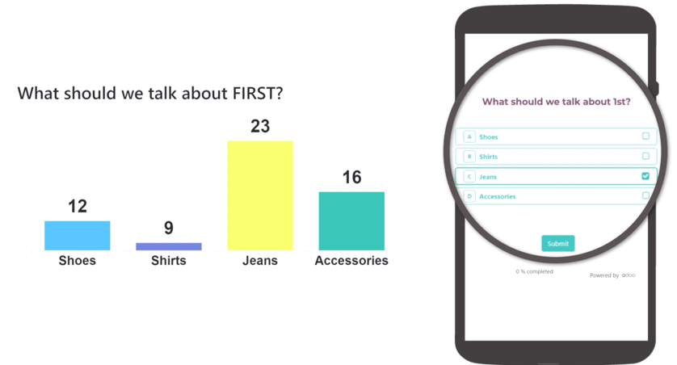
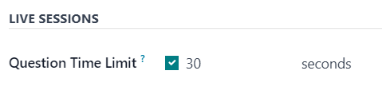

====================
Live Session surveys
====================

With the Odoo *Surveys* application, users can enhance in-person demonstrations and presentations
with the *Live Session* feature.

*Live Session* surveys function the same way as a normal survey, but with a host (or moderator), who
presents the questions to participants, reveals their responses in real-time, and controls the tempo
of the overall survey.

In *Live Session* surveys, participants access the survey experience via a custom URL, and sign-in
with an optional access code. When the survey has begun, the host presents one question at a time.

Then, the audience of participants submit their answer, either via their computer or mobile device,
and once the resposnes have been gathered, the host reveals all the participant's responses, in
real-time, with each answer's results displayed as a bar graph.

Create Live Session survey
==========================

To create a live session survey, begin by opening the *Surveys* application. From the
:guilabel:`Surveys` dashboard, click the :guilabel:`New` button to reveal a blank survey form.

Any of the survey type options (:guilabel:`Survey`, :guilabel:`Live Session`,
:guilabel:`Assessment`, or :guilabel:`Custom`), presented as radio buttons at the top of the survey,
can be used to create a live session.

However, selecting the :guilabel:`Live Session` survey type radio button streamlines the process
because Odoo auto-selects the optimal settings and options for a live session survey when that
option is selected.

.. important::
   If the :guilabel:`Is a Certification` option is enabled in the :guilabel:`Options` tab, the
   survey **cannot** be used as a live session survey.

With the desired survey radio button option selected, proceed to :doc:`create a survey
<../surveys/create>` with :doc:`questions and sections <../surveys/time_random>`.

While creating questions for the live session survey, open the :guilabel:`Options` tab on the
:guilabel:`Open: Sections and Questions` pop-up form, in order to reveal the :guilabel:`Live
Sessions` section, which only has one available feature: :guilabel:`Question Time Limit`.

When the :guilabel:`Question Time Limit` option is enabled, a new field appears beside it, wherein
the user **must** enter the desired amount of time (in seconds) the participant gets to answer the
question.

Options tab
-----------

After the questions have been created for the live session survey, open the :guilabel:`Options` tab
of the survey form to further configure the survey.

The :guilabel:`Options` tab is organized into four sections: :guilabel:`Questions`, :guilabel:`Time
& Scoring`, :guilabel:`Participants`, and :guilabel:`Live Session`.

Questions section
~~~~~~~~~~~~~~~~~

Regardless of the option selected for the :guilabel:`Pagination` field, the live session survey
*only* shows :guilabel:`One page per question`, and will default to that option when the
:guilabel:`Create Live Session` button is clicked, and a live session survey officially begins.

.. note::
   The :guilabel:`One page per question` option in the :guilabel:`Pagination` field is selected by
   default, and no other options appear in the :guilabel:`Questions` section, when the
   :guilabel:`Live Session` survey type radio button is selected.

The :guilabel:`Display Progress as` and :guilabel:`Question Selection` options are still viable and
active options for live session surveys, if desired, but they are **not** required.

However, the :guilabel:`Allow Roaming` feature is **not** available during live sessions whatsoever,
as the host/moderator controls the survey, and participants have no control over what question they
see, or when they see it.

Time & Scoring section
~~~~~~~~~~~~~~~~~~~~~~

The :guilabel:`Survey Time Limit` option is not applicable for live session surveys. This option
does not even appear in the :guilabel:`Time & Scoring` section of the :guilabel:`Options` tab if the
:guilabel:`Live Session` survey type radio button option is selected.

.. note::
   While the :guilabel:`Survey Time Limit` option is not applicable for live session surveys, each
   question *can* be affixed with its own *Question Time Limit*, via the *Options* tab of the question
   pop-up form. Those question-specific time limits *do* work with live session surveys.

If desired, any :guilabel:`Scoring` option, and subsequent :guilabel:`Required Score (%)` option are
available to use with live session surveys.

However, if the :guilabel:`Is a Certification` option is enabled, the survey **cannot** be used as a
live session survey. The :guilabel:`Is a Certification` option does **not** appear in the
:guilabel:`Time & Scoring` section of the :guilabel:`Options` tab if the :guilabel:`Live Session`
survey type radio button option is selected.

Participants section
~~~~~~~~~~~~~~~~~~~~

The :guilabel:`Access Mode` field is set to the :guilabel:`Anyone with the link` option when the
survey is used as a live session. The :guilabel:`Anyone with the link` option **cannot** be modified
if the :guilabel:`Live Session` survey type radio button option is selected.

The :guilabel:`Require Login` option is available for live session surveys. However, if the
:guilabel:`Live Session` survey type radio button option is selected, the usual :guilabel:`Limit
Attempts` field that appears when :guilabel:`Require Login` is enabled does **not** appear, as live
session participants only get to attempt the survey once, as the host leads them through it.

Live Session section
~~~~~~~~~~~~~~~~~~~~

The :guilabel:`Session Code` field allows users to create unique codes for participants to use, in
order to gain access to the live session survey. This code can consist of any combination of
letters, numbers, and/or symbols.

The :guilabel:`Session Code` field is **not** requried, however, it is encouraged because it adds a
level of exclusivity to the survey and, without a :guilabel:`Session Code`, the URL that appears in
the following :guilabel:`Session Link` field becomes far more complex.

.. important::
   If a :guilabel:`Session Code` is **not** entered, participants can access the survey, via the
   :guilabel:`Session Link` without needing a host, and the fundamental elements of the live session
   are lost, as the survey is then just a normal questionairre, without any real-time results.

With a :guilabel:`Session Code`, the URL in the non-modifiable :guilabel:`Session Link` field is
simplified, and ends with the :guilabel:`Session Code`, preceded by `/s/`.

.. example::
   If `1212` has been entered as the :guilabel:`Session Code`, the URL in the :guilabel:`Session
   Link` field begins with the basic URL of the database (e.g. `sample-database.odoo.com`), followed
   by: `/s/1212`.

   So, collectively, that sample :guilabel:`Session Link` would be:
   `sample-database.odoo.com/s/1212`.

.. tip::
   If a user sends out the :guilabel:`Session Link` URL in its complete form - :guilabel:`Session
   Code` and all - participants would *not* need to enter in a code, as it would already be entered
   for them. That complete link places the participant in a waiting room of sorts, where they simply
   need to wait for the host to officially start the live session survey.

   If a user sends out the :guilabel:`Session Link` URL - *except* for the :guilabel:`Session Code`
   at the end (i.e. the entire URL *through* `.../s/`) - participants would be taken to a page,
   wherein they would need to enter the specific :guilabel:`Session Code` in order to access the
   live session.

If any :guilabel:`Scoring` option has been enabled, the opportunity to :guilabel:`Reward quick
answers` is also available with live session surveys.

Start Live Session surveys
==========================

Once all the questions and configurations are complete, users can click the :guilabel:`Create Live
Session` button at the top of the survey form. Doing so opens a new browser tab to the *Session
Manager*.

When the :guilabel:`Create Live Session` button has been clicked, and the live session has begun,
a new :guilabel:`Open Session Manager` button appears on the survey form, which opens a new browser
tab to the *Session Manager*. If the live session has already begun, that button leads the user to
the question or section the live session is currently on.

Additionally, a :guilabel:`Close Live Session` button appears on the survey form. When that button
is clicked, the live session survey closes.

The *Session Manager* is controlled by the host/moderator of the live session survey, and is
typically shown on a projection or screen, so the participants can collectively view the questions
and real-time responses, as the host/moderator guides them through the live session.

.. note::
   The participant, from their computer or mobile device, can see and answer the questions, but the
   results and real-time responses can **only** be seen on the *Session Manager*.

Initially, the *Session Manager* shows the title of the live session survey, the link needed to
access it, and a :guilabel:`Waiting for attendees...` counter, which populates as participants enter
the live session survey.

Once the desired amount of participants have entered the live session survey, the host/moderator can
click the :guilabel:`Start` button on the right side of the *Session Manager* window to begin the
live session.

.. note::
   If the survey begins with a section title on the survey form, that section title appears in the
   *Session Manager*, and the participant's view of the survey informs them to `Pay attention to the
   host screen until the next question`. This message appears whenever a section title appears
   during a live session.

When the first question appears on the survey, the *Session Manager* shows the question above an
empty bar graph, showing the potential answer options on the x-axis. The participants see the
question and selectable answer options on their computer or mobile device.

As participants submit their answers, a progress bar, in the upper-left corner of the *Session
Manager*, fills in. This is how live session hosts/moderators know when every participant has
submitted their responses.

Then, when the desired amount of participants have submitted their responses, the host/moderator
clicks the :guilabel:`Show Results` button on the right side of the *Session Manager* to reveal the
collective real-time responses on the bar graph.

Once the host/moderator feels like the participants have had enough time to view the real-time
results, via the populated bar graph, they can click the :guilabel:`Show Correct Answer(s)` button
on the right side of the *Session Manager* window. Doing so highlights the correct response, if one
has been designated, in green. All incorrect responses are highlighted in red.

When the host/moderator feels the participants have had enough time to take in the correct and
incorrect responses, via the bar graph on the *Session Manager*, they can click the
:guilabel:`Next` button to move on to the next portion of the survey.

Repeat this process until the survey is complete.

.. seealso::
   :doc:`create`
