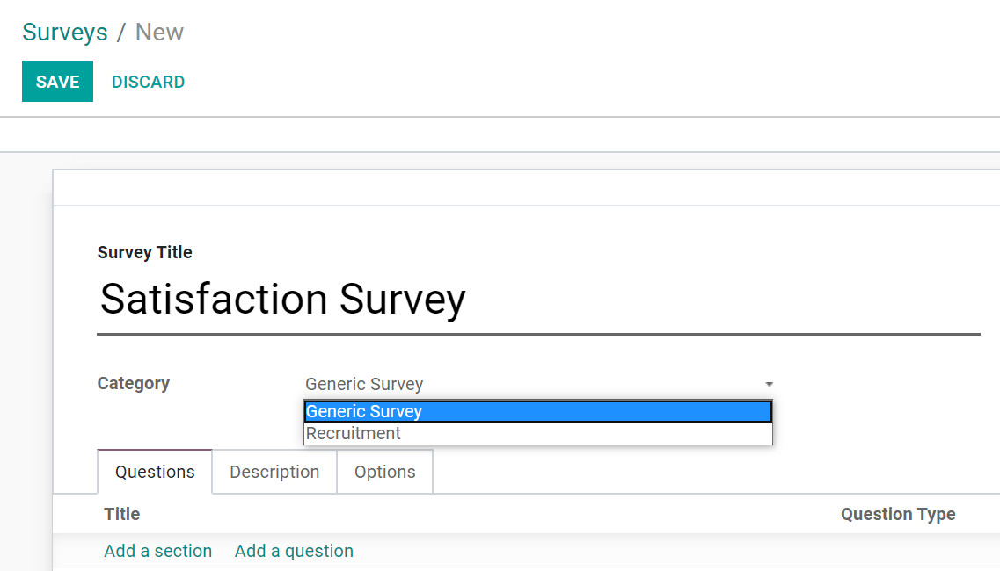

========================
Get Started with Surveys
========================

Surveys can be used for a range of purposes that can go from collecting customer feedback, evaluate
the success of an event, measure how pleased customers are with your products/services, gauge
whether employees are happy and satisfied with their work environment, and even to find out what
your market is thinking.

Get started
===========

When creating your survey, choose a *Title* and *Category*. The *Category* field is used to know in
which context the survey is being conducted, as different applications might use it for different
purposes such as recruitment, certification, or employee appraisal.

Tab: Questions
--------------

| Add sections and questions by clicking on the respective links.
| On the *Sections and Questions* form, once the question type is chosen and the answer added,
  under the tab *Options*, enable *Mandatory Answer*, and set an *Error message* to be shown
  when the user tries to submit the survey without answering the respective question.
| Depending on the *Question Type*, the tab *Options* aggregates extra and different
  possibilities. Examples:

- *Single Line Text Box* - can choose a minimum and maximum text length (number of characters -
  spaces do not count), and its error message.
- *Multiple choice: multiple answers allowed*: choose between radio buttons or a dropdown menu
  list, and if you would like to have a comment field. If the user select an answer and type a
  comment, the values are separately recorded. Or, enable the comment field to be
  displayed as an answer choice, with which a text type field is displayed.
- *Matrix Type*: choose if you would like to have one or multiple choices per row.

.. image:: create/sections_questions.png
   :align: center
   :alt: Sections and questions view of a survey in Odoo Surveys

Tab: Description
----------------

Write a *Description* to be displayed under the title of the survey's homepage.

.. image:: create/frontend_description.png
   :align: center
   :alt: Frontend of a survey showing the title and description of a survey for Odoo Surveys

.. tip::
   Click on *Edit* to personalize your pages with the website builder.

Tab: Options
------------

Under the tab *Options*, choose the *Layout* of your questions. If choosing *One page per section* or
*One page per question*, an option *Back Button* becomes available, which allows the user to go back
pages.

.. image:: create/tab_options_layout.png
   :align: center
   :alt: Form view of a survey emphasizing the layout feature under options in Odoo Surveys

Test and share the survey
=========================

| Once your Survey is ready, *Test* it to avoid *Sharing* it with potential errors. As answers get
  collected, click on *Answers* to access all the details of the respondent and his answers.
| By default, a filter *Except Test Entries* is applied to keep the list of entries clean with only
  real participants.

.. image:: create/user_feedback.png
   :align: center
   :alt: View list of the participations of a survey in Odoo Surveys

| Another way to access detailed answers is by going to :menuselection:`Participations -->
  Participations`.
| Click on *See results* to be redirected to an analytical page.

.. image:: create/analytical_page.png
   :align: center
   :alt: View of an analytical page for Odoo Surveys

.. seealso::
   - :doc:`scoring`
   - :doc:`time_random`
