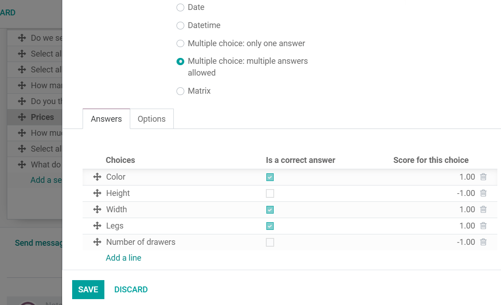
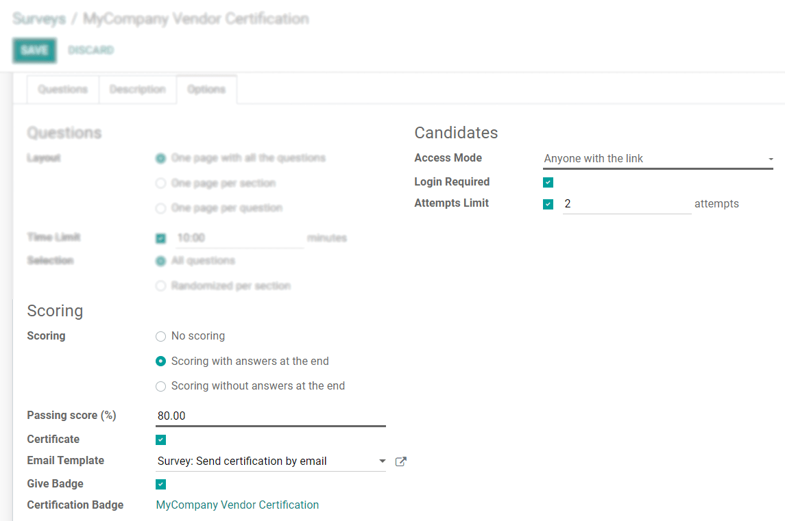

===============
Scoring Surveys
===============

To measure your respondent’s performance, knowledge of a subject, or overall satisfaction, attach
points to the answers of specific questions. The points are summed up to give your respondent a
final score.

On your survey’s form, click on *Add a question* and, under the tab *Options*, choose between
*Scoring with answers at the end* or *Scoring without answers at the end*. Now, on your question’s
form, set the right answer and score.

Set the percentage score the user needs to achieve to have successfully taken the survey. If
enabling *Certificate*, choose its template. The certification is automatically sent by email to the
users who successfully finish it.

Enable *Login required* to be able to *Give Badges*. Badges are related to the eLearning section of
your website. Besides the logged-in user, visitors of the website that access the page *Courses*
can also see the granted badges.

.. image:: scoring/frontend_bagdes.png
   :align: center
   :alt: View of the courses tab emphasizing the latest achievements section on the website for
         Odoo Surveys

.. seealso::
   - :doc:`time_random`

