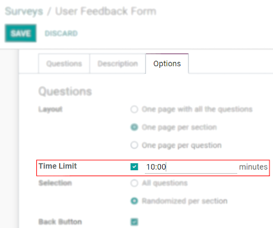

============================
Time and Randomize Questions
============================

Time Limit
==========

| On timed surveys, respondents need to complete the survey within a certain period of time. It can
  be used to ensure that all respondents get the same amount of time to find the answers, or to
  decrease the chance of having them looking at external resources.
| Set the *Time limit* under the tab *Options*.

A timer is shown on the pages so the user can keep track of the remaining time. Surveys not \
submitted by the *Time limit* do not have their answers saved.

Selection
=========

| When you randomize a survey, you allow for the questions to be shuffled in a random order every
  time someone opens the questionnaire. This can be useful to avoid having respondents looking at
  each others' answers.
| To do so, under the tab *Options*, enable *Randomized per section*. Now, under the tab *Questions*,
  set how many of the questions in that section should be taken into account during the shuffling.

.. image:: time_random/random_question.png
   :align: center
   :alt: View of a survey form emphasizing the random questions count column in Odoo Surveys

.. seealso::
    - :doc:`scoring`