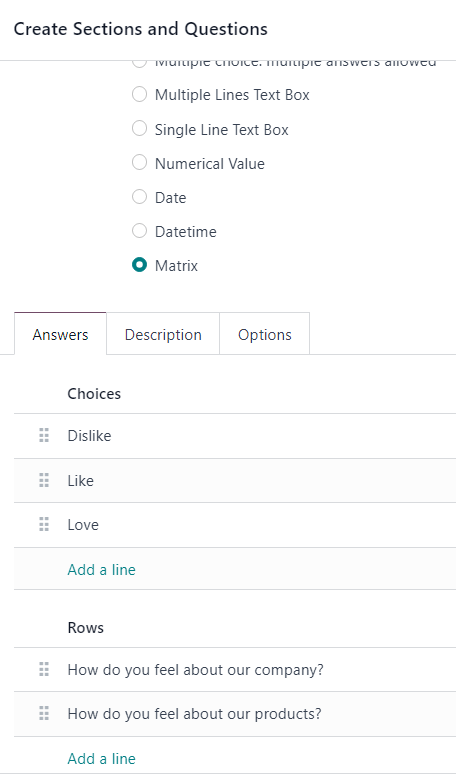
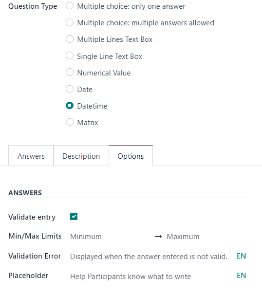
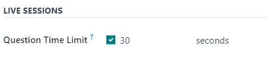

================
Create questions
================

In Odoo *Surveys*, crafting and tailoring survey questions is crucial for :doc:`creating and
customizing surveys <../surveys/create>`.

Fortunately, Odoo provides numerous ways to configure tailored questions for any kind of survey.

To access a list of *all* the questions that have been created in the database, navigate to
:menuselection:`Surveys app --> Questions & Answers --> Questions`. There, users can view and modify
any question from any survey.

However, there is only one place in the Odoo *Surveys* application where survey questions can be
created. To do that, navigate to a survey form, by going to :menuselection:`Surveys app --> New`, or
by selecting any pre-existing survey from the :guilabel:`Surveys` page (:menuselection:`Surveys app
--> Surveys`).

Questions tab
=============

On a survey form, users can view, access, add, and/or delete questions (and sections) in the
:guilabel:`Questions` tab.

By default, two columns are present in the :guilabel:`Questions` tab: :guilabel:`Title` (i.e. the
question) and :guilabel:`Question Type`.

If the :guilabel:`Randomized per Section` option is enabled in the :guilabel:`Options` tab of the
survey form, a column titled, :guilabel:`# Questions Randomly Picked` appears in the
:guilabel:`Questions` tab.

To reveal the :guilabel:`Mandatory Answer` column on the :guilabel:`Questions` tab, which indicates
if questions require a mandatory answer or not, click the :guilabel:`(optional columns)` icon
located to the far-right of the column titles.

.. image:: questions/slider-dropdown-mandatory-answer.png
   :align: center
   :alt: The slider drop-down menu showing the Mandatory Answer option in Odoo Surveys.

Create sections
---------------

A *section* divides the survey into organized parts, in order to visually group similar questions
together. To make a section, click :guilabel:`Add a section` at the bottom of the
:guilabel:`Questions` tab, proceed to type in a desired name for the section, then either press
:kbd:`Enter` or click away.

The section line appears in dark gray in the :guilabel:`Questions` tab.

Then, drag-and-drop desired questions beneath a section, or drag-and-drop a section title on top of
(i.e. *before*) the desired question(s) in the survey, in order to populate the section with
specific questions that fit the theme of the section.

If the :guilabel:`Randomized per Section` option is enabled in the :guilabel:`Options` tab of the
survey form, the number `1` appears, by default, on the section line, beneath the :guilabel:`#
Questions Randomly Picked` column.

This indicates that `1` question from that section will be picked at random for each participant
taking the survey, bypassing every other, non-chosen question from that section. To change that
number, select that figure, and type in the desired number in its place. Then, either press
:kbd:`Enter`, or click away.

Create questions
================

To create questions for the survey, click :guilabel:`Add a question` in the :guilabel:`Questions`
tab.

Clicking :guilabel:`Add a question` opens the :guilabel:`Create Sections and Questions` pop-up
window, in which a survey question can be created.

.. important::
   There **must** be a survey title entered in order for the :guilabel:`Create Sections and
   Questions` pop-up window to appear. If no title is entered for the survey, an error pop-up
   message appears in the upper-right corner, instructing the user to enter a survey title.

When all desired configurations are complete click either :guilabel:`Save & Close` to save the
question and return to the survey form, or :guilabel:`Save & New` to save the question and create a
new one right away in a fresh :guilabel:`Create Sections and Questions` pop-up window.

Click :guilabel:`Discard` to discard the question entirely.

Create Sections and Questions pop-up window
-------------------------------------------

.. image:: questions/create-sections-questions-popup.png
   :align: center
   :alt: The Create Sections and Questions pop-up form in Odoo Surveys.

In the :guilabel:`Create Sections and Questions` pop-up window, start by typing the question into
the :guilabel:`Question` field, located at the top of the pop-up window.

Then, choose the desired :guilabel:`Question Type`. A preview of each :guilabel:`Question Type` is
to the right of the :guilabel:`Question Type` field, when a :guilabel:`Question Type` is selected.

Choose from the following :guilabel:`Question Types`:

- :guilabel:`Multiple choice: only one answer`: a multiple choice question, where only one answer is
  permitted.
- :guilabel:`Multiple choice: multiple answers allowed`: a multiple choice question, where more than
  answer is permitted.
- :guilabel:`Multiple Lines Text Box`: an open-ended question, where participants can type in a
  multiple line response.
- :guilabel:`Single Line Text Box`: an open-ended question, where participants can type in a single
  line response.
- :guilabel:`Numerical Value`: a number-based question, where participants must enter a number as a
  response.
- :guilabel:`Date`: a date-based question, where participants must enter a date (year-month-day) as
  a response.
- :guilabel:`Datetime`: a date-based question, where participants must enter a date *and* time
  (year-month-day, hour-minute-second) as a response.
- :guilabel:`Matrix`: a multiple-choice, multiple question, in a table/chart layout, where
  participants are presented with different questions on each row, and different answer options on
  each column.

.. note::
   Different features appear in the :guilabel:`Answers` and :guilabel:`Options` tabs, depending on
   the chosen :guilabel:`Question Type`.

   However, the :guilabel:`Description` tab **always** remains the same, regardless of the question
   type chosen.

Once a :guilabel:`Question Type` has been selected, there are three possible tabs where information
can be customized for the question. These include the :guilabel:`Answers` tab (if applicable for the
chosen :guilabel:`Question Type`), the :guilabel:`Description` tab, and the :guilabel:`Options` tab.

Each tab offers a variety of different features, depending on what :guilabel:`Question Type` was
chosen.

Answers tab
~~~~~~~~~~~

The :guilabel:`Answers` tab **only** appears if the selected :guilabel:`Question Type` provides
answer options to the participant.

However, if a custom response is required to answer the selected :guilabel:`Question Type`, like a
:guilabel:`Multiple Lines Text Box`, for example. Or, if the answer to the :guilabel:`Question Type`
is a number, date, or datetime, the :guilabel:`Answers` tab disappears completely.

If the :guilabel:`Single Line Text Box` is selected as the :guilabel:`Question Type`, the
:guilabel:`Answers` tab remains, although it only provides two checkbox options: :guilabel:`Input
must be an email` and :guilabel:`Save as user nickname`.

.. image:: questions/single-line-answer-tab.png
   :align: center
   :alt: The Single Line Text box question type answers tab in Odoo Surveys.

If the :guilabel:`Input must be an email` option is enabled, a new field, :guilabel:`Save as user
email` appears. If that box is ticked, Odoo saves the participant's answer to that specific question
as their email address.

If the :guilabel:`Save as user nickname` option is enabled, Odoo saves the participant's answer as
its nickname.

For all other applicable :guilabel:`Question Type` options that provide answer options to the
participant, the :guilabel:`Answers` tab appears the same.

.. image:: questions/multiple-choice-answer-options.png
   :align: center
   :alt: The answer tab with a multiple choice answer option selected in Odoo Surveys.

From here, users can add answer options by clicking :guilabel:`Add a line`, and typing in the
various answer options for that question. Then, either press :kbd:`Enter` to lock in that answer
option and immediately add another one. Or, click away to simply lock in that answer option.

The entered answer options appear in the :guilabel:`Choices` column of the :guilabel:`Answers` tab.

If any *Scoring* option is enabled in the :guilabel:`Options` tab of the survey form, the
:guilabel:`Correct` and :guilabel:`Score` columns appear to the right of the :guilabel:`Choices`
column.

To mark an answer option as correct, tick the box beneath the :guilabel:`Correct` column for the
respective question. If :guilabel:`Multiple choice: multiple answers allowed` is set as the
:guilabel:`Question Type`, multiple answers in the :guilabel:`Choices` column can be marked as
:guilabel:`Correct`.

In the :guilabel:`Score` column, designate how many points (if any) should be rewarded to the
participant for entering that specific answer. It is possible to enter a negative amount as the
:guilabel:`Score` to take points away for an incorrect response.

The option to upload a corresponding image to accompany the answer options is available on the
question line, beneath the :guilabel:`Image` column, by clicking :guilabel:`Upload your file`, and
uploading the desired image.

To delete any answer option, click the :guilabel:`🗑️ (trash can)` icon to the far-right of the
question line.

An exception to that is if the :guilabel:`Matrix` option is selected as the :guilabel:`Question
Type`. If that's chosen, the :guilabel:`Answers` tab remains, but below the typical
:guilabel:`Choices` section, there is a :guilabel:`Rows` section. That's because the
:guilabel:`Matrix` option provides an answer table for participants to fill out.

Description tab
~~~~~~~~~~~~~~~

In the :guilabel:`Description` tab of the :guilabel:`Create Sections and Questions` pop-up window is
used to provide any kind of guidelines, instructions, or any other type of supplemental material
deemed necessary to help participants answer/understand the question.

Entering a description is **not** required.

Options tab
~~~~~~~~~~~

In the :guilabel:`Options` tab of the :guilabel:`Create Sections and Questions` pop-up window, there
are four available sections: :guilabel:`Answers`, :guilabel:`Constraints`, :guilabel:`Conditional
Display`, and :guilabel:`Live Sessions`.

Answers section
***************

.. note::
   Fields in the :guilabel:`Answers` section in the :guilabel:`Options` tab of the :guilabel:`Create
   Sections and Questions` pop-up window vary, depending on the selected :guilabel:`Question Type`
   and overall :guilabel:`Options` configured on the survey form.

Multiple Choice question types
^^^^^^^^^^^^^^^^^^^^^^^^^^^^^^

If the selected :guilabel:`Question Type` is either :guilabel:`Multiple choice: only one answer` or
:guilabel:`Multiple choice: multiple answers allowed`, there is a :guilabel:`Show Comments Field`
present in the :guilabel:`Answers` section.

When enabled, two additional fields appear: :guilabel:`Comment Message` and :guilabel:`Comment is an
answer`.

.. image:: questions/multiple-choice-options-tab.png
   :align: center
   :alt: The answers section of the options tab when a multiple choice question type is selected.

In the :guilabel:`Comment Message` field, type in a guiding message to help participants know what
is expected of them (e.g. `If other, please specify`).

If the :guilabel:`Comment is an answer` option is enabled, Odoo takes the participant's commented
response as an answer, and not just commentary on the question. This is best utilized in surveys
where there is no scoring option enabled.

Multiple Lines Text Box question type
^^^^^^^^^^^^^^^^^^^^^^^^^^^^^^^^^^^^^

If the selected :guilabel:`Question Type` is :guilabel:`Multiple Lines Text Box`, a
:guilabel:`Placeholder` field appears in the :guilabel:`Answers` section of the :guilabel:`Options`
tab.

.. image:: questions/multiple-lines-placeholder.png
   :align: center
   :alt: The placeholder field when a multiple lines text box option is chosen in Odoo Surveys.

In the :guilabel:`Placeholder` field, enter a guiding direction to help participants know what they
should write in the :guilabel:`Multiple Lines Text Box` presented to them.

Single Line Text Box, Numerical Value, Date, Datetime question types
^^^^^^^^^^^^^^^^^^^^^^^^^^^^^^^^^^^^^^^^^^^^^^^^^^^^^^^^^^^^^^^^^^^^

If the selected :guilabel:`Question Type` is :guilabel:`Single Line Text Box`, :guilabel:`Numerical
Value`, :guilabel:`Date`, or :guilabel:`Datetime`, two options appear in the :guilabel:`Answers`
section of the :guilabel:`Options` tab: :guilabel:`Validate Entry` and :guilabel:`Placeholder`.

If the :guilabel:`Validate Entry` option is enabled, two additional fields appear beneath:
:guilabel:`Min/Max Limits` and :guilabel:`Validation Error`.

In the :guilabel:`Min/Max Limits` field, designate the minimum and maximum allowed quantities for
that specific question.

In the :guilabel:`Validation Error` field, enter a custom message that Odoo displays when an answer
is not valid.

In the :guilabel:`Placeholder` field, enter a guiding direction to help participants know what they
should write in the :guilabel:`Multiple Lines Text Box` presented to them.

Constraints section
*******************

The :guilabel:`Constraints` section in the :guilabel:`Options` tab is the same, regardless of the
selected :guilabel:`Question Type`.

.. image:: questions/constraints-section.png
   :align: center
   :alt: The Constraints section in the options tab in Odoo Surveys.

In the :guilabel:`Constraints` section, there is one option available: :guilabel:`Mandatory Answer`.

When :guilabel:`Mandatory Answer` is enabled, that means that specific question requires an answer
from the participant before they can move on. Also, when :guilabel:`Mandatory Answer` is enabled,
that reveals an additional field: :guilabel:`Error Message`.

In the :guilabel:`Error Message` field, enter a custom error message prompting the participant to
provide an answer for this question.

Conditional Display section
***************************

:guilabel:`Conditional Display` means the question is **only** displayed if a specified conditional
answer(s) (i.e. :guilabel:`Triggering Answers`) has been selected in a previous question(s).

.. note::
   The :guilabel:`Conditional Display` section of the :guilabel:`Options` tab is **not** available
   when questions are randomly picked.

There is only one field in the :guilabel:`Conditional Display` section: :guilabel:`Triggering
Answers`.

.. image:: questions/conditional-display-section.png
   :align: center
   :alt: The Conditional Display section of the options tab in the Odoo Surveys application.

In the :guilabel:`Triggering Answers` field, select specific responses from previous questions that
would trigger this question. More than one answer can be selected. Leave the field empty if the
question should always be displayed.

Live Sessions section
*********************

The option in the :guilabel:`Live Sessions` section of the :guilabel:`Options` tab are **only**
supported by *Live Session* surveys.

There is only one option available in the :guilabel:`Live Sessions` section: :guilabel:`Question
Time Limit`.

When the :guilabel:`Question Time Limit` option is enabled, designate how much time (in
:guilabel:`seconds`) participants have to answer the question during a *Live Session* survey.

.. note::
   Survey text colors are directly linked to the colors used for the :doc:`website theme
   <../../websites/website/web_design/themes>`.
