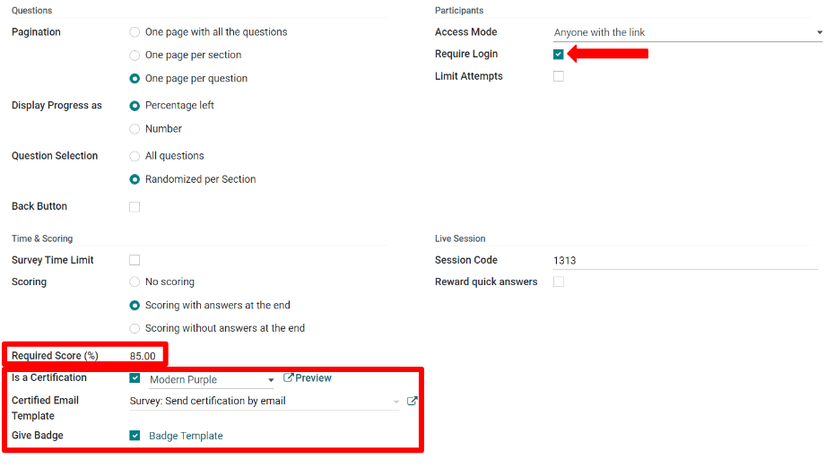
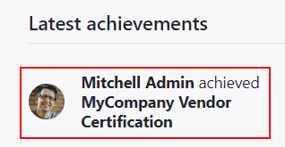

===============
Scoring surveys
===============

To measure a survey participant's performance, knowledge, or overall satisfaction, Odoo ascribes
points to survey answers. At the end of the survey, these points are summed up, resulting in the
participant's final score.

To add points to questions, open the :guilabel:`Surveys` application, choose the desired survey
form, and then click on the :guilabel:`Options` tab. Under the :guilabel;`Scoring` section, choose
between :guilabel:`Scoring with answers at the end` or :guilabel:`Scoring without answers at the
end`.

- :guilabel:`Scoring with answers at the end` shows the survey participant their answers after
  completing the survey, and displays which questions they got right or wrong. On questions where
  there was an incorrect answer, the correct answer will be highlighted.

- :guilabel:`Scoring without answers at the end` does not show the survey participant their answer
  choices after completing the survey, only their final score.

To indicate correct answers, click on the :guilabel:`Questions tab` and choose a question. In the
question form, check the :guilabel:`Is a correct answer` box for the choice that is the correct
answer and attach a score value.

Back on the :guilabel:`Options` tab of the survey, set the :guilabel:`Success %`. The percentage
entered determines what percentage of correct answers is needed to pass the survey.

Further on the :guilabel:`Options` tab of the survey, survey administrators can also choose to make
the survey a certification. A certification indicates that the survey asks questions to test the
participants' knowledge level on a subject.

When enabling the :guilabel:`Is a certification` option, choose a :guilabel:`Certification email
template`. The certification will automatically be emailed using this email template to users who
pass the survey with a final score that is greater than or equal to the set :guilabel:`Success %`.

In the :guilabel:`Candidates` section, participants can be required to log in to take the survey.
If the :guilabel:`Login Required` setting is enabled, two new options appear: the
:guilabel:`Attempts Limit` checkbox, which limits the number of times a participant can attempt
the survey, and the option to :guilabel:`Give Badge`, located beneath the :guilabel:`Certification`
options in the :guilabel:`Scoring` section.

Badges are displayed on the eLearning portion of a given user's portal, and are a way to set
milestones and reward participants for passing surveys or gaining points. Besides the awardee,
website visitors who access the :guilabel:`Courses` page will also be able to see the granted
badges.

.. seealso::
   :doc:`time_random`
