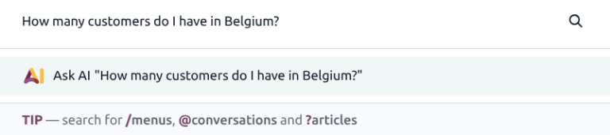
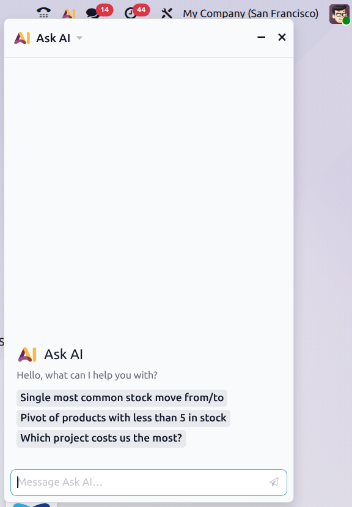

:show-content:
:hide-toc:

==
AI
==

.. |AI| replace:: :abbr:`AI (artificial intelligence)`

Artificial intelligence (AI) in Odoo enhances productivity across all apps by providing intelligent,
context-aware assistance. It helps users work faster, make better decisions, and automate routine
tasks, all while staying within the familiar Odoo interface.

Ask AI
======

The :guilabel:`Ask AI` feature allows users to receive assistance anywhere in an Odoo database. It
understands natural language and can answer questions, open views, and improve content.

To enter a prompt from anywhere in the database, enter :kbd:`Ctrl` + :kbd:`k` to open the command
palette. From here, type in a prompt, then click the |AI| icon or hit enter. This opens a
conversation window with the *Ask AI* agent.

.. important::
   The *Ask AI* agent is instructed not to display an error to a user. If it is unable to complete
   the requested query, it responds that it is unable to complete the request at that time.

After the agent has responded, hover over the response to do one of the following:

 - :guilabel:`Send as Message`: opens an email pop-up with the contents of the response in the body
   of the message. The message can be edited before it is sent.
 - :guilabel:`Log as Note`: opens a chatter pop-up with the contents of the response. The note can
   be edited before it is logged as a note.
 - :icon:`fa-copy` :guilabel:`(Copy)`: copies the contents of the response to the clipboard.

 .. image:: ai/response-options.png
    :alt: A response from an agent with the send, log, and copy options visible.

.. note::
   These options are pre-configured *Default Prompts*. The default prompts can be edited, and new
   prompts can be added through the **AI** application.

.. tip::
   To open the conversation with the agent in the **Discuss** app, click on the header of the
   conversation window, then click :icon:`fa-expand` :guilabel:`Open in Discuss`.

   .. image:: ai/open-in-discuss.png
      :alt: The header of a conversation window with the open in discuss option visible.

AI button
---------

In addition to the command palette, the |AI| button can be utilized to open a conversation with the
*Ask AI* agent as well. The |AI| button is located in the top-right corner of the screen and is
available throughout the database regardless of what app the user is currently using.

After clicking the |AI| button, a conversation window opens with the *Ask AI* agent. Either type a
request in the message field or click one of the preconfigured message prompts.

   The AI button opens a window that includes suggested conversation prompts. The prompts vary based
   on where in the database the button was clicked.

Common requests
===============

Below are some common requests that the *Ask AI* agent can assist with:

- Translation: *Translate the most recent chatter message*
- Summarize: *Summarize this chatter thread*
- Text generation: *Generate a follow-up message*
- Improve: *Improve this message draft*
- Suggest: *Suggest next steps for the sales rep/support agent*

.. important::
   The standard *Ask AI* agent **cannot** make changes to the database. As such, it can open views
   and display reports, but it cannot create leads or alter data. For more information on
   customizing agents to complete tasks, see :ref:`Topics <ai/topics>`.

.. toctree::
   :titlesonly:

   ai/apikeys
   ai/agents
   ai/fields
   ai/webpage
