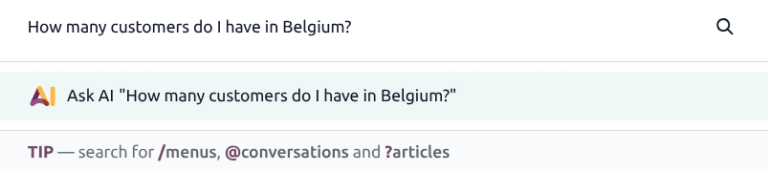

:show-content:
:hide-toc:

==
AI
==

.. |AI| replace:: :abbr:`AI (artificial intelligence)`

Odoo |AI| brings artificial intelligence into Odoo to help users work with information, complete
tasks, and automate workflows.

AI agents are at the core of Odoo AI. An agent can understand natural-language requests, access
information, and perform tasks using the tools available to it. Agents can be configured for
specific purposes and can also be triggered as part of automated workflows.

Odoo AI can be used with Odoo's built-in AI services or connected to an external AI agent through an
Odoo MCP server.

Access Odoo AI
==============

Odoo AI can be accessed from anywhere in the database:

- Click the :guilabel:`AI` icon at the top of the screen.
- Press :kbd:`Ctrl` + :kbd:`k` to open the command palette, enter a prompt, and select the
  :guilabel:`AI` option.

.. tip::
   To open the conversation with the agent in the **Discuss** app, click on the header of the
   conversation window, then click :icon:`fa-expand` :guilabel:`Open in Discuss`.

Use Odoo AI
-----------

Odoo provides AI features throughout the database, including:

- :doc:`AI Fields <ai/fields>`: Generate field values based on information from the current record.
- :doc:`AI in email templates <ai/email-templates>`: Generate personalized email content using
  information from the current record.
- :doc:`AI voice transcription <ai/voice>`: Transcribe recorded conversations and generate
  summaries.
- :doc:`AI image generation <ai/generate_images>`: Generate images from natural-language prompts.
- :doc:`AI in Live Chat <ai/live-chat>`: Use an AI agent to respond to visitors, qualify
  conversations, and create leads.

See the related documentation for information about using these features.

AI agents
=========

AI agents are configurable virtual assistants that can understand natural language, perform tasks,
and interact with Odoo tools.

An *agent* is configured with a **System Prompt** that defines its purpose and behavior. **Skills**
provide the instructions and tools the agent uses to complete tasks, while **Sources** provide
information the agent can use.

.. seealso::
   :doc:`AI agents <ai/agents>`

AI and automation
=================

AI can also be used as part of automated Odoo workflows. AI server actions allow AI to evaluate a
situation and select the appropriate tool to execute. AI agents can also be triggered by automated
and scheduled actions.

.. seealso::
   - :doc:`AI server actions <ai/server-actions>`
   - :doc:`AI document sort <ai/document_sort>`

AI providers
============

Odoo AI uses Odoo's :doc:`In-App Purchase  <../essentials/in_app_purchase>` (IAP) service for AI
requests. AI usage consumes IAP `credits <https://iap.odoo.com/iap/in-app-services/867>`_.

Alternatively, an external AI agent can connect directly to an Odoo database through the Odoo MCP
server (Model Context Protocol). This allows the external agent to access Odoo data and use tools
exposed by the database.

.. seealso::
   :doc:`AI MCP server <ai/mcp_server>`

.. toctree::
   :titlesonly:

   ai/apikeys
   ai/agents
   ai/default_prompts
   ai/document_sort
   ai/fields
   ai/generate_images
   ai/live-chat
   ai/server-actions
   ai/email-templates
   ai/voice
   ai/improve_text
   ai/support_operations
   ai/mcp_server
