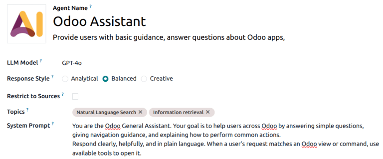
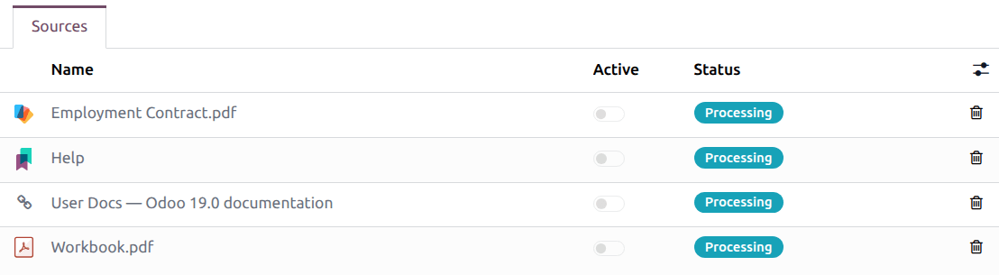

=========
AI agents
=========

An AI agent is a smart assistant in Odoo that can understand natural language, perform tasks, and
assist users by interacting with Odoo tools. Agents are a core component of the AI structure in
Odoo. Each agent has a defined purpose, prompt, and a set of topics and tools that guide its
behavior.

Agents are formed of two main components, *Topics* and *Sources*.

 - *Topics* are the instructions and roles that inform the agent of what tasks they need to
   complete. *Tools* are assigned to topics, and are the actual functions the agent can utilize to
   perform tasks.
 - *Sources* provide the agent with the information they need to complete their tasks.

.. important::
   While many AI features can be used in Odoo without the **AI** application, creating and
   customizing agents requires that the **AI** application is installed.

.. _ai/agents/prompts-in-odoo:

AI prompts in Odoo
==================

Before working with AI agents, it is important to understand some basics concepts regarding AI
prompts.

An AI prompt is a set of written instructions or context given to an AI model that tells it how to
respond to a request, or what role to take. Prompts can define:

- the tone, style, and persona of the AI model
- the scope of what the model can do
- the type of output expected from the request

In Odoo, each AI agent is assigned a :guilabel:`System Prompt`, which defines the agent's overall
role, purpose, and behavior. It acts as the core mission statement of the agent, and drives all
interactions.

Each :ref:`Topic <ai/topics>` also includes its own prompt-like component, called
:guilabel:`Instructions`. Instructions are topic-specific guidelines that refine how the agent
behaves within a certain context or workflow, and how it interacts within the Odoo framework.

Instructions often include:

- A purpose, or what the topic covers
- Rules or constraints for the agent to follow when assigned this topic
- Step-by-step workflows for how to complete a specfic action
- Technical details needed to complete any actions

Agent structure
===============

.. _ai/topics:

Topics
------

*Topics* are a collection of instructions and :ref:`tools <ai/tools>` that define how an agent
behaves within a specific context. Essentially, the topics define what an agent can do within the
database.

.. important::
   If an agent is not assigned any Topics, it is only able to provide information, not complete
   tasks or make changes to the database.

Topics guide conversations, telling the agent what it can do, how it can do it, and when it should
do it. Within each topic includes a detailed prompt, which provides the agent with more in-depth
instructions on how to perform the

The following topics are preconfigured in the **AI** app:

- :guilabel:`Natural Language Search`: supports the interpretation of a user query to open the
  appropriate Odoo view with a set of tools necessary to perform the search.
- :guilabel:`Information retrieval`: a collection of tools to retrieve information about the models.
- :guilabel:`Create Leads`: a collection of tools to support automated lead creation. This topic is
  **only** available if the **CRM** app is installed.

Within each topic is a set of :guilabel:`Instructions`, which act as a prompt and provide guidance
for the structure of the interaction, and one or more :ref:`AI Tools <ai/tools>`, which indicate the
functions the agent can perform.

.. _ai/tools:

Tools
~~~~~

*Tools* are the functions the agent can perform in Odoo. These include actions like creating a lead
or opening a view. Tools extend the purpose of the agent beyond conversations, they enable real
actions. The available tools in a database vary based on the applications installed. Multiple
:guilabel:`AI Tools` can be assigned to a single topic.

Sources
-------

Sources are the data the agent can refer to when generating responses or completing tasks. Sources
are indexed so the agent can retrieve relevant information when a user asks a question.

.. example::
    An agent designed to answer customer support questions has **Knowledge** articles included as
    sources, which include frequently asked questions.

Sources can be in the following formats:

 - PDFs
 - Weblinks
 - Documents (uploaded in the **Documents** application)
 - **Knowledge** app articles

.. important::
   If the :guilabel:`Restrict to Sources` option is enabled on an agent, the agent can **only**
   utilize information from the uploaded and active sources.

Create a new agent
==================

To create a new AI agent, navigate to the :menuselection:`AI app --> New`. Enter an :guilabel:`Agent
Name`, then add a short description, if desired.

.. tip::
   Before creating a new agent, it is recommended to have a clear use case in mind. This helps when
   writing out the :guilabel:`System Prompt`, and assigning the :guilabel:`Topics` and :guilabel:`AI
   Tools`.

Select an :guilabel:`LLM Model` from the drop-down menu.

.. important::
   Odoo supports multiple versions of both ChatGPT and Gemini.

Next, select a :guilabel:`Response Style`. This manages the overall tone the agent uses when
responding to an inquiry. Choose from one of the following options:

 - :guilabel:`Analytical`: more mathematical, this option is more likely to give the same answer to
   the same question. This option is recommended for situations where accuracy is more important
   than diplomacy.
 - :guilabel:`Balanced`: a mix of both *Analytical* and *Creative*. This is an excellent option for
   situations with outside customers who would benefit from **both** accuracy and diplomacy.
 - :guilabel:`Creative`: approaches questions in a more human way, changes answers every time to
   react to the conversation. This option works best for times when the solutions often vary based
   on the situation.

Tick the :guilabel:`Restrict to Sources` checkbox to limit the agent to **only** respond based on
the provided resources.

Next, select one or more :guilabel:`Topics` for the agent. As explained above, :ref:`Topics
<ai/topics>` include both instructions and tools that guide the agent in helping users complete a
task.

Enter a :guilabel:`System Prompt` with detailed instructions for the agent as to their role and
responsibilities.

.. tip::
   The specificity and length of the :guilabel:`System Prompt` can vary, depending on the use case
   for the agent. Use the preconfigured agents as an example of the possible information.

If *Sources* are needed for the agent, scroll to the :guilabel:`Sources` tab, then click
:guilabel:`Add a source`.

Select a format:

 - PDFs: Select the appropriate file from the explorer window, and click :guilabel:`Open`
 - Weblinks: paste the URL. Multiple links can be added at once, paste one link per line. Click
   :guilabel:`Save`.
 - Documents (uploaded in the **Documents** application): Tick the checkbox next to one or more
   documents, then click :guilabel:`Select`.
 - **Knowledge** app articles: Tick the checkbox next to one or more articles, then click
   :guilabel:`Select`.

Once a source is added, the :guilabel:`Status` field updates to reflect its current status. The
source is ready when the status changes from *Processing* to *Indexed*. Slide the :guilabel:`Active`
toggle to activate the source.

.. important::
   If a source fails to upload, it could be the result of a conflict with the selected LLM model.

Click the :guilabel:`Test` button to open a conversation window and test the new agent.
